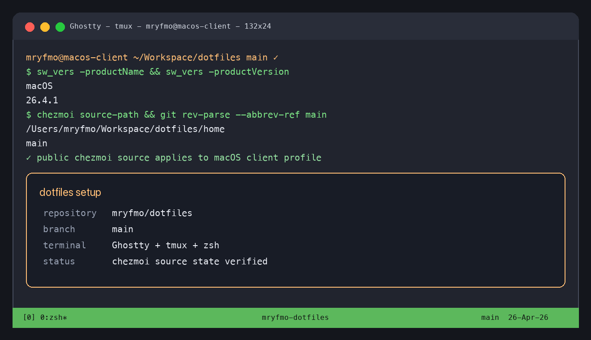
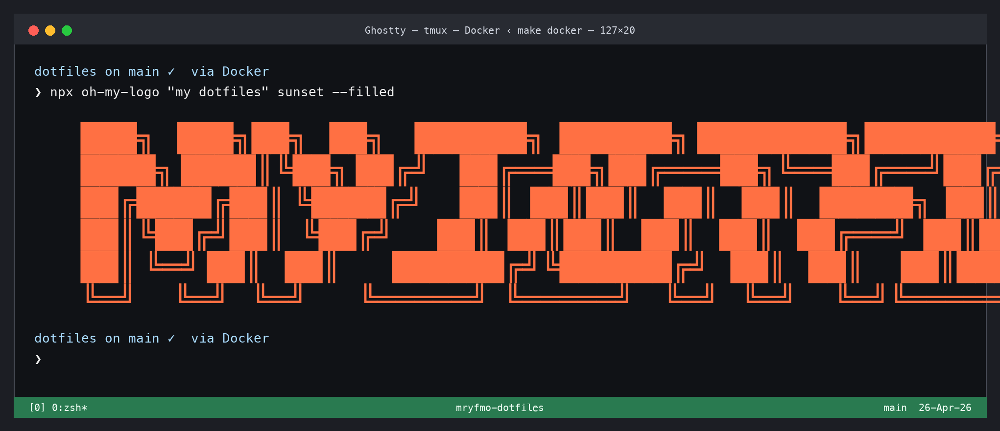

<div align="center">
    
    <h1>📂 dotfiles</h1>
</div>

<div align="center">

[](https://github.com/mryfmo/dotfiles/actions/workflows/remote.yaml)
[](https://github.com/mryfmo/dotfiles/actions/workflows/test.yaml)
[](https://codecov.io/gh/mryfmo/dotfiles)

[](https://github.com/zsh-users/zsh)
[](https://github.com/tmux/tmux)
[](https://github.com/rossmacarthur/sheldon)
[](https://github.com/starship/starship)
[](https://github.com/jdx/mise)

[](https://github.com/anthropics/claude-code)
[](https://github.com/openai/codex)
[](https://github.com/NousResearch/hermes-agent)

</div>

## 🗿 Overview

This [dotfiles](https://github.com/mryfmo/dotfiles) repository is managed with [`chezmoi🏠`](https://www.chezmoi.io/), a great dotfiles manager.
The setup scripts are aimed for [MacOS](https://www.apple.com/jp/macos), [Ubuntu Desktop](https://ubuntu.com/desktop), and [Ubuntu Server](https://ubuntu.com/server). The first two (MacOS/Ubuntu Desktop) include settings for `client` machines and the latter one (Ubuntu Server) for `server` machines.

The actual dotfiles exist under the [`home`](https://github.com/mryfmo/dotfiles/tree/main/home) directory specified in the [`.chezmoiroot`](https://github.com/mryfmo/dotfiles/blob/main/.chezmoiroot).
See [.chezmoiroot - chezmoi](https://www.chezmoi.io/reference/special-files-and-directories/chezmoiroot/) more detail on the setting.

## 📥 Setup

To set up the dotfiles run the appropriate snippet in the terminal. Public bootstrap installs Hermes Agent by default by downloading the official NousResearch installer with `--skip-setup`.
Set chezmoi data `hermes.install: false` before applying if you need to skip that network installer.

### 💻 `MacOS` [](https://github.com/mryfmo/dotfiles/actions/workflows/macos.yaml)

- Configuration snippet of the Apple Silicon MacOS environment for client macnine:

```console
bash -c "$(curl -fsLS https://raw.githubusercontent.com/mryfmo/dotfiles/main/setup.sh)"
```



### 🖥️ `Ubuntu` [](https://github.com/mryfmo/dotfiles/actions/workflows/ubuntu.yaml)

- Configuration snippet of the Ubuntu environment for both client and server machine:

```console
bash -c "$(wget -qO - https://raw.githubusercontent.com/mryfmo/dotfiles/main/setup.sh)"
```



### Minimal setup

The following is a minimal setup command to install chezmoi and my dotfiles from the github repository on a new empty machine:

> sh -c "$(curl -fsLS get.chezmoi.io)" -- init mryfmo --apply

## ⚙️ Install & Setup Application Individually

This repository provides for the installation and setup of each application individually.
The desired application can be installed as follows (e.g., docker installation on MacOS):

```shell
bash install/macos/common/docker.sh
```

Each installation script can be found under the [`./install`](https://github.com/mryfmo/dotfiles/tree/main/install) directory.

### Private credentials and keys

This public repository intentionally does not store machine-specific secrets such as SSH private keys, GnuPG secret keyrings, or VPN credentials. Private state belongs in the separate `mryfmo/dotfiles-private` chezmoi source or should be generated on the target machine.

After applying the public dotfiles, use the following explicit setup helpers when private state was not restored:

```shell
setup-gh   # create or reuse ~/.ssh/id_ed25519(.pub), then register the public key with GitHub
setup-gpg  # create a GnuPG secret key interactively when no local secret key exists
```

VPN credentials such as AnyConnect profiles are not generated by the public installer. Add them to the private chezmoi source only when they are still needed on the target machine.

## 📚 Documentation

This repository can generate a temporary MkDocs site from the shell-based setup assets.
The generated Markdown lives under `docs/reference/`, `docs/index.md` is regenerated as a landing page, `docs/catalog.md` is regenerated as the full catalog, and internal Codex working notes live under `.agents/worklog/` so they are not published.

```shell
make docs
make serve
make serve PORT=8001
make deploy
```

- `make docs`: generate Markdown with `shdoc` (falling back to source-based pages when needed) and rebuild the site.
- `make serve`: preview the generated site locally with MkDocs on `127.0.0.1:8000` by default.
- `make serve PORT=8001`: preview the site on a different local port when `8000` is already in use.
- `make deploy`: publish the current generated site to the `gh-pages` branch.

## 🛠️ Update & Test 🧪

Updating and testing the dotfiles follows [chezmoi's daily operations](https://www.chezmoi.io/user-guide/daily-operations/).
To verify that the updated scripts work correctly, run the scripts on the actual local machine and on the docker container.

### Lifecycle

The public lifecycle has four entry points: `setup`, `update`, `doctor`, and `upgrade`.
The bootstrap path and the upgrade path are intentionally separate.
`setup.sh` prepares a machine for dotfiles management and runs `chezmoi apply`, but it must not upgrade already-installed tools just because the bootstrap command was re-run.
Use the explicit lifecycle commands below instead:

```shell
# First-time remote bootstrap from any directory. On a clean machine this
# clones the repository into chezmoi's sourceDir, usually ~/.local/share/chezmoi.
# If ~/.config/chezmoi/chezmoi.yaml already defines sourceDir, setup.sh reuses
# that configured source directory instead of creating ~/.local/share/chezmoi.
bash -c "$(curl -fsLS https://raw.githubusercontent.com/mryfmo/dotfiles/main/setup.sh)"

# Makefile lifecycle commands must run from the repository root, not from $HOME.
# Because .chezmoiroot is "home", chezmoi source-path points at the managed
# source subtree, for example ~/.local/share/chezmoi/home. Use git to move back
# to the repository root that contains Makefile, regardless of the configured
# sourceDir.
cd "$(git -C "$(chezmoi source-path)" rev-parse --show-toplevel)"

# Update and apply managed dotfiles without upgrading tools.
make update

# Inspect the current tool state without modifying it.
make doctor

# Explicitly upgrade user-level tools, mise itself, and Homebrew-managed packages.
make upgrade

# Include operating-system package upgrades such as apt when you want them.
make upgrade SYSTEM=1
```

`SYSTEM=1`, `SYSTEM=true`, and `SYSTEM=yes` enable operating-system package
upgrades. Other values, including `SYSTEM=0`, keep `make upgrade` in user-level
tooling mode.

`make update` applies managed files only and excludes chezmoi scripts, so
one-time installers do not run during routine updates. It force-applies
`~/.hermes` before the normal apply so Hermes runtime rewrites do not block
updates.

### Agent review and permission assets

`make update` also refreshes agent-managed assets after `chezmoi apply`.
This includes the Crit integrations and Ponytail (`ponytail@ponytail`) plugin
for Codex and Claude Code, plus ccgate PermissionRequest hooks for both agents.

ccgate is used as a permission gate, not as a model router. Its
`provider.model` is the small classifier used for permission decisions, while
the active Codex or Claude Code task model is selected by the agent itself.
The managed Codex ccgate config can read `HookInput.model` and uses it as
model-proportionality context. The managed Claude Code ccgate config cannot see
the active task model, so Claude model choice is documented in the managed
Claude rule files and ccgate only judges the requested tool action.

The intended lifecycle is:

```shell
# Apply ~/.codex, ~/.claude, ~/.config/mise, and agent rule files.
make update

# Ponytail is installed from the upstream marketplace.
# Claude Code and Codex use DietrichGebert/ponytail as the marketplace source.
# In Codex, open /hooks after install or update, then review and trust the
# Ponytail lifecycle hooks before starting a new thread.

# Before an agent reports completion with a dirty diff, run the review guard.
# It only requires review for meaningful changes such as agent lifecycle,
# hooks, plugins, permissions, scripts, or broad diffs.
make require-crit-review
# After the active agent reads Crit data, save the JSON evidence in the repo,
# write a receipt, and rerun with its path. The receipt must include
# review_surface, reviewer, review_source, and review_outcome fields.
AGENT_REVIEWED=1 REVIEW_EVIDENCE=.agents/worklog/codex/review/<id>.md make require-crit-review
# Use this only after an explicit Crit web review was requested and completed:
CRIT_REVIEWED=1 REVIEW_EVIDENCE=.agents/worklog/codex/review/<id>.md make require-crit-review
# Only use this explicit escape hatch when the user disables review.
CRIT_REVIEW=off make require-crit-review

# Then upgrade installed tools using the applied mise and agent settings.
make upgrade

# Inspect ccgate decisions and tune rules from real fallthrough/deny patterns.
ccgate codex metrics --details 5
ccgate claude metrics --details 5
```

If ccgate is not available after the mise-managed install step,
`scripts/update-agent-assets.sh` fails instead of leaving Codex or Claude Code
with a configured PermissionRequest hook whose runtime is missing.

### Herdr and Ghostty agent workspace

Ghostty starts as a normal terminal; `~/.config/ghostty/config.ghostty` must not
set a Herdr `initial-command`. In Ghostty zsh sessions, bare `herdr` calls
`herdr-agents "$PWD"` and then the real `herdr` CLI, so the terminal attaches
to the focused workspace after the agent layout is created. Argumented Herdr
calls such as `herdr --remote` and `herdr server reload-config` still run the
real Herdr CLI. Outside Ghostty, bare `herdr` also runs the real Herdr CLI.

The workspace layout itself stays centralized in `herdr-agents`, which is also
bound inside Herdr at `prefix+alt+a`. It reuses the workspace root pane for
Claude Code and starts Codex in the same workspace with `--split down`, so the
visible result is Claude Code above Codex. The Codex process still runs the
`codex` command, but its Herdr agent name is workspace-scoped as
`codex-${workspace_id}` so repeated runs do not collide with an older active
Codex agent. Both agents start in the same project cwd and use the shared agmsg
scripts/state for cross-agent messaging.

Verification for this flow lives in `tests/unit/test_herdr_agents.py`: it checks
the Ghostty config keeps normal shell startup, bare `herdr` routing in Ghostty,
argumented `herdr` routing in Ghostty, bare `herdr` routing outside Ghostty, and
the Herdr `prefix+alt+a` command binding. Its sandbox E2E fakes Herdr deeply
enough to execute fake Claude Code and Codex commands, verifies Claude Code is
run in the root pane, Codex is started with `--split down` under a
workspace-scoped Herdr agent name, rejects the old literal `codex` agent name
that triggers `agent_name_taken` on repeated runs, and proves agmsg is usable by
sending a message from fake Claude Code to fake Codex through a temporary agmsg
database.

`make require-crit-review` is the mechanical review gate for agents
(`scripts/require-crit-review.py` is the underlying script).
It keeps small documentation-only edits from opening unnecessary reviews, but
requires review before completion for agent lifecycle scripts, hooks, plugins,
permission gates, shared agent rules or skills, and broad multi-file diffs.
When review is required, the active agent should retrieve Crit data first,
for example with `crit comments --json`, save that output to a repo-local JSON
evidence file under `.agents/worklog/...`, judge the findings inside the
current task, and address any feedback. Then write a receipt file and set
`REVIEW_EVIDENCE` to its path. For agent judgment the receipt must include
`review_surface: crit-data`, `reviewer: codex` or `reviewer: claude-code`,
`review_source:` pointing to that JSON file, and `review_outcome:`. The guard
parses the JSON and rejects missing files, invalid JSON, external paths, and
unresolved Crit comments. Set `AGENT_REVIEWED=1` only after the agent has read
the Crit data, addressed feedback, and recorded evidence. Use Crit's browser
review only when the user explicitly asks for Crit web UI or Crit data is
unavailable; then set `CRIT_REVIEWED=1` with the same `REVIEW_EVIDENCE`
requirement after finishing the Crit round. Set `CRIT_REVIEW=off` only when
Crit/review is explicitly disabled for the task.

Ponytail keeps coding tasks biased toward YAGNI, existing code, standard
library and native platform features, and the smallest correct diff. The
managed default follows upstream (`full`); set
`PONYTAIL_DEFAULT_MODE=lite|full|ultra|off` only when a session needs a
different intensity.

`setup.sh` does not clone into the current directory. It runs `chezmoi init`
without a fixed `--source`, so the clone/init location is chezmoi's `sourceDir`.
On a clean installation this is normally `~/.local/share/chezmoi`. If an
existing `~/.config/chezmoi/chezmoi.yaml` already sets `sourceDir`, setup reuses
that location instead; for example a dotfiles development machine may resolve to
`~/Workspace/dotfiles`, and `~/.local/share/chezmoi` may not exist. Because this
repository sets `.chezmoiroot` to `home`, `chezmoi source-path` points at the
managed source subtree such as `~/.local/share/chezmoi/home`, not at the
directory that contains `Makefile`. Use the Git repository root from that path
before running `make` commands.

If you are already inside the cloned repository root, `make setup` remains available as a local wrapper around `./setup.sh`.

`make apply` remains as a compatibility alias for `make update` because `apply` is the native chezmoi verb, while `update` is the public dotfiles workflow command.
One-time chezmoi scripts under `home/.chezmoiscripts/**/run_once_*` are for initial installation.
Do not use `make reset` as the normal update path; it clears chezmoi's script state so one-time installers can run again intentionally.
The `latest` entries in `home/dot_mise/config.toml` are rolling tool definitions and are refreshed by the explicit upgrade lifecycle, not by ordinary dotfile updates.

### 💡 Develop the Setup Scripts

The setup scripts are stored as shellscripts in an appropriate location under the [`./install`](https://github.com/mryfmo/dotfiles/tree/main/install) directory.
After verifying that the shellscript works, store the [chezmoi template](https://www.chezmoi.io/user-guide/templating/)-based file, which is based on the shellscript, in an appropriate location under the [`./home/.chezmoiscripts`](https://github.com/mryfmo/dotfiles/tree/main/home/.chezmoiscripts) directory.

Below is the correspondence between shellscript and template for docker installation on MacOS.

- The shellscript for docker: [`install/macos/common/docker.sh`](https://github.com/mryfmo/dotfiles/blob/main/install/macos/common/docker.sh)
- The chezmoi template for docker: [`home/.chezmoiscripts/macos/run_once_10-install-docker.sh.tmpl`](https://github.com/mryfmo/dotfiles/blob/main/home/.chezmoiscripts/macos/run_once_10-install-docker.sh.tmpl)

### 💾 Test on the Local Machine

Currently, chezmoi does not automatically reflect updated configuration files (ref. [twpayne/chezmoi#2738](https://github.com/twpayne/chezmoi/discussions/2738)).
The following command will execute the [`chezmoi apply`](https://www.chezmoi.io/reference/commands/apply/) command as soon as the file is modified using [`watchexec`](https://github.com/watchexec/watchexec).

```shell
make watch
```

The chezmoi documentation mentions automatica application by [`watchman`](https://facebook.github.io/watchman/).
See [https://www.chezmoi.io/user-guide/advanced/use-chezmoi-with-watchman/](https://www.chezmoi.io/user-guide/advanced/use-chezmoi-with-watchman/) for more detail.

### 🐳 Test on Docker Container

Test the executation of the setup scripts on Ubuntu in its initial state.
The following command will launch the test environment using Docker 🐳.

```shell
make docker

# docker run -it -v "$(pwd):/home/$(whoami)/.local/share/chezmoi" dotfiles /bin/bash --login
# mryfmo@5f93d270cb51:~$
```

Run the [`chezmoi init --apply`](https://www.chezmoi.io/user-guide/setup/#use-a-hosted-repo-to-manage-your-dotfiles-across-multiple-machines) command to verify that the system is set up correctly.

```shell
mryfmo@5f93d270cb51:~$ chezmoi init --apply
```

### 🦇 Unit Test with [Bats](https://github.com/bats-core/bats-core) [](https://github.com/mryfmo/dotfiles/actions/workflows/test.yaml)

Test the shellscript for setup with [Bash Automated Testing System (bats)](https://github.com/bats-core/bats-core).
The scripts for the unit test can be found under [`./tests`](https://github.com/mryfmo/dotfiles/tree/main/tests/install) directory.

### 📦 Continuously monitor code coverage with Codecov [](https://codecov.io/gh/mryfmo/dotfiles)

The code coverage of the [`./install`](https://github.com/mryfmo/dotfiles/tree/main/install) scripts is continuously monitored at [app.codecov.io/gh/mryfmo/dotfiles](https://app.codecov.io/gh/mryfmo/dotfiles). The following Icicle graph represents the code coverage of the scripts:

[](https://app.codecov.io/gh/mryfmo/dotfiles)

## 📊 Measure the startup speed of the dotfiles

The startup speed of zsh on MacOS with this dotfile is continuously measured at [mryfmo.me/my-dotfiles-benchmarks](https://mryfmo.me/my-dotfiles-benchmarks/) using [benchmark-action/github-action-benchmark](https://github.com/benchmark-action/github-action-benchmark).

## 💡 Miscellaneous Tips

### Minimum setup for server machine without chezmoi

- Download [`.tmux.conf.d/system/server.conf`](https://github.com/mryfmo/dotfiles/blob/main/home/dot_tmux.conf.d/system/server.conf) and deploy as `~/.tmux.conf`

```shell
wget -O ~/.tmux.conf https://raw.githubusercontent.com/mryfmo/dotfiles/main/home/dot_tmux.conf.d/system/server.conf
```

- Download [`.vimrc`](https://github.com/mryfmo/dotfiles/blob/main/home/dot_vimrc) and deploy to `~/.vimrc`

```shell
wget -O ~/.vimrc https://raw.githubusercontent.com/mryfmo/dotfiles/main/home/dot_vimrc
```

## 📈 Stats

[](https://github.com/mryfmo/dotfiles)

## 👏 Acknowledgements

Inspiration and code was taken from many sources, including:

- Original repository: [shunk031/dotfiles](https://github.com/shunk031/dotfiles).
- [twpayne/chezmoi](https://github.com/twpayne/chezmoi) from [twpayne](https://github.com/twpayne).
- [alrra/dotfiles](https://github.com/alrra/dotfiles): macOS / Ubuntu dotfiles from [@alrra](https://github.com/alrra).
- [b4b4r07/dotfiles](https://github.com/b4b4r07/dotfiles): A repository that gathered files starting with dot from [@b4b4r07](https://github.com/b4b4r07).
- [da-edra/dotfiles](https://github.com/da-edra/dotfiles): Arch Linux config from [@da-edra](https://github.com/da-edra).

## 📝 License

The code is available under the [MIT license](https://github.com/mryfmo/dotfiles/blob/main/LICENSE).
