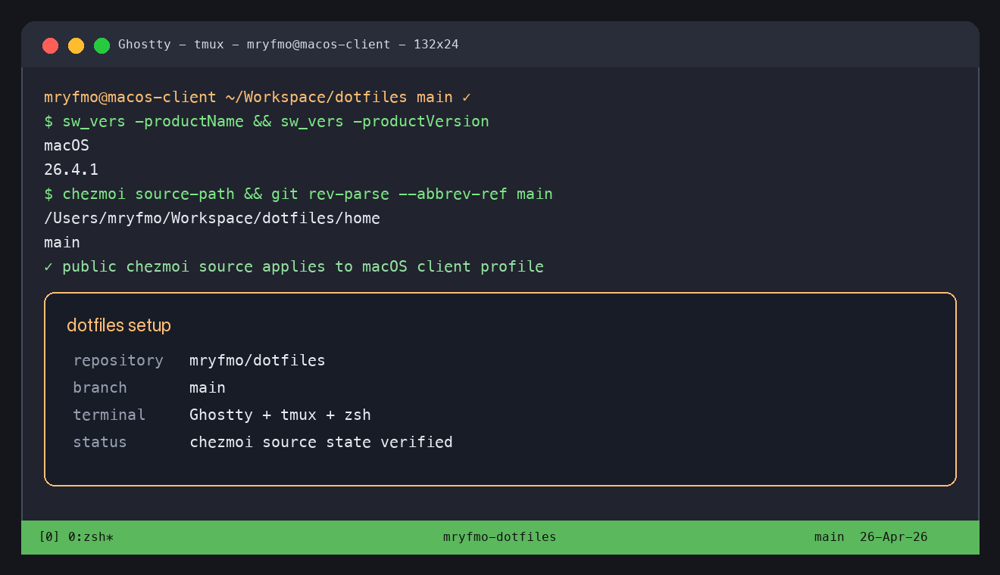
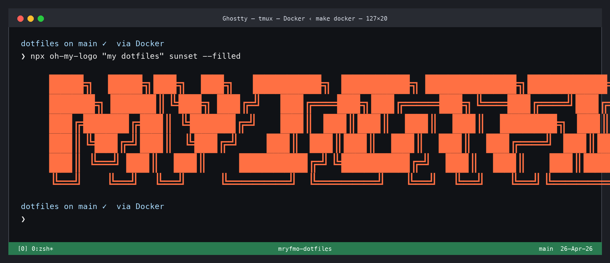

<div align="center">
    
    <h1>📂 dotfiles</h1>
</div>

<div align="center">

[](https://github.com/mryfmo/dotfiles/actions/workflows/remote.yaml)
[](https://github.com/mryfmo/dotfiles/actions/workflows/test.yaml)
[](https://codecov.io/gh/mryfmo/dotfiles)

[](https://github.com/zsh-users/zsh)
[](https://github.com/rossmacarthur/sheldon)
[](https://github.com/starship/starship)
[](https://github.com/jdx/mise)

[](https://github.com/anthropics/claude-code)
[](https://github.com/openai/codex)

</div>

## 🗿 Overview

This [dotfiles](https://github.com/mryfmo/dotfiles) repository is managed with [`chezmoi🏠`](https://www.chezmoi.io/), a great dotfiles manager.
The setup scripts are aimed for [MacOS](https://www.apple.com/jp/macos), [Ubuntu Desktop](https://ubuntu.com/desktop), and [Ubuntu Server](https://ubuntu.com/server). The first two (MacOS/Ubuntu Desktop) include settings for `client` machines and the latter one (Ubuntu Server) for `server` machines.

The actual dotfiles exist under the [`home`](https://github.com/mryfmo/dotfiles/tree/main/home) directory specified in the [`.chezmoiroot`](https://github.com/mryfmo/dotfiles/blob/main/.chezmoiroot).
See [.chezmoiroot - chezmoi](https://www.chezmoi.io/reference/special-files-and-directories/chezmoiroot/) more detail on the setting.

## 📥 Setup

To set up the dotfiles run the appropriate snippet in the terminal.

### 💻 `MacOS` [](https://github.com/mryfmo/dotfiles/actions/workflows/macos.yaml)

- Configuration snippet of the Apple Silicon MacOS environment for client macnine:

```console
bash -c "$(curl -fsLS https://raw.githubusercontent.com/mryfmo/dotfiles/main/setup.sh)"
```



On CI runners (`CI=true`), the Homebrew installer (`install/macos/common/brew.sh`) also handles the third-party taps that the runner image ships untrusted, so that `brew install` does not warn about them; outside CI it leaves your taps alone.

### 🖥️ `Ubuntu` [](https://github.com/mryfmo/dotfiles/actions/workflows/ubuntu.yaml)

- Configuration snippet of the Ubuntu environment for both client and server machine:

```console
bash -c "$(wget -qO - https://raw.githubusercontent.com/mryfmo/dotfiles/main/setup.sh)"
```



On a fresh machine, enter the age passphrase only when the interactive prompt appears; GitHub authentication is intentionally deferred, so run `setup-gh` after the public apply. The next `make update` installs the configured GitHub CLI extensions. On Ubuntu Desktop, add **Japanese (Mozc)** under **Settings → Keyboard → Input Sources** after installation. Ubuntu clients use zsh from the next login; run `exec zsh` to switch the current terminal immediately.

### Minimal setup

The following is a minimal setup command to install chezmoi and my dotfiles from the github repository on a new empty machine:

> sh -c "$(curl -fsLS get.chezmoi.io)" -- init mryfmo --apply

## ⚙️ Install & Setup Application Individually

This repository provides for the installation and setup of each application individually.
The desired application can be installed as follows (e.g., docker installation on MacOS):

```shell
bash install/macos/common/docker.sh
```

Each installation script can be found under the [`./install`](https://github.com/mryfmo/dotfiles/tree/main/install) directory.

### Remote shells with mosh

`mosh` is installed on both Ubuntu (apt) and macOS (Homebrew) by the common
dependency scripts. Over Tailscale, mosh's UDP ports 60000-61000 stay inside
the tailnet, so this repository adds no firewall rule. `mosh user@host` starts
`mosh-server` through a non-interactive SSH command, and `~/.zshenv` puts the
Homebrew and local bin directories on `PATH` for exactly that case. The UTF-8
locale that `mosh-server` needs comes from `install/ubuntu/common/setup_locale.sh`.
A host that runs its own firewall (for example ufw) must allow that UDP range on
its Tailscale interface.

### Private credentials and keys

This public repository intentionally does not store machine-specific secrets such as SSH private keys, GnuPG secret keyrings, or VPN credentials. Private state belongs in the separate `mryfmo/dotfiles-private` chezmoi source or should be generated on the target machine.

After applying the public dotfiles, use the following explicit setup helpers when private state was not restored:

```shell
setup-gh                 # create or reuse ~/.ssh/id_ed25519(.pub), then register the public key with GitHub
setup-gpg                # create a GnuPG secret key interactively when no local secret key exists
provision-machine-key    # generate ~/.ssh/id_ed25519(.pub) non-interactively, then print the gh ssh-key add commands
```

VPN credentials such as AnyConnect profiles are not generated by the public installer. Add them to the private chezmoi source only when they are still needed on the target machine.

With `commit.gpgsign = true` (the default), commits fail on a fresh machine until the signing key is registered with GitHub. Run `provision-machine-key` to generate the key and print the exact `gh ssh-key add ... --type authentication|signing` commands for the operator's account; `scripts/check-tools.sh` also warns when the key is missing.

## 📚 Documentation

This repository can generate a temporary MkDocs site from the shell-based setup assets.
The generated Markdown lives under `docs/reference/`, `docs/index.md` is regenerated as a landing page, `docs/catalog.md` is regenerated as the full catalog, and internal Codex working notes live under `.agents/worklog/` so they are not published.

```shell
make docs
make serve
make serve PORT=8001
make deploy
```

- `make docs`: generate Markdown with `shdoc` (falling back to source-based pages when needed) and rebuild the site.
- `make serve`: preview the generated site locally with MkDocs on `127.0.0.1:8000` by default.
- `make serve PORT=8001`: preview the site on a different local port when `8000` is already in use.
- `make deploy`: publish the current generated site to the `gh-pages` branch.

## 🛠️ Update & Test 🧪

Updating and testing the dotfiles follows [chezmoi's daily operations](https://www.chezmoi.io/user-guide/daily-operations/).
To verify that the updated scripts work correctly, run the scripts on the actual local machine and on the docker container.

### Lifecycle

The public lifecycle has four entry points: `setup`, `update`, `doctor`, and `upgrade`.
The bootstrap path and the upgrade path are intentionally separate.
`setup.sh` prepares a machine for dotfiles management and runs `chezmoi apply`, but it must not upgrade already-installed tools just because the bootstrap command was re-run.
Use the explicit lifecycle commands below instead:

```shell
# First-time remote bootstrap from any directory. On a clean machine this
# clones the repository into chezmoi's sourceDir, usually ~/.local/share/chezmoi.
# If ~/.config/chezmoi/chezmoi.yaml already defines sourceDir, setup.sh reuses
# that configured source directory instead of creating ~/.local/share/chezmoi.
bash -c "$(curl -fsLS https://raw.githubusercontent.com/mryfmo/dotfiles/main/setup.sh)"

# Makefile lifecycle commands must run from the repository root, not from $HOME.
# Because .chezmoiroot is "home", chezmoi source-path points at the managed
# source subtree, for example ~/.local/share/chezmoi/home. Use git to move back
# to the repository root that contains Makefile, regardless of the configured
# sourceDir.
cd "$(git -C "$(chezmoi source-path)" rev-parse --show-toplevel)"

# Pull and apply the repository, update installed tools to the latest safe
# versions, and refresh agent assets.
make update
# Include operating-system package upgrades such as apt when you want them:
make update SYSTEM=1

# Inspect the current tool state without modifying it.
make doctor
```

`SYSTEM=1`, `SYSTEM=true`, and `SYSTEM=yes` enable operating-system package
upgrades. Other values, including `SYSTEM=0`, keep `make update` in user-level
tooling mode.

**Tool versions.** No tool version is committed. `home/dot_mise/config.toml`
requests `"latest"` for every tool not held back (below) and there is no
`mise.lock`, so `make update` moves each installed tool to the newest release
its manager allows and changes no file in the repository. The safety comes from
each manager's own features. mise skips releases younger than
`minimum_release_age = "72h"` ("Skip versions published more recently than this
duration or date", [mise settings](https://mise.jdx.dev/configuration/settings)):
72 hours goes past the 24-hour default of mise and pnpm and past pnpm's "In most
cases, malicious releases are discovered and removed from the registry within
an hour", but stops short of the several days over which the Shai-Hulud worm
re-infected packages in waves, because a longer delay also holds back security
fixes. mise also keeps its default-on verification settings `aqua.cosign`,
`aqua.minisign`, `aqua.slsa`, `aqua.github_attestations`, `github_attestations`
and `node.verify`, which need no lockfile, and `mise upgrade` without `--bump`
"keeps the range specified in mise.toml"
([mise upgrade](https://mise.jdx.dev/cli/upgrade)), so a held exact version
stays exact. Per the settings page the cooldown covers every backend this
config uses except `http:` (`bats` and `gcloud`, which are exact anyway); a live
probe on 2026-10-09 showed the setting acting on core `node` (26.11.1 without
it, 26.10.0 with it). `mise self-update` waits the same 72 hours through
`self_update.minimum_release_age = "72h"` (its own default is 24h), and Codex
and Claude Code follow the same cooldown. A `node` major bump can leave `npm:`
tool installs invalid until `mise install` reruns, so when an upgrade moves
`node`, `make update` reinstalls the `npm:` tools on it (`mise install --force`).
`mise self-update --no-plugins` leaves installed mise plugins such as `shdoc`
alone, because a plugin update is a branch move the cooldown does not cover;
run `mise plugins update` when you want one.
Homebrew bottles are verified against
their build attestations (`HOMEBREW_VERIFY_ATTESTATIONS=1`) when `gh` is
present. Homebrew, `uv tool upgrade --all` and GitHub CLI extensions take their
newest release, and apt (`SYSTEM=1`) the distribution's. The trade-off: with no
exact pins and no committed lock, machines may differ in tool versions, and CI
tests the latest safe versions rather than one recorded set. Because the
applied file is mise's global config, it no longer turns on lockfile mode for
other projects on the host; a project that keeps its own `mise.lock` sets
`lockfile` in its own config. The release-asset installers (the mise bootstrap,
aws-cli, tode, terminal-browser, Crit, Zed, the chezmoi bootstrap and agmsg)
keep their manifest pins until T119 moves them to the same policy.

**Holding a tool back** uses the manager's own feature:

- mise: an exact version in `home/dot_mise/config.toml` with a one-line reason
  (today `fd`, `npm:pnpm`, and the `http:` tools `bats` and `gcloud`);
- Homebrew: `brew pin <formula>`;
- uv: `uv tool install <package>==<version>`;
- apt: `sudo apt-mark hold <package>`.

The **operator phase** is the interactive part, run once per machine:
`./setup.sh` (chezmoi init prompts, the age passphrase, the sudo keepalive, the
macOS Command Line Tools prompt, Ubuntu `chsh`, the SSH, `gh` and Codex logins,
and the `run_once_*` scripts), plus `sudo -v` right before `make update` when
the pulled diff touches `install/**` or `.chezmoiscripts/**`, and with
`SYSTEM=1`. Everything after
it is unattended: `make update` never prompts, except that a Homebrew cask
whose upgrade runs an installer package can ask for the sudo password.

`make update` applies all committed public and private chezmoi state, including
scripts. Chezmoi records each `run_once` content hash, so new or changed
one-time installers run once while unchanged installers stay skipped. Before
applying, `make update` runs
`git pull --ff-only` only when the checkout is on `main`, tracks `origin/main`,
and has no staged or unstaged tracked-file changes. Otherwise it prints the
reason and the exact manual `git -C <repo> pull` command, then continues with
the local source; a failed fast-forward pull also warns and continues. The
pull runs first, in its own step, and a second `make` (`update-tree`) runs the
rest from the Makefile it fetched, so a recipe change lands in the same run. On
a host whose clone predates this split, the first `make update` would still run
the old recipe; run `git -C <clone> pull && make -C <clone> update` once instead.
`chezmoi apply` refuses a source tree whose `home/`, `install/` or `scripts/`
differ from the last-fetched `origin/main`, through uncommitted, unmerged,
unpushed or not yet pulled changes (override `CHEZMOI_ALLOW_DIRTY_SOURCE=1`), so
changes reach the host only through a merged pull request; git-ignored untracked
files are not checked. `make update` then runs `scripts/upgrade-tools.sh`, which
installs missing mise tools and upgrades outdated ones from the applied
`~/.config/mise/config.toml`, then Homebrew packages, uv tools and GitHub CLI
extensions (apt with `SYSTEM=1`); it exits 0 without changes when `CI=true`.
The network-only phases (Homebrew, `mise self-update`, uv tools, GitHub CLI
extensions) only warn when they fail, so an offline host with its tools
installed still converges; `make update` stops before the asset refresh only
when a declared mise tool cannot be installed, or apt fails with `SYSTEM=1`.
`make apply` is the same target.
The asset refresh also converges configured GitHub CLI extensions, syncs the
vendored CompactionDB tree, and updates the pinned agmsg skill in place
(see [agmsg](#agmsg); its `teams`/`db`/`run` runtime state is backed up first
and must come through unchanged). It then reloads a
running Herdr server, skips reload
when the server is reported as not running or the command is unavailable, and
fails on reload errors other than `protocol_mismatch`. When the server status
cannot be read or is unknown, it prints
`Herdr server unreachable; skipping config reload.` and continues. A
protocol mismatch after updating Herdr prints instructions to stop and restart
the server (or recreate the Ghostty session), then continues successfully; run
`herdr server reload-config` manually after restarting. Finally,
`make agmsg-bootstrap` converges repository-scoped agent message delivery hooks.

Weekly model-usage measurement is informational and never changes
`model_profiles`. Capture or report usage manually with:

```shell
make usage-snapshot
make usage-report
```

On macOS, chezmoi manages a LaunchAgent that runs both targets every Monday at
09:00 and writes stdout/stderr to
`~/.config/dotfiles/usage-review.log`. After `make update`, load it once:

```shell
launchctl bootstrap gui/$(id -u) \
  ~/Library/LaunchAgents/com.mryfmo.dotfiles.usage-snapshot.plist
```

Usage reports only surface +7d/+14d review reminders and model-share evidence.
Any model-profile decision still requires manual quality review and a PR.

### Agent review and permission assets

`make update` also refreshes agent-managed assets, configured GitHub CLI
extensions, and the vendored CompactionDB tree after `chezmoi apply`.
The generated `create_marketplace.json` seeds `~/.agents/plugins/marketplace.json`
only when it is missing; plugin runtimes own later content and mode changes.
This includes the Crit integrations, the Ponytail (`ponytail@ponytail`) plugin,
and the Understand-Anything (`understand-anything@understand-anything`)
knowledge-graph plugin for Codex and Claude Code. Understand-Anything installs
from the `Egonex-AI/Understand-Anything` marketplace for Claude Code and via
the upstream installer for Codex, pinned to a reviewed commit and verified by
sha256 before execution (bump both constants together in
`scripts/update-agent-assets.sh` to take upstream installer updates). The
installer clones `~/.understand-anything/repo` and symlinks its skills into
`~/.agents/skills` (expected unmanaged-skill WARNs in `make doctor`, one per
linked skill); Codex runtime files are provisioned from the version-matched Claude release artifact when available.
`make update` also builds the plugin's `packages/core` with the mise-pinned
`npm:pnpm` (run through `mise exec`, which installs the pin on demand) when
its `dist/index.js` is missing or older than any file under
`packages/core/src` or the root `pnpm-lock.yaml` (in the release artifact, or
in the Codex clone without one), so the plugin's graph helpers run, and
`make doctor` warns under the same rule, so `make update` repairs what it reports.
This repository refreshes `.ua/` only by a full rebuild (`/understand --full`),
run by a worker task when the operator asks for it at a regime boundary.
Incremental updates cannot publish here: plugin 2.9.7's symbol gate
(`validate-incremental-symbols.mjs`) marks every unowned function `unknown` in
files without a deterministic parser, namely the extension-less shell scripts
`executable_herdr-agents` and `executable_agmsg-dispatch` and the Python
chezmoi script `modify_private_settings.json`. The plugin has no per-path
language override, and `herdr-agents` changes in nearly every task.
`.ua/config.json` therefore sets `autoUpdate: false`, which stops the plugin's
SessionStart and PostToolUse update prompts. Between rebuilds the graph is
stale by design, and agents fall back to grep under the freshness check.
A `.ua/` refresh is accepted only when `ua-symbol-coverage` (installed on PATH
from `home/dot_local/bin/common/executable_ua-symbol-coverage`), run with
`--repo-ref` and `--old-ref` set to the revisions the new and previous graphs
were built from (so renames are told apart from deletions), shows no
unexplained per-file function/class regressions against the previous graph
(`home/dot_config/claude/rules/understand-anything.md`).
Plugin 2.9.7 has two known coverage gaps: `merge-batch-graphs.py` drops
`tested_by` edges from `.bats` tests and from non-`file:` production nodes, and
`extract-structure.mjs` misses shell functions with a subshell body. A full
rebuild therefore under-reports test coverage until upstream fixes land.

Crit itself is installed on both Linux and macOS from the pinned amd64/arm64
GitHub release binary for the matching OS, after SHA-256 verification. All
four checksums and the version are declared under `assets.crit` in
`home/dot_agents/agent-config.yaml`, rendered into
`scripts/lib/installer-pins.sh`, and changed with `generate-agent-configs.py --set-asset`. Lifecycle
checks on both platforms inspect the authoritative `~/.local/bin/crit`
directly, prepend `~/.local/bin` to `PATH`, and run `hash -r` so an older
ambient Crit cannot shadow it. If that managed binary is missing, `REPAIR=1
make doctor` can restore it.

The zenbu-labs terminal tools — terminal-code (`tode`) and `terminal-browser` —
install through their sha256-verified upstream curl installers, pinned by
version and installer checksum under `assets:` (rendered into
`scripts/lib/installer-pins.sh`).
`make update` converges both tools to the pinned versions; a pin changes only
in `assets:` (see Asset manifest below).
terminal-browser links its bundled agent skills into `~/.agents/skills`
(expected unmanaged-skill WARNs in `make doctor`, tracked by its
`~/.local/state/terminal-browser/skills.links` receipt), and its editor setup
is always skipped in lifecycle runs — run `terminal-browser setup` once
manually if wanted.

Model selection is governed by `model_profiles` in
`home/dot_agents/agent-config.yaml`, the single place where model IDs and
efforts live. The generator renders the interactive profile into the managed
Claude settings and Codex config, one `~/.codex/<profile>.config.toml` file per
profile for `codex --profile <name>`, `~/.agents/model-profiles.env` for the
launchers, and the low-cost `express-explorer` Claude subagent.
`make render-check` runs `uv run --with pyyaml scripts/generate-agent-configs.py
--check` to confirm every rendered file matches the manifest; tasks and docs
name that one command, since a bare `python3` run fails without PyYAML.

Agent work runs as a three-role constellation. The orchestrator uses the
`deep` profile (Claude `claude-fable-5-1`, high effort, advisor fable) to
author tasks, review results, and own acceptance. The worker uses the
`standard` profile (Claude `claude-opus-5-5` at xhigh effort, or Codex
`gpt-6.1-sol` at high) to implement one task at a time. The auditor uses the
`audit` profile (Codex `gpt-6-astra`, xhigh reasoning effort, read-only
sandbox)
for one independent task-level audit of each final head, run as the agmsg-orchestration SKILL's task-level audit bullet describes. The responsibility
boundaries live in `home/dot_config/claude/rules/model-selection.md`,
`home/dot_config/claude/rules/agmsg-orchestration.md`, and the `## Audit`
section of `AGENTS.md`. Neither Codex model needs API-key authentication: both
answered under the ChatGPT login (probe 2026-10-05). Both xhigh settings
answered on 2026-10-09: the Codex audit probe under the ChatGPT login, the
Claude worker probe under the Anthropic login.

On Ubuntu 24.04 and later, `kernel.apparmor_restrict_unprivileged_userns=1`
stops `/usr/bin/bwrap` from creating the user namespaces that sandboxed Codex
runs need. Rather than relaxing that sysctl globally, `chezmoi apply` installs
the `bwrap-userns` AppArmor profile
(`install/ubuntu/common/apparmor/bwrap-userns`, loaded by
`install/ubuntu/common/apparmor_userns.sh` with `sudo -n`), and `make doctor`
probes `bwrap` to confirm it works. Without cached sudo credentials the
installer never prompts: it leaves the profile pending, and `make doctor`
reports it missing. Install it with
`sudo -v && bash install/ubuntu/common/apparmor_userns.sh` from the repository
root; `make update` does not retry it. To remove it, run
`sudo apparmor_parser -R /etc/apparmor.d/bwrap-userns` and then
`sudo rm /etc/apparmor.d/bwrap-userns`.

`permgate` handles Claude Code and Codex PermissionRequest hooks from the
repo-owned policy at `~/.agents/permgate-policy.yaml` and is deterministic
only: deny patterns run first, then allow patterns for single, bounded
commands. Every other request, including unconstrained reads and searches,
writes such as `apply_patch`, and any policy or input failure, falls through
to the agent's native prompt. permgate runs no classifier model. The audit
JSONL records each decision with an input hash and a command summary, never
payload values. ccgate is fully removed.

The intended lifecycle is:

```shell
# Apply ~/.codex, ~/.claude, ~/.config/mise, and agent rule files.
make update

# Ponytail is installed from the upstream marketplace.
# Claude Code and Codex use DietrichGebert/ponytail as the marketplace source.
# make update also trusts the Ponytail lifecycle hooks it installs (see the
# hook trust paragraph below), so no /hooks step is needed for them.

# A fresh Codex install needs authentication before its OpenAI-curated catalog
# is available. If Superpowers is skipped, complete these commands:
codex login
codex plugin add superpowers@openai-curated

# Before an agent reports completion with a dirty diff, run the review guard.
# It only requires review for meaningful changes such as agent lifecycle,
# hooks, plugins, permissions, scripts, or broad diffs.
make require-crit-review
# After the active agent reads Crit data, save the JSON evidence in the repo,
# write a receipt, and rerun with its path. The receipt must include
# review_surface, reviewer, review_source, and review_outcome fields.
AGENT_REVIEWED=1 REVIEW_EVIDENCE=.agents/worklog/codex/review/<id>.md make require-crit-review
# Use this only after an explicit Crit web review was requested and completed:
CRIT_REVIEWED=1 REVIEW_EVIDENCE=.agents/worklog/codex/review/<id>.md make require-crit-review
# Only use this explicit escape hatch when the user disables review.
CRIT_REVIEW=off make require-crit-review
# PR integration adds BASE, PR_FEEDBACK_EVIDENCE and AUDIT_EVIDENCE as the
# agmsg-orchestration SKILL's Orchestrator Playbook step 10 gives them (see below).
```

Codex runs a hook from `~/.codex/config.toml` or a plugin only when
`[hooks.state]` holds the trust hash of its current definition. `make update`
deploys that trust. `codex.hooks.state` in `home/dot_agents/agent-config.yaml`
declares the hooks this repository ships or installs: the four config hooks
(the three CompactionDB hooks `PreCompact`, `PostCompact` and `SessionEnd`,
which run `contextdb-codex-notify`, and the permgate `PermissionRequest` hook)
plus the Crit and Ponytail plugin hooks. The Codex modify scripts hash each
declared hook at apply time with Codex's own algorithm: a config hook from its
manifest definition embedded in the modify script, a plugin hook from the
installed plugin file under `~/.codex/plugins/cache/`. The result replaces any
existing entry for that key, and keys the manifest does not declare are kept.
Config-hook trust follows the manifest definition, so a hook hand-edited in
`~/.codex/config.toml` deliberately stops matching and stays untrusted. As its
last step, after every plugin update, `scripts/update-agent-assets.sh`
re-applies only the Codex config files (`make codex-hook-trust` runs the same
step on its own), so a plugin whose hooks changed in the same `make update` is
trusted at once.
A hook anyone else writes into `config.toml` or a plugin stays untrusted until
you review and trust it in `/hooks`. For a plugin, trusting the installed
content means a plugin upgrade by `make update` is trusted by the same
`make update`. When a plugin's hook file is missing, the manifest's pinned
`trusted_hash` is used and the apply prints a warning.

### Claude Code sandbox

`claude.sandbox` in `home/dot_agents/agent-config.yaml` renders the `sandbox`
block of the managed Claude settings, the counterpart of the Codex
`workspace-write` sandbox. Bash commands, their child processes, and subagent
Bash calls may write only the working directory, the session `$TMPDIR`, and
`sandbox.filesystem.allowWrite`, which the generator renders from
`codex.sandbox_workspace_write.writable_roots` so both agents share one list of
agmsg store directories, followed by `claude.sandbox.filesystem.extra_allow_write`
(currently only `~/.cache/uv`, so `uv run` targets such as `make unit-test`
work from sandboxed Bash). Network access from sandboxed commands is limited to
the GitHub hosts in `sandbox.network.allowedDomains`; other hosts prompt.
`sandbox.network.allowUnixSockets` lists the herdr socket
(`~/.config/herdr/herdr.sock`). Claude Code honours that list only on macOS and
ignores it on Linux and WSL2. The Claude messaging socket is a per-process path
set at runtime (`CLAUDE_CODE_MESSAGING_SOCKET`), so it cannot be listed.
Because Linux and WSL2 ignore that list (the seccomp filter cannot inspect
socket paths), `herdr`, `herdr-agents` and `gh` (which reads its token from
the keyring over D-Bus) run through the normal unsandboxed retry prompt on
Linux. `sandbox.excludedCommands` lists only `agmsg-dispatch`, which inserts one
agmsg row and sends a herdr wake: from sandboxed Bash the herdr socket is
denied, and outside the sandbox it delivered the T49 messages within seconds, so
a Claude worker wakes a herdr-paned orchestrator without a failed sandboxed run.
Claude Code matches an excluded entry against the command's first word and still
applies its permission rules to it, so the managed settings also allow
`Bash(agmsg-dispatch:*)` and the dispatch runs without a prompt. That is the
first and only managed `permissions.allow` entry: every Claude session using the
managed settings can run `agmsg-dispatch` without confirmation. Codex workers
run under Codex's own sandbox and are not affected. `sandbox.network.allowAllUnixSockets` is deliberately not
used: on a workstation with a `docker`-group user or a reachable
`systemd --user` bus it turns the auto-approved sandbox into an escape (see the
upstream [security limitations](https://code.claude.com/docs/en/sandboxing#security-limitations)).
`failIfUnavailable` is `false` for the first rollout stage: when the sandbox
cannot start, Claude Code warns and runs commands unsandboxed. A later change
flips it to `true` after live end-to-end verification.
`autoAllowBashIfSandboxed` skips the bare Bash prompt for sandboxed
commands, while deny rules and content-scoped ask rules such as
`Bash(git push:*)` still apply. A command that fails under the sandbox can
still be retried unsandboxed through the normal permission prompt.

On Ubuntu, `make update` installs `bubblewrap` and `socat`. On Ubuntu 24.04
and later, the user-namespace restriction is handled by the `bwrap-userns`
AppArmor profile described in "Agent review and permission assets" above; no
separate `bwrap` profile is installed. `make doctor` reports `bwrap` and
`socat` under "Claude Code sandbox" as found or as optional warnings. macOS
needs nothing because the sandbox uses Seatbelt.

Operator-visible effect: after the next `make update`, Claude Code Bash
commands run confined to the working directory, the session `$TMPDIR`, and
`allowWrite` (the agmsg store directories and the uv cache). On Linux,
commands that need a local Unix socket (herdr, the `gh` keyring) fail inside
the sandbox and go through the unsandboxed retry prompt. Network hosts
other than the listed GitHub domains prompt. A command that fails inside the
sandbox may be retried unsandboxed after a normal permission prompt. Missing
`bwrap` or `socat` only warns while `failIfUnavailable` is `false`.

Nested worktrees under `.claude/worktrees/` stay writable. From the main
checkout they are subdirectories of the working directory and are not among
the sandbox-protected `.claude` settings, skills, agents, commands, or hooks
paths. A session started inside a linked worktree may also write the main
repository's shared `.git` directory, except its `hooks/` and `config`.

Plan mode is the exception to auto-allow: sandboxed commands still prompt there.
Sandbox denials appear in the blocked command's result, naming the path or
host; run `/sandbox` and open the Config tab to see the effective write paths,
domains, and protected paths.

### agmsg

agmsg is installed by its upstream installer at a pinned release, never
vendored. `assets.agmsg` in `home/dot_agents/agent-config.yaml` records the
release (`pin: "1.5.0"`), its tag (`ref: v1.5.0`), the tag's commit
(`ref_commit`), the sha256 of GitHub's source archive for that commit, and the
npm `bootstrap_integrity` of `agmsg@<pin>`. `make update` runs `update_agmsg`
in `scripts/update-agent-assets.sh` whenever `~/.agents/skills/agmsg/VERSION`
differs from the pin or the upstream `.agmsg` marker is missing:

- It downloads the archive for `ref_commit`, verifies its sha256, and runs that
  tree's own `install.sh`: `--update` only when the `.agmsg` marker exists,
  otherwise the plain installer. The marker-less directory left by the old
  vendored copy therefore takes the plain installer, which upstream `--update`
  refuses ("Not installed").
- Before the installer runs, it copies `teams/`, `db/`, `run/`, and `agents/`
  to `~/.agents/backups/agmsg-state-<UTC time>/` as the rollback.
- Afterwards, every file that existed under `teams/`, and `db/messages.db`,
  must be byte-identical. The installer may add files, for example create a
  missing `messages.db`. `VERSION` must equal the pin.
- `run/` changes are only reported: live watchers, and the sync-engine
  restart that `--update` performs, rewrite it by design.
- A failure says what failed. A live-state failure also lists the changed
  files and the path of the copy; failures before the installer runs say
  that nothing was installed.
- Remove old copies with `rm -rf ~/.agents/backups/agmsg-state-*`.
- `npx agmsg@<pin>` installs the same tag but clones it without any checksum,
  which is why the lifecycle verifies the archive instead.
- `install.sh --update` makes in-flight `watch.sh` watchers stand down on
  their own. After `make update`, restart running agent sessions to bring
  delivery back. Re-run `delivery.sh set <mode> <type> <project>` where a
  project's hooks were dropped, and check with `delivery.sh status <type>
<project>`. The upstream installer prints both steps (#133).

chezmoi no longer manages anything under `~/.agents/skills/agmsg`.
`home/.chezmoiremove` retires the old `~/.claude/skills/agmsg/**` symlink farm,
which pointed into the deleted vendored tree; upstream never installs that
path. `~/.claude/commands/agmsg.md` is upstream's own rendered command. The
old chezmoi symlink there dangles until the first install replaces it (the
installer renders to a temp file and `mv -f`s it over the link). It is
therefore not in `.chezmoiremove`, which would delete upstream's file on
every apply. `validate-agent-assets` enforces all of this.

Delivery: Claude Code seats use `both`; the keep-alive rule for a Claude
worker's Monitor watch is in the agmsg-orchestration SKILL ("Identity,
delivery, and storage"). Codex
seats use `turn`, not upstream's shim-based `monitor` bridge, while its
defects #149, #151, and #1236 stay open.

Registration: upstream project resolution
([#92](https://github.com/fujibee/agmsg/issues/92), `docs/design.md` "Project
resolution") lets `join.sh`, `whoami.sh`, `actas-claim.sh`, `reset.sh`, and
`watch.sh` rewrite a path. It tries three signals in order: the live
SessionStart marker `run/proj.<agent_pid>.project`, then the nearest
registered ancestor, then the registered main checkout via
`git rev-parse --git-common-dir`. `identities.sh` stays an exact lookup.
Register a worker at its own worktree with
`AGMSG_RESOLVE_PROJECT=0 join.sh <team> <name> <type> <worktree>`, and point
`delivery.sh set <mode> <type> <worktree>` at the same path.

Verified against a scratch v1.5.0 install:

- Without the opt-out, a `join.sh` from inside `.claude/worktrees/<x>`
  registers at the main checkout.
- A seat launched from the main path carries a marker that names the main
  checkout. For that seat, `whoami.sh` inside the worktree answers with the
  main checkout's identities.
- The opt-out restores the worktree in both cases.
- `session-start.sh` exits before starting a watcher or writing a marker for
  any session whose cwd is under `.claude/worktrees/` (#367). A Claude seat
  launched inside a nested worktree therefore gets no Monitor watch from that
  hook: a worker seated with `--add-worker` starts its own Monitor through its
  actas boot prompt and gets turn delivery through its own Stop hook.

Wake and send:

- Wake a worker in a `herdr-agents` pane with `agmsg-dispatch <team> <from>
<to> <pane_id> "<message>"`. It sends, sends a generic inbox wake, and waits
  for `read_at`, using upstream `lib/validate.sh` and `lib/storage.sh` plus a
  strict identifier grammar. It stays the sanctioned path until worker seating
  writes placement records at launch. `poke.sh` exits 1 with "no placement
  record" for a hand-joined member. A `herdr-agents` worker gets a record
  only once it acts from its own pane: upstream `send.sh` and `inbox.sh`
  record the acting pane (#1109). Until then, poke cannot reach it.
- Wake a spawn-seated member (`team.sh <team> --json` shows its pane) with
  `poke.sh <team> <name> --body-file <path>`.
- Reach a pane-less member with `send.sh <team> <from> <to> --body-file
<path>`.
- Pass `send.sh`/`poke.sh` bodies with `--body-file`, since a positional body
  passes through the caller's shell (#378). `agmsg-dispatch` is the one
  exception: it takes a single-line, shell-safe positional message.

`poke.sh` exit codes:

- 10: terminal unreachable.
- 12: pane gone.
- 14/15: refused to type over a changing or unlocatable input box.
- 13: no poke path for this pane, and nothing was delivered. The message says
  why: it names the native channel (a claude-code target from a claude-code
  caller), tells the caller to claim its own identity first, or reports that
  poke's own message fallback failed. Never retry a 13 as `send.sh`.

Health checks are read-only: `team.sh <team> --json`, `doctor.sh --project
<p>`, `peek.sh <team>`, and `delivery.sh status <type> <project>`.

### Codex orchestration without a pane

After selecting the Codex orchestrator in the agent manifest and deploying its
generated `~/.agents/model-profiles.env`, run from the main checkout root:

```bash
codex-orchestrate --max-turns 40 --timeout 1800 --team dotfiles "<operator task>"
```

The launcher requires the generated `HERDR_AGENTS_ORCHESTRATOR_KIND=codex` and
takes its interactive Codex arguments from that same file. It temporarily
exchanges the main checkout's Claude orchestrator registrations for
`codex-<interactive-profile>-<project-suffix>`, preserving worker registrations.
It configures agmsg `turn` delivery for Codex before the first invocation. On
normal exit, failure, or INT/TERM, it restores the exchanged Claude registrations
and their `both` delivery mode. The Codex project delivery setting remains `turn`.
The replacement Codex identity joins every team whose Claude registration was
exchanged. An existing matching Codex seat keeps its original memberships;
any memberships added for the exchange are removed on exit. `--team` selects
only the inbox to poll (required when several teams are available). Memberships
in other teams let workers address the seat, but this loop does not read those
inboxes; route results needed by this run to the selected team. A different Codex
identity at this checkout, or the target name registered at another project in
any local team, is refused before the exchange. The launcher uses Python 3 to
read registration metadata without inspecting panes. The exchange uses
project/type-scoped agmsg resets; registrations in other projects or runtimes stay
intact. Stop the current
orchestrator before launching; do not run another Codex session in that checkout
while this loop uses `exec resume --last`.

The first turn receives `herdr-agents --directive`, the operator task, and an
explicit instruction to finish completed orchestration with the line
`ORCHESTRATION-DONE` or otherwise wait for the next delivery. Workers
reply through the pane-less convention:

```bash
bash ~/.agents/skills/agmsg/scripts/send.sh <team> <worker> <codex-orchestrator-name> --body-file <result-file>
```

The launcher checks the quiet inbox immediately, then every 15 seconds, and
resumes on delivered text. It exits successfully only when the final non-blank
line of the last message is exactly `ORCHESTRATION-DONE`; reaching the turn limit exits 2, and an idle inbox timeout
exits 124. The timeout bounds inbox waiting, not a running Codex turn. Both the
initial prompt and resume bodies go through stdin, so large deliveries do not
hit the command-line argument size limit.

Raw prompts, final messages, and Codex stdout/stderr stay in a new mode-0700
`${XDG_STATE_HOME:-$HOME/.local/state}/codex-orchestrate/<date>-<n>/` directory
(files use mode 0600). These private files remain after exit. The launcher
canonicalizes the state path and refuses locations beneath the repository,
`~/.agents/skills/agmsg`, or `${TMPDIR:-/tmp}`. This relies on the managed Codex
writable roots: an operator who adds `~/.local/state` (or their custom state
location) to Codex's writable roots re-exposes the transcripts. The launcher
does not resolve custom Codex permission overrides.

The repository file `.orchestration/validation/codex-orchestrate-<date>-<n>.md`
contains only turn numbers, timestamps, exit codes, prompt/final byte counts,
completion-marker status and private file paths. No prompt, final message or
`.last.md` file is published there. Each run increments `<n>`.

Before reading identities, the launcher acquires a private directory lock at
`…/codex-orchestrate/locks/<sha256-of-canonical-repository-path>/`.
Before any reset, it saves exchanged Claude registrations and original Codex
memberships in `…/codex-orchestrate/<date>-<n>/registrations.tsv`
(`team`, `name`, `type`, `project` columns). The adjacent `context.txt` records
the repository, lock path, selected team, Codex identity, original memberships,
and restoration outcome. Both files remain for recovery, outside the child
writable roots under the same assumption as the raw transcripts. No launcher
lock or recovery snapshot is stored in the repository or agmsg/run.

A failed restoration retains the private lock. After an uncatchable termination
or restoration failure, confirm the launcher has stopped and inspect that run's
snapshot. Reset its Codex registration with
`AGMSG_RESOLVE_PROJECT=0 bash ~/.agents/skills/agmsg/scripts/reset.sh <repo> codex <name>`,
then re-join every TSV row, including original Codex memberships, with
`AGMSG_RESOLVE_PROJECT=0 bash ~/.agents/skills/agmsg/scripts/join.sh <team> <name> <type> <project>`.
If Claude rows were restored, also run
`bash ~/.agents/skills/agmsg/scripts/delivery.sh set both claude-code <repo>`.
Remove the lock named in `context.txt` only after restoring registrations and
delivery. A preflight failure before any exchange creates no recovery snapshot;
a lock left at that stage can be removed after confirming its launcher stopped.

`CODEX_ORCHESTRATE_DELIVERY=poll` is the default. T87 still needs to verify whether
the trusted project Stop hook consumes messages under `codex exec`: the worker
probe could not initialize Codex with its runtime home read-only. Selecting
`CODEX_ORCHESTRATE_DELIVERY=hook` currently exits 2 with `not validated; T87`.
The switch is reserved for enabling hook delivery after that live verification.

### Herdr and Ghostty agent workspace

Ghostty starts at a normal zsh prompt, and `herdr` is the real Herdr CLI:
it opens as one plain pane with no agent layout. Agent panes are added
lazily — starting Claude Code inside a Herdr pane fires the Claude
`SessionStart` hook, which runs `herdr-agents --attach` (its stdout reaches
the session context; stderr is logged to `~/.config/herdr/herdr-agents.log`).
Exiting Herdr returns to the shell. A Codex orchestrator does not use this
layout: with `orchestrator_kind: codex` the agmsg regime runs through
`codex-orchestrate` (see "Codex orchestration without a pane").

A Claude Code session started from a plain shell outside Herdr (for example
over mosh or ssh, or `claude -p`) never seats a worker. Its SessionStart hook
prints a summary line into the session context: not in a Herdr pane, the
orchestrator pane is not started, the on-demand commands, and the manifest
worktree's worker with its `<socket>:<pane>` location when one is seated. In a
regime repository (a main checkout with one orchestrator agmsg identity and a
manifest worker worktree) the
`agmsg-orchestration:` directive line follows, as it follows `seat_claim=` in the
orchestrator's Herdr pane. Such a pane-less orchestrator
claims its seat outside the sandbox with the composite id
(`actas-claim.sh <repo> claude-code <name> <session_id>.<claude pid>`; a claim
from sandboxed Bash writes the bare session id and turn delivery then skips
silently), seats the worker on demand with
`herdr-agents --add-worker <worktree>` (which derives `HERDR_SOCKET_PATH` from
the default Herdr server socket `~/.config/herdr/herdr.sock`, the path the Claude
sandbox allowlists, before creating anything, accepts a claude
worker's workspace-trust dialog during spawn's readiness wait, and takes
`--ready-timeout <seconds>`), confirms the worker's placement in
`team.sh <team> --json`, sends `AGMSG-PING` with `poke.sh --body-file`, and
dispatches no task before the `AGMSG-PONG`. The auditor runs headless
(the headless form in the agmsg-orchestration SKILL's task-level audit bullet), and a sandboxed pane-less
session has no Monitor watch, so RESULTs arrive by turn delivery.

The workspace layout stays centralized in `herdr-agents`, which is also bound
inside Herdr at `prefix+alt+a`. Full mode creates the managed workspace with
one pane, `claude-orchestrator`, and starts no worker. Workers are seated on
demand with `herdr-agents --add-worker`, each in its own tab, and removed with
`--remove-worker` when their task is done, the way the auditor runs in its
`audit` tab; the procedure is the agmsg-orchestration SKILL's ("Regime
activation and progress", "Parallel workers"). The worker kind comes from
`worker_kind` in `home/dot_agents/agent-config.yaml` (currently `claude`;
`codex` when the key is absent), rendered into `~/.agents/model-profiles.env`
as `HERDR_AGENTS_WORKER_KIND`; exporting that variable or passing `--kind`
overrides the manifest for one seat. The orchestrator kind likewise comes from
`orchestrator_kind` in `home/dot_agents/agent-config.yaml` (currently `claude`;
`claude` when the key is absent, `codex` hands orchestration to
`codex-orchestrate`), rendered as `HERDR_AGENTS_ORCHESTRATOR_KIND`. A `claude`
worker, useful when Codex is unavailable (for example, not logged in), gets an
unattended `Down`+`Enter` sent to its workspace-trust dialog while `spawn.sh`
waits, since that dialog otherwise defaults to "No" and exits.

A worker is seated in its own worktree. `--add-worker` without a worktree uses
`worker_worktree` in the manifest (currently `.claude/worktrees/worker-c`),
rendered into `~/.agents/model-profiles.env` as `HERDR_AGENTS_WORKER_WORKTREE`;
a lone argument outside `.claude/worktrees/` is DIR. Before the worker starts,
`herdr-agents` prepares the seat:

- It creates the worktree detached at `origin/main` when it is missing, and
  refuses a path that exists but is not a worktree of this repository. It
  never changes an existing worktree's checkout.
- It reuses the single agmsg identity registered at that path. If there is
  none, it names `<kind>-<profile>-<suffix>-aNNN` in the orchestrator's team.
  The team and suffix come from the orchestrator's one non-worker
  `claude-code` identity at the main checkout, and NNN is the next free
  number. It refuses on any ambiguity.
- It points delivery at the worktree: `both` for claude-code, `turn` for
  codex.

It then starts the worker through upstream `spawn.sh` (see Add-worker below).

A codex worker in a linked worktree also gets that worktree's git metadata as
writable roots. Its index, `HEAD` and refs live under the main checkout's git
common dir (`git rev-parse --git-common-dir`), outside the `workspace-write`
root, so without them every `git add`, `commit`, `fetch` or `rebase` fails
with `Read-only file system`. `herdr-agents` passes
`sandbox_workspace_write.writable_roots=[...]` as a `--config` entry in the
`--add-worker` spawn options file. The list starts
with the roots configured in `~/.codex/config.toml` (the agmsg store), because
`-c` replaces the array, followed by `<common>/objects`, `<common>/refs`,
`<common>/logs` and `<common>/worktrees/<name>`. The file is parsed with
python3's `tomllib` (3.11+), and the grant fails closed: when the file cannot
be parsed or its `writable_roots` is not a list of strings, `herdr-agents`
prints a stderr line and passes no override, so the worker keeps its configured
roots. The common dir itself and its `config`, `hooks`, `info`, `HEAD` and
`packed-refs` stay read-only (a rebase still succeeds; git only logs that it
cannot lock `packed-refs`). In a shallow clone, `<common>/shallow` is not
granted either, so `git fetch --deepen` or `--unshallow` still fails;
`herdr-agents` says so on stderr.

The codex worker seat (through the `--add-worker` spawn options) runs with `--ask-for-approval never` and
`-c sandbox_workspace_write.network_access=true`, so it never prompts and
reaches the network, GitHub included, inside the sandbox: `git fetch`,
`git push` and `gh` work without an escalation. There is no escalation prompt
for a worker. A write outside the writable roots, or a command that the
execpolicy below forbids, fails back to the model, and the worker reports
`AGMSG-PONG v1 status=blocked` with the exact command. The trade-off: the
`sandbox_workspace_write.network_access` switch is a boolean, so the worker
reaches any host; unlike Claude Code's `sandbox.network.allowedDomains`, no
domain allowlist is configured (Codex's network proxy domain policy is not used
here). Under `never`
Codex raises no approval request, so the `permgate` PermissionRequest hook
never fires for the worker seat; it stays live for interactive Codex sessions,
which keep the base config (`approval_policy = "on-request"`,
`network_access = false`).

The Codex execpolicy forbidden set is managed by this repository:
`home/dot_codex/rules/default.rules` becomes `~/.codex/rules/default.rules`
and replaces it on every `chezmoi apply`. It forbids `sudo` (also by absolute
path), `rm -rf` and
`rm -fr` (also split as `rm -r -f`), `gh pr merge` (merging is the
orchestrator's acceptance step), `gh release`, `npm publish`, `uv publish`,
`terraform apply` and `destroy`, `kubectl apply` and `delete`, `chezmoi apply`,
`chezmoi update`, all of `chezmoi init` and `chezmoi edit`, and the make
targets that run it or reset chezmoi state (`make setup`, `init`, `update`,
`apply`, `upgrade`, `watch`, `reset`, `reset-config`), and `./setup.sh`, which
`make setup` wraps. It also forbids `make clean`, whose recipe runs `rm -rf`,
and `make deploy`, which force-pushes the docs site. A forbidden match is a refusal under every approval
policy and overrides any allow rule for the same prefix. The file holds no
allow rules, so an "always allow" that an interactive session adds there does
not survive the next `chezmoi apply`. Codex reads the rules at startup, so
restart running Codex sessions after `make update` (`herdr-agents
--remove-worker` and then `--add-worker` for a seated worker). Rules match the argument list Codex is
asked to run by prefix, so they cover the documented invocation forms only.
Global options placed before the subcommand (`terraform -chdir=<dir> apply`,
`kubectl --context <c> apply`, `chezmoi --source <d> --config <f> apply`),
flags after the operands, and commands a script spawns are outside prefix
coverage, for Codex and the Claude Code deny list alike; the sandbox
(read-only, or workspace-write with its writable roots) is the backstop for
them. Pipelines such as `curl … | sh` are covered by the Claude Code deny
list.

Delivery reaches a worker through its own Stop hook as turn delivery, and its
Monitor watch comes from the actas boot prompt `spawn.sh` sends (upstream
`session-start.sh` skips sessions whose cwd is under `.claude/worktrees/`,
#367). The worker's own SessionStart `--attach` hook exits quietly in its
linked worktree. `herdr-agents --restart-worker` is retired: it exits 2 and
names `herdr-agents --remove-worker <worktree>` followed by
`herdr-agents --add-worker <worktree>`, which is how new worker launch
arguments take effect.

Attach mode, run by the SessionStart hook in the orchestrator's Herdr pane,
renames the current Claude pane `claude-orchestrator` (unless self-naming
already labeled it), claims the orchestrator seat, prints the directive and
bootstraps agmsg; it never starts, restarts or repairs a worker. Full mode
(`herdr-agents [DIR]`) creates the orchestrator pane or heals it: a healthy
existing workspace is only focused, and an exited orchestrator is restarted in
an agentless pane, or in a new pane split from one that is neither the `audit`
pane, a `files` pane nor one in a linked worktree (a worker's own tab), and
it stops with a hint when only those remain; a Claude worker never counts as
the orchestrator. Unmanaged panes, such as a legacy `files` pane
restored from a pre-two-pane persisted session or a worker pane left by the
retired resident pair, are deliberately preserved, never closed or reused. The
orchestrator starts in DIR and each worker in its worktree; both use the shared
agmsg scripts/state for cross-agent messaging. Claude Code seats use agmsg's
`both` delivery mode (monitor's push plus turn's pull), one notch more
redundant than upstream's own `monitor` default, since an unattended worker
pane has no one to notice a Monitor watch that silently failed to re-arm.
Every worker seat's environment carries `AGMSG_RESOLVE_PROJECT=0`, so agmsg's
project resolution keeps a worker's own path; see [agmsg](#agmsg) for the
registration rule.

Upstream agmsg 1.5.0 self-naming renames a seat's pane to `<team>:<name>`
when the seat acts, and its herdr agent to a hash key (`scripts/lib/self-name.sh`,
`lib/terminal-registry.sh`). So the legacy `claude-orchestrator` and
`<kind>-worker` pane labels, and the `<kind>-worker-<workspace>` agent names,
do not survive on live seats; herdr exposes no workspace env to key on either.
`herdr-agents` therefore reads pane labels through the repository's agmsg
seats, read at the main checkout (also from a linked worktree):

- a pane labeled `<team>:<name>` counts as `claude-orchestrator` when `<name>`
  is the orchestrator, meaning the non-worker (no `-aNNN`) `claude-code`
  identity registered there;
- such a pane counts as a worker of the retired resident pair when `<name>` is
  a worker-type identity registered at `HERDR_AGENTS_WORKER_WORKTREE` or at the
  main checkout other than the orchestrator, so full mode never mistakes it
  for the orchestrator;
- the legacy labels keep working.

It never renames a pane that already carries a `<team>:<name>` label, so it does
not fight self-naming.

The orchestrator and its worker tabs always live in one Herdr workspace. A
workspace counts as managed for DIR when it carries the full-mode `<dir> agents`
label or has a `claude-orchestrator` pane in DIR (attach mode keeps the
workspace's own label). Full mode never creates a second workspace for such a
DIR: it heals the existing one, and exits 2 when more than one managed
workspace already exists. Do not run full mode from inside the managed
workspace. To tear down a stray duplicate workspace, `/exit` each of its agents
with `herdr agent prompt <pane> "/exit"`, then run `herdr workspace close <id>`.

When `HERDR_AGENTS_ORCHESTRATOR_KIND` (manifest `orchestrator_kind`, default
`claude`) is `codex`, full mode and `--attach` exit 2 with
`herdr-agents: orchestrator_kind=codex: use codex-orchestrate` before touching
Herdr, while the worker, audit and bootstrap modes keep working.
`herdr-agents --directive` prints the `agmsg-orchestration:` directive line for
a regime repository, and nothing elsewhere, without a Herdr server, so a Codex
orchestrator's first turn can carry it.

`herdr-agents --audit <sha> [--task ID] [--out PATH] [--timeout SECONDS] [DIR]` makes the
orchestrator's Codex audit visible: it runs the `audit` profile's read-only
`codex exec` (the command is in the agmsg-orchestration SKILL's task-level audit
bullet) in the managed workspace's dedicated `audit` tab (created once, then reused and
left open). Without `--task`, the prompt tells the auditor to audit only
`<sha>`, follow the AGENTS.md "Audit" section, and end with one concluding
`Verdict:` line.

A task is audited once, on its PR's final head, with `--task ID`. The prompt then
names `.orchestration/tasks/ID.md` (required; a missing file exits 2), the
worker's `reports/ID.md`, `validation/ID.md` and `sandboxes/ID.md`, and
`validation/ID-pr-feedback.json` with the CI check runs and the review threads
(each named only when present; the worker artifacts may be `.txt` in older tasks). It also gives the full PR diff
`git diff <base> <sha>`, where `<base>` is `git merge-base origin/main <sha>`
in DIR (exit 2 when there is none). The auditor judges specification
conformance, implementation, and evidence reality, reports findings as
`[P0-P3] confidence dimension file:line rationale`, and ends with the same
`Verdict:` line. PATH then defaults to
`.orchestration/validation/ID-audit-<sha7>.md`. Per-commit audits remain
available without `--task` but are no longer the default.

The helper tees the transcript to PATH (default
`.orchestration/validation/audit-<sha>.md` under DIR), waits up to SECONDS
(default 1800) for its exit marker, and exits nonzero when the audit does.
`codex review --commit` is not used: it accepts no prompt with `--commit` and
never produced the AGENTS.md verdict. Because codex exits 0 even when it cannot
assess the commit, the helper then gates on `PATH.last.md`, which `-o` fills
with only the final assistant message. The concluding non-blank line must be a
whole-line `Verdict: correct`, `incorrect`, or `blocked`; a concluding line
starting `Review blocked` reads as `blocked`, and anything else, including a
quoted verdict earlier in the message or an empty or missing file, reads as
`missing`. It prints `Audit verdict: <verdict>` and exits 1 for anything but
`correct`; a `missing` verdict is the orchestrator's signal to judge the
evidence manually. When `-o` wrote nothing (an older codex), it prints
`Audit verdict source: transcript` and applies the same concluding-line rule
to the transcript region after the last line that is exactly `codex`. The gate
trusts the auditor's own final message, not an auditor that deliberately ends
with a fake verdict. Before the gate, the transcript and last-message file are
masked in place with `scripts/validate-agent-assets.py --mask-secrets`, so
committed evidence never trips the repository's secret scan. DIR is assumed to
be the orchestrator's own checkout, where the audited commit is only fetched;
masking is skipped only when git tracks no validator in DIR and none is on
disk (another repository). The masker is refused when DIR is at the audited
commit or the validator is missing, untracked, or changed against `HEAD`, and a
refused or failed mask ends the audit
with `Audit verdict: unmasked` and exit 1. The busy check is based on the audit pane's foreground process (the pane's
shell alone means free), not on its visible snapshot, which can be stale for a
background tab. The audit pane is labeled `audit`, so full mode never
reuses it, and the auditor still has no agmsg identity. It exits 2 without a
managed workspace; run the same audit headless there, in the form the
agmsg-orchestration SKILL's task-level audit bullet gives.

Per-task agent switching happens at the profile layer, never in the layout:
the worker profile comes from `HERDR_AGENTS_WORKER_PROFILE`, otherwise from the manifest
`worker_profile` rendered into `~/.agents/model-profiles.env` as
`HERDR_AGENTS_WORKER_PROFILE` (currently `standard`), then from
`MODEL_PROFILE_INTERACTIVE` in the same file, and is `standard` only when
that file sets neither,
passed to `codex --profile` for a codex worker or resolved through
`MODEL_PROFILE_<PROFILE>_CLAUDE_ARGS` for a claude worker. The worker profile
carries `advisor: fable` on its claude side, rendered into those launch args as
`--advisor fable`; a seated worker picks it up when it is removed and seated
again. The orchestrator side
follows `interactive_profile` in `home/dot_agents/agent-config.yaml`,
escalating with `/model` and `/effort` only at task boundaries. Parallelism
never adds panes to the orchestrator tab: one git worktree equals one seated
worker, in its own tab of this workspace. `herdr-agents --add-worker [<worktree>] [--kind
codex|claude] [--profile NAME] [DIR]` and `herdr-agents --remove-worker
<worktree> [--force] [DIR]` are the only sanctioned way to add or remove one.
`<worktree>` is a path under `DIR/.claude/worktrees/`; omitted, it is the
manifest `worker_worktree`.
For Codex, seat ordinary tasks with `--profile standard` and reserve `--profile security` for trust-boundary tasks (permgate, redaction or secret handling, sandbox or permission policy), with an identity such as `codex-security-dot-aNNN`.

Add-worker:

- creates the worktree from `origin/main` when missing and names the identity
  as above;
- points delivery at the worktree;
- seats the worker in its own tab of the managed workspace for `DIR`, labeled
  `<team>:<name>`, and leaves the orchestrator tab untouched; only without a
  managed workspace (the pane-less bring-up) does it create or reuse the workspace
  `<repo> worker <name>` instead;
- seats the worker through upstream `spawn.sh <type> <name> --project
<worktree> --team <team> --terminal-driver herdr --window`, which pre-joins
  the identity with project resolution off, opens the tab, boots the CLI with
  its actas prompt, writes the placement record that `poke.sh` and
  `despawn.sh` need, and waits for readiness.

The profile's launch arguments reach the CLI through a generated
`AGMSG_SPAWN_OPTIONS_FILE` section:

- a claude worker gets `MODEL_PROFILE_<NAME>_CLAUDE_ARGS`, so model, effort
  and advisor are all carried;
- a codex worker gets `--profile <name>`, `--sandbox workspace-write`,
  `--ask-for-approval never` and the
  `sandbox_workspace_write.network_access=true` `--config` line.

Re-running when the worker's tab (or workspace) already has its agent is a
no-op.

Remove-worker refuses a worktree with uncommitted changes unless `--force`.
Otherwise it despawns graceful-first, following upstream `despawn.sh`.
A graceful `despawn.sh <team> <orchestrator> <name>` is enough when it succeeds,
and that includes a member with no placement record, for example after a
failed spawn, where `--force` would fail. It retries with `--force` only when
the graceful call reports `status=needs-force` (a record but no live actas
lock, as for a codex seat) or when you passed `--force`. After a completed
despawn it always runs `delivery.sh set off` and `leave.sh`, then closes the
worker's tab in the managed workspace (only a tab whose panes all carry that
worker's `<team>:<name>` label) or its own workspace; a despawn that cannot complete stops removal with a hint. Add-worker refuses a profile that
`~/.agents/model-profiles.env` does not define. The worktree itself is kept. Raw herdr topology commands (`tab
create`, `pane split`, `workspace create`) stay forbidden to the orchestrator
(T21 G7). Completion is detected only through agmsg RESULT messages, and about
three concurrent workers is the practical supervision ceiling.

New workspaces no longer create a persistent files pane; `prefix+f` opens the
on-demand `herdr-file-viewer` popup instead. A legacy `files` pane restored
from an older persisted session is left untouched as an unmanaged pane, as
described above. Yazi remains available as a mise-managed
tool: opening an editable file uses `zed --add` when available and falls back
to `${EDITOR:-vi}` elsewhere, while directory navigation and non-edit opener
rules retain Yazi's defaults.

The official Herdr integrations are refreshed by `make update` through
`scripts/update-agent-assets.sh`: `ensure_herdr_integrations` runs
`herdr integration install claude` and `herdr integration install codex` when
the `herdr` CLI is available. The Claude `SessionStart` hook is also represented
in `home/dot_agents/agent-config.yaml` and generated into
`home/.chezmoitemplates/claude-settings-managed.json`, so `chezmoi apply` and Herdr's
installer converge regardless of which runs first. Those integrations install
Herdr agent-state hooks; with Herdr's `[session] resume_agents_on_restore`
default enabled, agent panes can be restored with their conversation sessions
after a Herdr server restart.

Verification for this flow lives in `tests/unit/test_herdr_agents.py`: it checks
that Ghostty does not auto-start Herdr and the Herdr `prefix+alt+a` command
binding. Its sandbox E2E fakes
Herdr deeply enough to execute fake Claude Code and Codex commands, verifies
Claude Code is run in the root pane, and verifies full mode starts no worker
pane, since workers are seated through `--add-worker`. It also covers existing
workspace focus and orchestrator repair paths.

`make require-crit-review` is the mechanical review gate for agents
(`scripts/require-crit-review.py` is the underlying script).
It keeps small documentation-only edits from opening unnecessary reviews, but
requires review before completion for agent lifecycle scripts, hooks, plugins,
permission gates, shared agent rules or skills, and broad multi-file diffs.
When review is required, the active agent should retrieve Crit data first,
locate the review with `crit status --json`, then save
`crit comments --all --json <review.json>` to a repo-local JSON evidence file
under `.agents/worklog/...`, judge the findings inside the current task, and
address any feedback. Evidence must contain at least one resolved record; for
a finding-free review, add and resolve one review-scope approval record. Then
write a receipt file and set `REVIEW_EVIDENCE` to its path. For agent judgment
the receipt must include
`review_surface: crit-data`, `reviewer: codex` or `reviewer: claude-code`,
`review_source:` pointing to that JSON file, and `review_outcome:`. The guard
parses the JSON and rejects missing files, invalid JSON, external paths, empty
evidence, malformed records, and unresolved Crit comments. This local evidence
is process evidence, not reviewer authentication. Set `AGENT_REVIEWED=1` only
after the agent has read the Crit data, addressed feedback, and recorded
evidence. Use Crit's browser review only when the user explicitly asks for Crit
web UI or Crit data is unavailable; then set `CRIT_REVIEWED=1` with the same
`REVIEW_EVIDENCE` requirement after finishing the Crit round. Set
`CRIT_REVIEW=off` only when Crit/review is explicitly disabled for the task.

#### PR feedback and the merge gate

Before a pull request is merged, every piece of GitHub feedback on its final
head must be collected and dispositioned (rule:
`home/dot_config/claude/rules/pr-integration.md`, mirrored in
`home/dot_config/codex/AGENTS.md`):

```bash
# Optional: request one CodeRabbit full review on the final head. The plan
# allows one review per hour and each review event spends one; the gate does
# not require a bot review.
gh pr comment <pr> --body '@coderabbitai full review'
# Collect comments, reviews, inline threads, non-passing checks, every
# check-run annotation (notice/warning/failure), and commit statuses.
python3 scripts/pr-feedback.py <pr> --json .orchestration/validation/<task>-pr-feedback.json
# Fill every item's disposition with fixed:<commit> or not-applicable:<reason>,
# run the task-level audit of the head, write the acceptance record, then run
# the integration gate exactly as the agmsg-orchestration SKILL's
# Orchestrator Playbook step 10 gives it.
```

With `BASE=<ref>` (`--base <ref>` on the script), the guard also reviews the
committed `<ref>...HEAD` changes and requires `PR_FEEDBACK_EVIDENCE`. It
rejects a missing, external, or malformed file; evidence whose `head_sha` is
not the current `HEAD`; any item without a `fixed:<commit>` or
`not-applicable:<reason>` disposition; a `fixed:` commit that does not exist
or lies outside `<ref>..HEAD`; and a `not-applicable` reason shorter than 20
characters on an item that failed or did not finish (`failure`, `error`,
`cancelled`, `timed_out`, `action_required`, `startup_failure`, `stale`,
`in_progress`, `queued`, or `pending`). It also re-runs the
base branch's `scripts/pr-feedback.py` (so the PR under review cannot swap
the collector) for the evidence's `pr` and fails unless GitHub's head for that
PR is the local `HEAD` and every currently collected item is present in the
evidence, so a hand-written or stale file cannot pass. Bot-review presence is
not gated: a CodeRabbit review that exists is collected and must be
dispositioned like any other item, and its absence is not an error. Without
`BASE` the evidence is only format-checked. The evidence file itself is not
counted toward the diff that decides whether review is required.
`.coderabbit.yaml` writes reviews in Japanese, excludes `.orchestration/`,
`reviews/`, and `.ua/`, turns off automatic reviews (on open and per push) so a
review runs only when explicitly requested, and lets CodeRabbit request
changes. No workflow posts review requests automatically.

`main` has one ruleset, the **integrity ruleset** `main integration gate`,
saved as `main-integrity.json`. Committing the payload does not apply it. In
the repository settings, keep squash-only merging (so history stays linear),
auto-merge enabled, and `delete_branch_on_merge` off.

Every seat on a machine acts as that machine's one GitHub account, so the
ruleset protects `main` without telling accounts apart:

- pull requests only;
- the seven strict required checks;
- resolved review threads;
- blocked force pushes and deletion.

It has no bypass actors and no required approvals. An author cannot approve
its own pull request, so under one account an approval rule would block every
merge.

```json
{
  "name": "main integration gate",
  "target": "branch",
  "enforcement": "active",
  "bypass_actors": [],
  "conditions": {
    "ref_name": {
      "include": ["refs/heads/main"],
      "exclude": []
    }
  },
  "rules": [
    {
      "type": "deletion"
    },
    {
      "type": "non_fast_forward"
    },
    {
      "type": "pull_request",
      "parameters": {
        "required_approving_review_count": 0,
        "dismiss_stale_reviews_on_push": true,
        "require_code_owner_review": false,
        "require_last_push_approval": false,
        "required_review_thread_resolution": true
      }
    },
    {
      "type": "required_status_checks",
      "parameters": {
        "strict_required_status_checks_policy": true,
        "required_status_checks": [
          {
            "context": "validate"
          },
          {
            "context": "test (ubuntu-24.04, server)"
          },
          {
            "context": "test (ubuntu-24.04, client)"
          },
          {
            "context": "test (macos-14, client)"
          },
          {
            "context": "public-bootstrap (ubuntu-24.04, server)"
          },
          {
            "context": "public-bootstrap (ubuntu-24.04, client)"
          },
          {
            "context": "public-bootstrap (macos-14, client)"
          }
        ]
      }
    }
  ]
}
```

Who merges is decided outside GitHub. The orchestrator merges with
`gh pr merge <pr> --squash --match-head-commit <audited head sha>` only after
the integration gate (agmsg-orchestration SKILL, Orchestrator Playbook step
10), so GitHub refuses the merge if the head moved after the audit.

Codex worker seats are denied merge commands natively. The Codex execpolicy
forbids `gh pr merge`, `gh api graphql`, and `gh api -X PUT` or
`gh api --method PUT` when the flag comes right after `api`. A flag after the
path, `-XPUT` and `--method=PUT` are not caught by a prefix rule.

`herdr-agents` writes the Claude worker deny rules (`Bash(gh pr merge:*)`,
`Bash(gh api -X PUT:*)`, `Bash(gh api --method PUT:*)`, `Bash(gh api graphql:*)`)
into the worker worktree's `.claude/settings.local.json`; [deny rules take
precedence over allow rules and cover nested subcommands in every permission
mode](https://code.claude.com/docs/en/permissions), but a method flag after the path
escapes these prefix rules, so the integration gate remains the authority.

Under one OS user nothing isolates a deliberately misbehaving seat. The
denials stop the accidental and prompt-injected paths; the gate and the agmsg
records make the rest visible afterwards, but they cannot prevent it. The design report (`.orchestration/validation/github-auth-design-2026-10-05.md`
§16) holds the reasoning.

To apply the payload:

1. Find the `main integration gate` ID with `gh api repos/mryfmo/dotfiles/rulesets`.
2. Update it with
   `gh api -X PUT repos/mryfmo/dotfiles/rulesets/<id> -H 'X-GitHub-Api-Version: 2026-03-10' --input main-integrity.json`.
3. Read it back and check: no bypass actors, the seven strict checks, zero approvals, thread resolution, and deletion and non-fast-forward protection.
4. Delete an earlier `main merge control` ruleset if one exists. Its approval and bypass rules need two accounts.

GitHub login (once per machine, outside the sandbox): every seat on a machine
(the orchestrator, the worker seats and the headless auditor) acts as that
machine's one GitHub account, stored in gh's default directory.

- **The login step:** `./setup.sh` ends with it on a terminal, and
  `make gh-auth` runs it at any time. It logs in with gh's own device-code
  login only when gh holds no working login in its `hosts.yml`, storing it
  there (`--insecure-storage`, mode 0600) because the Claude Linux sandbox
  cannot reach the host keyring.
- **Where credentials live:** never in a repository. Each machine logs in for
  its own token, so a lost machine costs one revocation.
- **`make update`:** never prompts and never logs in.
- **Git:** needs no extra step. The managed git config's credential helper,
  `!gh auth git-credential`, serves the login; `gh auth setup-git` would
  rewrite that chezmoi-managed file.
- **`make doctor`:** reports the login (`found:` with its name), or warns with
  the `make gh-auth` hint when gh holds no working login or more than one.

On Linux the Claude sandbox cannot reach the host keyring. So a Claude seat
runs `gh`, `git push` and an authenticated `git fetch` outside the sandbox,
through the permission gate (agmsg-orchestration SKILL, Worker Playbook step
4). SSH pushes use SSH keys instead.

Bot-review presence is not gated. The `CodeRabbit` status is not a required
check (it reports success even when it skipped the review); with `BASE`, the
integration gate relies on the resolved threads and the dispositioned JSON
re-collected for the final `HEAD`.

Ponytail keeps coding tasks biased toward YAGNI, existing code, standard
library and native platform features, and the smallest correct diff. The
managed default follows upstream (`full`); set
`PONYTAIL_DEFAULT_MODE=lite|full|ultra|off` only when a session needs a
different intensity.

`setup.sh` does not clone into the current directory. It runs `chezmoi init`
without a fixed `--source`, so the clone/init location is chezmoi's `sourceDir`.
On a clean installation this is normally `~/.local/share/chezmoi`. If an
existing `~/.config/chezmoi/chezmoi.yaml` already sets `sourceDir`, setup reuses
that location instead; for example a dotfiles development machine may resolve to
`~/Workspace/dotfiles`, and `~/.local/share/chezmoi` may not exist. Because this
repository sets `.chezmoiroot` to `home`, `chezmoi source-path` points at the
managed source subtree such as `~/.local/share/chezmoi/home`, not at the
directory that contains `Makefile`. Use the Git repository root from that path
before running `make` commands.

Before applying files, `setup.sh` runs `chezmoi status` and `chezmoi diff`. A
clean target proceeds to `chezmoi apply`; local changes since chezmoi's last
write stop the bootstrap without changing destination targets. Initialization
and update may still change chezmoi's source directory or config before this
check. Review and resolve that state, then rerun setup:

```shell
chezmoi status --path-style absolute --exclude=scripts
chezmoi diff
# Keep the local version by adding it, or edit/remove it to accept the source state.
chezmoi add ~/.path/to/changed-file
bash -c "$(curl -fsLS https://raw.githubusercontent.com/mryfmo/dotfiles/main/setup.sh)"
```

After apply, use `chezmoi status` again to verify the target state. An apply
failure returns nonzero but may leave target operations that chezmoi completed
before the failure; inspect `chezmoi status` and `chezmoi diff`, resolve the
error, and rerun setup. Setup does not provide rollback.

If you are already inside the cloned repository root, `make setup` remains available as a local wrapper around `./setup.sh`.

`make apply` remains as a compatibility alias for `make update` because `apply` is the native chezmoi verb, while `update` is the public dotfiles workflow command.
One-time chezmoi scripts under `home/.chezmoiscripts/**/run_once_*` run once per
content hash, including when a newly committed script first reaches an existing
machine through `make update`.
Do not use `make reset` as the normal update path; it clears chezmoi's script state so one-time installers can run again intentionally.
Tool versions are not committed: `home/dot_mise/config.toml` requests `"latest"` behind mise's 72-hour cooldown and `make update` moves the installed tools, as the Tool versions paragraph under Lifecycle above describes.
A held tool keeps an exact version and its reason in that file, and `~/.config/mise` is its applied copy, not a live symlink into the source tree.
Under the agmsg regime a worker task carries every repository change as a PR. The GitHub ruleset on `main` (see the ruleset payload above) is the boundary: `main` accepts only pull requests that pass the required checks, so no change, the `.orchestration` boundary commit included, is pushed to `main` directly.
For `npm:` tools, mise owns the version and isolated install prefix, while the npm CLI performs installation through
`settings.npm.package_manager = "npm"`. Do not install Claude Code or Codex
directly with user-global `npm install -g`; duplicate global installs can
shadow the mise-managed commands. Claude Code alone permits its reviewed
package lifecycle script because its postinstall replaces `bin/claude.exe`
with the platform-native binary. Codex has no package lifecycle script and
does not receive that permission. If an older aube-backed agent CLI cannot run,
`scripts/update-agent-assets.sh` force-reinstalls only that broken CLI through
the npm backend before refreshing plugins.

**Asset manifest.** Every third-party component the lifecycle installs outside
mise — the mise binary itself, sheldon, starship, the AWS CLI, the Homebrew
installer, Crit, Zed, tode, terminal-browser, the Understand-Anything
installer, the vendored CompactionDB tree, the pinned upstream agmsg skill,
and the Claude/Codex plugins and GitHub CLI extensions — has one declaration under `assets:` in
`home/dot_agents/agent-config.yaml`, with its upstream, pin, verification
method, install path, and installer step. mise tools are not listed there;
`home/dot_mise/config.toml` is the mise manifest. `scripts/generate-agent-configs.py` renders each pinned value into
the installer that uses it (`install/**/*.sh`, `scripts/lib/installer-pins.sh`,
`scripts/update-agent-assets.sh`, and the Codex config template), and
`scripts/validate-agent-assets.py` rejects incomplete declarations, rendered
drift, and any hand-written `*_VERSION="..."` or `version="..."` literal left
in `install/` or `scripts/`. Change a pin only in the manifest, then
regenerate. For tode, terminal-browser, Crit, and Zed, write the reviewed pins
and checksums into `assets:` with
`generate-agent-configs.py --set-asset NAME.FIELD=VALUE`, which re-renders
`scripts/lib/installer-pins.sh`. `pin: unknown` marks a component with no
recorded upstream version, and plugin pins record the installed versions,
which `make update` does not enforce yet.

### 💡 Develop the Setup Scripts

The setup scripts are stored as shellscripts in an appropriate location under the [`./install`](https://github.com/mryfmo/dotfiles/tree/main/install) directory.
After verifying that the shellscript works, store the [chezmoi template](https://www.chezmoi.io/user-guide/templating/)-based file, which is based on the shellscript, in an appropriate location under the [`./home/.chezmoiscripts`](https://github.com/mryfmo/dotfiles/tree/main/home/.chezmoiscripts) directory.

Below is the correspondence between shellscript and template for docker installation on MacOS.

- The shellscript for docker: [`install/macos/common/docker.sh`](https://github.com/mryfmo/dotfiles/blob/main/install/macos/common/docker.sh)
- The chezmoi template for docker: [`home/.chezmoiscripts/macos/run_once_10-install-docker.sh.tmpl`](https://github.com/mryfmo/dotfiles/blob/main/home/.chezmoiscripts/macos/run_once_10-install-docker.sh.tmpl)

### 💾 Test on the Local Machine

Currently, chezmoi does not automatically reflect updated configuration files (ref. [twpayne/chezmoi#2738](https://github.com/twpayne/chezmoi/discussions/2738)).
The following command will execute the [`chezmoi apply`](https://www.chezmoi.io/reference/commands/apply/) command as soon as the file is modified using [`watchexec`](https://github.com/watchexec/watchexec).

```shell
make watch
```

The chezmoi documentation mentions automatica application by [`watchman`](https://facebook.github.io/watchman/).
See [https://www.chezmoi.io/user-guide/advanced/use-chezmoi-with-watchman/](https://www.chezmoi.io/user-guide/advanced/use-chezmoi-with-watchman/) for more detail.

### 🐳 Test on Docker Container

Test the executation of the setup scripts on Ubuntu in its initial state.
The following command will launch the test environment using Docker 🐳.

```shell
make docker

# docker run -it -v "$(pwd):/home/$(whoami)/.local/share/chezmoi" dotfiles /bin/bash --login
# mryfmo@5f93d270cb51:~$
```

Run the [`chezmoi init --apply`](https://www.chezmoi.io/user-guide/setup/#use-a-hosted-repo-to-manage-your-dotfiles-across-multiple-machines) command to verify that the system is set up correctly.

```shell
mryfmo@5f93d270cb51:~$ chezmoi init --apply
```

### 🦇 Unit Test with [Bats](https://github.com/bats-core/bats-core) [](https://github.com/mryfmo/dotfiles/actions/workflows/test.yaml)

Python unit tests can be run locally with `make unit-test`.
Test the shellscript for setup with [Bash Automated Testing System (bats)](https://github.com/bats-core/bats-core).
Agent sessions must not run Bats locally; push and use GitHub Actions for Bats validation.
The scripts for the unit test can be found under [`./tests`](https://github.com/mryfmo/dotfiles/tree/main/tests/install) directory.

### 📦 Continuously monitor code coverage with Codecov [](https://codecov.io/gh/mryfmo/dotfiles)

The code coverage of the [`./install`](https://github.com/mryfmo/dotfiles/tree/main/install) scripts is continuously monitored at [app.codecov.io/gh/mryfmo/dotfiles](https://app.codecov.io/gh/mryfmo/dotfiles). The following Icicle graph represents the code coverage of the scripts:

[](https://app.codecov.io/gh/mryfmo/dotfiles)

## 📊 Measure the startup speed of the dotfiles

The startup speed of zsh on MacOS with this dotfile is continuously measured at [mryfmo.me/my-dotfiles-benchmarks](https://mryfmo.me/my-dotfiles-benchmarks/) using [benchmark-action/github-action-benchmark](https://github.com/benchmark-action/github-action-benchmark).

## 💡 Miscellaneous Tips

### Minimum setup for server machine without chezmoi

- Download [`.vimrc`](https://github.com/mryfmo/dotfiles/blob/main/home/dot_vimrc) and deploy to `~/.vimrc`

```shell
wget -O ~/.vimrc https://raw.githubusercontent.com/mryfmo/dotfiles/main/home/dot_vimrc
```

## 📈 Stats

[](https://github.com/mryfmo/dotfiles)

## 👏 Acknowledgements

Inspiration and code was taken from many sources, including:

- Original repository: [shunk031/dotfiles](https://github.com/shunk031/dotfiles).
- [twpayne/chezmoi](https://github.com/twpayne/chezmoi) from [twpayne](https://github.com/twpayne).
- [alrra/dotfiles](https://github.com/alrra/dotfiles): macOS / Ubuntu dotfiles from [@alrra](https://github.com/alrra).
- [b4b4r07/dotfiles](https://github.com/b4b4r07/dotfiles): A repository that gathered files starting with dot from [@b4b4r07](https://github.com/b4b4r07).
- [da-edra/dotfiles](https://github.com/da-edra/dotfiles): Arch Linux config from [@da-edra](https://github.com/da-edra).

## 📝 License

The code is available under the [MIT license](https://github.com/mryfmo/dotfiles/blob/main/LICENSE).
