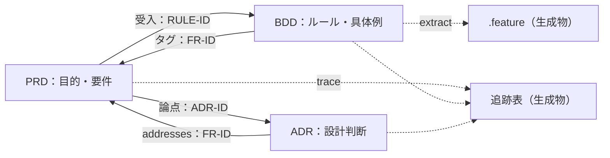

# 共通規約：正本・ID・関係・状態・記法

## 1. 3つの文書の分担

| 文書 | 答える問い | 書かないこと |
|---|---|---|
| PRD | 誰の何のために、どの能力を、どの品質で提供するか。どう成功を測るか | 方式・製品名・内部パラメータ（→ADR）、API やスキーマの詳細（→SPEC） |
| ADR | この制約のもとで、なぜその設計を選び、何を引き受けるか | 要件そのもの（→PRD）、実装手順や設計の全体像（→SPEC） |
| BDD | この条件でこの出来事が起きたら、何が観察できれば正しいか | 画面操作の手順、内部のデータ確認、試験上の仕掛け（→自動化コード） |
| テスト設計書（UT・CT・ST／E2E・UAT／PT） | 何を、なぜその水準で、どの技法で、どこまで確かめるか。いまどこまで実行したか | 個々のテストの手順と期待値（→テストコード。UAT を除く）。水準の分担は [06_TEST_STRATEGY.md](06_TEST_STRATEGY.md) |



小さな変更が具体例から始まっても、設計の論点から始まってもよい。順番は固定しない。固定するのは「同じ情報の正本は1か所」だけである。

## 2. 正本

| 情報 | 正本 | 他の文書での扱い |
|---|---|---|
| 目的・指標・要件（FR／NFR）・検証計画（NVT） | PRD | IDで参照する。要求文を写さない |
| 要件と設計判断の対応 | ADR の front matter `addresses` | 追跡表は生成する |
| 要件とルールの対応 | PRD の「受入」列と、シナリオの `@FR-nnn` タグ（両方に書き、リンターが一致を検査） | 追跡表は生成する |
| 期待する振る舞い | BDD のルールとシナリオ | 実装やテストコードから逆算して書き換えない |
| Gherkin | front matter `gherkin_source` が指す側（`markdown`：フェンスが正本、`extract` が marker 付き `.feature` を生成／`feature`：`.feature` が正本、`mirror` が対応するフェンスを書き戻す） | 反対側は生成物。手で直さない。不一致は両方向とも `check` が検出する（E121）。`markdown` でのマーカー無し孤立 `.feature` は削除せず検出する（E122）。`feature` での `extract` は書き込まず `mirror` を案内する（E123） |
| 追跡表・.feature | 生成物 | 手で直すと check が不合格にする |

## 3. ID

| 種類 | 形式 | 置き場 | 規則 |
|---|---|---|---|
| 目的・指標・ガードレール | GOAL-001・KPI-001・GRD-001 | PRD 3章 | — |
| 根拠・主体・リスク | EVID-001・ACT-001・RISK-001 | PRD | — |
| 要件 | FR-001・NFR-001 | PRD 7・8章。表の先頭セルに `<a id="FR-001"></a>` を置く | 1要件1ID。意味を変えたら新しいIDにする |
| 専用検証 | NVT-001 | PRD 9章 | 計画のID。実行結果のIDではない |
| 設計判断 | ADR-0001 | ファイル名と front matter | 連番。欠番を埋めない |
| 機能・ルール・シナリオ | FEAT-001・RULE-001・SCN-001 | Gherkin のタグ | そのまま `@RULE-001` と書く |
| 質問 | Q-001 | BDD 2章 | — |
| テスト条件・旅程・受入シナリオ・探索セッション・ペルソナ | UT-001・CT-001・E2E-001・UAT-001・PT-001・PER-001 | 各水準のテスト設計書 | 「由来」に FR・RULE・SCN・NVT・ADR・GOAL のIDを書く |

IDは削除しても再利用しない。複数の製品を同じ場所で管理するなら `PAY-FR-001` のように接頭辞を付ける。接頭辞は `kit.toml` の `[ids] prefix` で指定する（例：`prefix = "PAY-"`）。設定していない接頭辞付きの ID は認識されず、他所からの参照が「存在しない」扱いになる（無視されて見過ごされることはない）。

## 4. 関係の種類

| 関係 | 向き | 成立の条件 | 出所 |
|---|---|---|---|
| motivates | GOAL／KPI／GRD → FR | FR の「根拠」に書かれている | PRD |
| measures | FR → KPI | KPI の「計測手段」に書かれている | PRD |
| specifies | RULE／SCN → FR | 受入列とタグが一致している | PRD・BDD |
| addresses | ADR → FR／NFR | `addresses` に書かれている | ADR |
| plans-to-verify | NVT → NFR／FR | 検証計画に書かれている | PRD |
| designs | UT／CT／E2E／UAT → FR／RULE／NVT／ADR／GOAL | テスト設計書の「由来」に書かれている | テスト設計書 |
| allocates | NVT・FEAT → 水準 | NVT はちょうど1つ、FEAT は1つ以上のテスト設計書の表にある | テスト設計書 |
| verifies | 実行証跡 → FR／SCN／NVT など | 確かめるIDの印が付いたテストが合格し、証跡のハッシュが現行の入力と一致する | `evidence/example_tests.json`（記入例では UT と CT の一部だけ） |
| supersedes | 新ADR → 旧ADR | 新ADR が proposed の間は旧ADR側の書き換えを要求せず、accepted・deprecated・superseded になった時点で双方向の一致（`superseded-by`・`status: superseded`）を要求する（E086） | ADR |

タグが付いているだけの状態は specifies であって verifies ではない。

## 5. 状態

| 対象 | 状態 | 誤解してはいけないこと |
|---|---|---|
| PRD | draft → in_review → approved → retired | approved は製品の合格でも効果の実証でもない |
| ADR | proposed → accepted ／ rejected、accepted → deprecated ／ superseded | accepted は実装済みを意味しない。deprecated は使うのをやめた、superseded は後継に置き換えた |
| BDD | draft → agreed | agreed は関係者の合意で、試験の合格ではない |
| 自動化・実行 | `automation`：not_implemented／partial／implemented、`last_run`：not_run／passed／failed（自動化済みの範囲の最新結果） | 未定義・保留・スキップを passed に読み替えない。`last_run` が passed／failed のときは `evidence` に実行証跡のパスを書く（BDD を含む全文書種別で必須。無い・存在しないパスなら check が E155 で不合格にする） |
| サンプル | front matter `sample: true` | 架空であることは status ではなくこのキーで示す |

承認は、承認者・日時・対象の版・条件を変更履歴の表に書く。役職名だけの記載や、AI が生成した承認欄は承認ではない。

## 6. ゲート

ゲートの通過条件の正本は PRD 9 章。ここではゲート名（G1 実装着手／G2 受入／G3 本番導入／G4 成果評価）だけを定義する。各ゲートで使われる水準の対応は [06_TEST_STRATEGY.md](06_TEST_STRATEGY.md) 4章を見る。

未決の部分だけを保留し、独立した部分の調査や試作は止めない。

## 7. Markdown と Mermaid

| 項目 | 規則 |
|---|---|
| 文字コードと改行 | UTF-8、末尾に改行 |
| 見出し | H1 は1つ。階層を飛ばさない |
| リンク | 相対パス。文書内の位置は明示アンカー `<a id="..."></a>` にだけ張る（見出しから自動生成されるアンカーは表示環境によって異なる） |
| 表 | 列数を揃える。セルに縦棒を書かない |
| front matter | テンプレートと同じキーを持つ（サンプルは `sample: true` を追加） |
| 図の種類 | flowchart、sequenceDiagram、stateDiagram-v2 に限る（`kit.toml` の `[mermaid] allowed_types` を **E104** で検査）。フェンスは列0の ``` と ~~~、4個以上のバッククォート、字下げも認識する（`tools/mermaid_common.py` を `render_mermaid.py`・`check` の両方が使う） |
| 図の書き方 | ノードIDは英数字、ラベルは二重引用符で囲む。`click`・HTML・スクリプトを書かない。`accTitle` と `accDescr` を必ず書く |
| 図と本文 | 図は本文の説明であり、仕様を図だけで決めない。食い違えば本文が正しい |
| Mermaid の版 | 12.0.0 から既定のレイアウトと見た目が変わったため、ノードの位置や色に意味を持たせない。配置を固定したい図だけ、図の先頭に設定（`layout: dagre` など）を書く。表示環境が採用している版は環境ごとに確認する |

## 8. 検証コマンド

| コマンド | 内容 |
|---|---|
| `python tools/kit_lint.py check` | 全検査。不合格なら終了コード1 |
| `python tools/kit_lint.py trace` | 追跡表を生成 |
| `python tools/kit_lint.py extract` | `gherkin_source: markdown` の BDD 文書について、Markdown の Gherkin から `features/*.feature` を生成 |
| `python tools/kit_lint.py mirror` | `gherkin_source: feature` の BDD 文書について、`features/*.feature` から Markdown のフェンスを書き戻す |
| `python tools/kit_lint.py selftest` | 欠陥を注入してリンターが検出できるかを確認 |
| `python tools/render_mermaid.py --mermaid-dir <mermaidパッケージ> [--allow-no-sandbox]` | 全図を解析・描画し、図ごとのハッシュ付きで証跡を記録。既定は Chromium のサンドボックスを有効のまま起動。動かない環境では `--allow-no-sandbox` |
| `python tools/run_examples.py [--mutation] [--out PATH]` | 参考実装の UT・CT を実行し、テストごとの結果と確かめたID、入力ファイルのハッシュを証跡に記録（既定の出力先は `kit.toml` の `[tests] evidence`。`--out` で変更可） |
| `python tools/portability_test.py` | 全テンプレートだけから別構成のプロジェクトを作り、リンターが通ることを確認 |

前提条件（Python の版を含む）と各コマンドの詳しいエラーは [tools/README.md](tools/README.md)
を見る。依存は `gherkin-official` と `PyYAML`（描画は `playwright` と npm の `mermaid`、参考実装の実行は `pytest`・`hypothesis`・`pytest-bdd`・`coverage`・`mutmut`）。自分の案件で使うときは `kit.toml` の `[docs]` を自分の文書のパスに書き換える。
