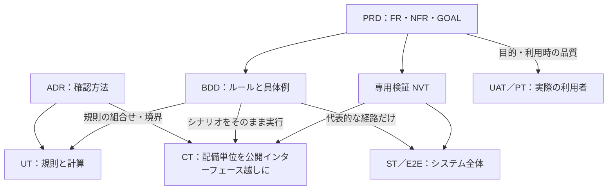

# テスト戦略：UT・CT・ST／E2E・UAT／PT の分担

PRD・ADR・BDD の後に続く4つのテスト水準の、定義・分担・共通規約。水準ごとのテンプレート・記入例・記載指示書は [ut/](ut/UT_GUIDE.md)・[ct/](ct/CT_GUIDE.md)・[st/](st/ST_GUIDE.md)・[uat/](uat/UAT_GUIDE.md) にある。出典は [02_RESEARCH_AND_DECISIONS.md](02_RESEARCH_AND_DECISIONS.md) の S16〜S29。

## 1. 水準の定義

「単体」「結合」「コンポーネント」は、組織や文献によって指すものが違う。本キットは次のとおりに固定する。

| 水準 | 対象 | 依存の扱い | 大きさ | 主な担い手 | ISTQB CTFL 4.0 での呼び方 |
|---|---|---|---|---|---|
| UT（単体テスト） | 関数・クラス・モジュールの規則と計算 | 入出力・時計・乱数に触れない。協調する自前のコードは実物を使う | small：単一プロセス、入出力なし、実時間の待ちなし | 開発者 | コンポーネントテスト（＝ユニットテスト） |
| CT（コンポーネントテスト） | 配備の単位（1つのサービスやアプリ）を、公開インターフェース越しに | 自分が所有する依存（DB など）は実物か忠実なフェイク。他チーム・外部の依存は代役にし、代役の正しさを契約テストで担保 | medium：単一マシン内 | 開発者・品質担当 | コンポーネント統合テスト（＋配備単位のコンポーネントテスト） |
| ST／E2E（システムテスト） | 配備したシステム全体を、利用者または外部システムの入口から | 本番相当の構成。制御できない外部だけ代役 | large：複数プロセス・複数マシン | 品質担当・運用担当・専門家 | システムテスト、システム統合テスト |
| UAT／PT（利用者受入・ペルソナ駆動テスト） | 業務の目的が、実際の利用者の手で達成できるか | 本番相当の環境と、業務を代表するデータ | 人が行う | 業務の代表者・実際の利用者 | 受入テスト（UAT）。PT は経験ベースの探索的テスト |

テストの**種類**（機能・非機能・ホワイトボックス・変更関連）は水準と直交する。性能やセキュリティは ST だけのものではなく、早く確かめられる部分は下の水準で確かめる。

## 2. 分担の原則

1. **確信が得られる最も下の水準で確かめる。** 下の水準ほど速く、安定し、失敗の原因が絞れる。組合せの網羅（境界値・決定表・状態×出来事）は UT に置く。
2. **BDD のシナリオは CT で実行するのを既定にする。** 業務ルールは画面に依存しない。画面経由でも実行するのは、画面と裏側のつなぎ目に固有の危険がある代表的な経路だけにする。
3. **E2E は重要な利用者の旅程（ジャーニー）に絞る。** 広い範囲を通すテストは遅く壊れやすい。下の水準で確かめた組合せを E2E で繰り返さない。
4. **代役を使ったら、代役の正しさを別に確かめる。** 契約テストか、実物に対する同じテストの定期実行で担保する。
5. **自動テストは「仕様どおりか」を、UAT は「それで業務が回るか」を確かめる。** UAT は下の水準の再実行ではない。目的（GOAL）と利用時の品質を、実際の利用者で確かめる。
6. **上の水準で見つかった欠陥は、再現する最も下の水準のテストを足してから直す。**

## 3. 何をどの水準で確かめるか

| 確かめたいこと | 第一の水準 | 補う水準 | 理由 |
|---|---|---|---|
| 入力規則・計算・状態遷移・優先順位などの規則 | UT | CT で代表例 | 組合せが多く、入出力なしで確かめられる |
| 業務ルールの具体例（BDD のシナリオ） | CT | E2E で代表的な経路 | 公開インターフェースで観察でき、画面より安定している |
| 永続化・トランザクション・同時実行・再送 | CT | ST で負荷時 | 実物の DB か忠実なフェイクが要る |
| 他チーム・外部とのインターフェースの取り決め | CT（契約テスト） | ST でつないだ確認 | 相手を起動せずに、両側の理解のずれを検出できる |
| 設計判断（ADR）が守られているか | UT（構造の検査）・CT | — | 依存の向きや資格情報の分離は、コードと構成で検査できる |
| 画面と裏側のつなぎ目、認証、配備構成 | E2E | — | 全体をつながないと現れない |
| 性能・可用性・復旧・削除・セキュリティ | ST | CT で部分的に早期確認 | 本番相当の構成と負荷が要る |
| アクセシビリティ | E2E の自動検査と手動確認 | UAT | 自動検査で見つかるのは一部 |
| AI の出力の品質 | ST（評価セット） | UAT で実利用者の判断 | 統計的な評価であり、1件の合否ではない |
| 業務の目的が達成できるか、使い続けられるか | UAT | PT | 実際の利用者にしか判断できない |
| 仕様にも書かれていない問題 | PT（探索） | 見つけたものを下の水準へ | 台本のあるテストは、想定した問題しか見つけない |

## 4. ゲートとの対応

ゲートの通過条件の正本は PRD 9章である。下は、各ゲートでどの水準の結果が使われるかの対応。

| ゲート | 使われる水準 | テストの側で用意するもの |
|---|---|---|
| G1 実装着手 | —（UT・CT の設計をここから始める） | 何をどの水準で確かめるかの分担（各設計書の2章） |
| G2 受入 | UT・CT・ST／E2E | UT・CT の合格、BDD のシナリオの全件実行と合格、G2 対象の NVT の合格。いずれも実行証跡つき |
| G3 本番導入 | UAT／PT・ST | UAT の受入判定の記録、G3 対象の NVT（復旧・削除など）の合格 |
| G4 成果評価 | 運用での計測 | KPI・ガードレール・SLO の実測。テストではなく観測である |

## 5. 共通規約

| 項目 | 規約 |
|---|---|
| 文書の役割 | 各水準の文書は**テスト設計書**である。何を・なぜ・どの技法で・どこまで確かめるかを書く。個々のテストの手順と期待値は**テストコードが正本**で、文書に写さない（UAT だけは人が読んで実施するため、文書が正本） |
| ID | テスト条件：UT-001・CT-001、旅程：E2E-001、受入シナリオ：UAT-001、探索セッション：PT-001、ペルソナ：PER-001 |
| 由来 | すべてのテスト条件に、由来のID（FR・NFR・RULE・SCN・NVT・ADR・GOAL）を書く。由来の無いテスト条件は、要件の欠落かテストの無駄のどちらかである |
| テスト名 | 設計書の「テスト名」はコード上の識別子と一致させる。リンターが、その名前がコードに実在するかを検査する（現状：Python の関数名との文字列一致のみ。他言語は `kit.toml` の `[tests] code` に glob パターンを追加すれば対象にできるが、名前の抽出規則自体は言語別に設定できない） |
| 逆方向の検査（予定） | Must の要件・NFR に、対応するテスト条件や NVT が1件も無い場合を警告する（コード W160）。現状は未実装（refkit-P4b で `kit_lint.py` に追加予定）。文書側の理由付けは、対応するテスト条件が無い要件について UT_SAMPLE §1 が扱う（FR-005・FR-009・FR-026、refkit-P7） |
| コード側の追跡 | テストに、確かめるIDの印（例：pytest の `req` マーカー、JUnit のタグ）を付ける。Gherkin のタグは実行時に同じ印へ写す |
| 大きさの宣言 | テストに small・medium・large を宣言し、small のテストが入出力や実時間の待ちを行わないことを保つ |
| 実行証跡 | 対象の版・環境・日時・結果・確かめたIDを機械可読で残す。証跡には入力ファイルのハッシュを含め、古い証跡を検出する。証跡のある合格だけが verifies の関係を作る |
| 不安定なテスト | 再実行で合格に変えない。隔離し、原因（時刻・順序・共有状態・外部依存・待ち）を直し、期限を決めて戻す。隔離中はそのIDを検証済みと数えない |
| テストデータ | テストが自分で作り、自分で片付ける。本番データの複製を使わない。時刻・乱数・識別子は固定か注入する |
| AI が生成したテスト | 人がレビューし、ミューテーションテストで検出力を確かめる。実装を読んで期待値を作らせない（実装の誤りを正しいと記録してしまう）。期待値の出所は要件・ルールである |
| 欠陥 | 発見した水準、再現する最も下の水準、由来のID、追加したテストを記録する |

## 6. 道具の候補

上級者向けの選択肢を、水準ごとに示す。版は 2026-09-23 に PyPI と npm のレジストリで確認した最新版（02_RESEARCH_AND_DECISIONS.md S28 のとおり）。**実行**＝本キットの参考実装で実際に動かした。それ以外は版の確認のみで、動作は確認していない。JVM の道具は版を確認していない。npm の一部（`@playwright/test`・Vitest・dependency-cruiser）は、レジストリに公開日が記録されておらず「確認した最新版」の日付を個別には示せない。

| 用途 | Python | TypeScript／JavaScript | JVM |
|---|---|---|---|
| UT の実行 | pytest 9.1.1（実行） | Vitest 5.0.1 | JUnit |
| プロパティベーステスト（状態機械を含む） | Hypothesis 6.168.1（実行） | fast-check 4.10.2 | jqwik |
| ミューテーションテスト | mutmut 3.8.0（実行）、cosmic-ray 8.7.0 | StrykerJS 10.0.0 | PIT |
| カバレッジ | coverage.py 7.16.1（実行、分岐） | Vitest のカバレッジ機能 | JaCoCo |
| 構造の検査（ADR の確認） | import-linter 2.15、pytest-archon 0.0.7 | dependency-cruiser 18.4.0 | ArchUnit |
| 時刻の制御 | time-machine 3.5.1、または時計の注入（実行） | Vitest の擬似タイマー | 時計の注入 |
| BDD の実行 | pytest-bdd 8.1.0（実行。日本語キーワードと `ルール` を確認） | @cucumber/cucumber 13.2.1 | Cucumber-JVM |
| 実物の依存をコンテナで | testcontainers 4.15.0 | testcontainers | Testcontainers |
| 契約テスト | pact-python 3.4.1 | @pact-foundation/pact 17.1.4 | Pact JVM |
| API 仕様からのプロパティベーステスト | Schemathesis 4.28.0 | — | — |
| ブラウザ経由の E2E | Playwright 1.63.0 | @playwright/test 1.63.0 | Playwright for Java |
| アクセシビリティの自動検査 | axe-core を Playwright から読み込む | @axe-core/playwright 4.13.0 | axe-core を Playwright から読み込む |
| 負荷（到着率を固定するオープンモデル） | Grafana k6（`constant-arrival-rate`）。言語に依存しない | 同左 | 同左 |
| AI の評価 | Inspect AI 0.3.268、DeepEval 4.2.5 | promptfoo 0.123.1 | — |

道具は入れ替わる。選ぶ基準は、(1) 公式の parser・仕様に従っている、(2) 決定的に実行できる、(3) 結果を機械可読で出せる、(4) 保守が続いている、の4点である。
