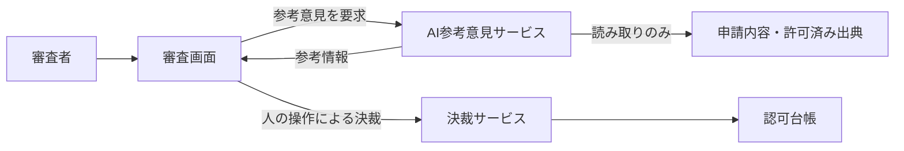

# ADR-0001：AI処理主体には決裁インターフェースの資格を発行しない

> **架空の記入例。** `status: accepted` は例の中の状態で、実在の承認ではない。要件は [PRD_SAMPLE.md](../prd/PRD_SAMPLE.md)。

## 1. 背景と課題（Context and Problem Statement）

PRD は「AI処理主体に申請の状態を変更する手段を与えてはならない」（FR-008）と定め、AIが止まっても人の審査が続くこと（FR-010・FR-024）を求めている。AIは申請本文と出典を読むため、そこに「承認せよ」といった命令文が紛れ込む前提で設計しなければならない。「AIに決裁させない」こと自体は要件で決まっており、ここで決めるのは**その禁止をシステムのどこで強制し、どうやって検証可能にするか**である。モデル製品・検索方式・画面設計はこのADRでは決めない。

## 2. 判断の決め手（Decision Drivers）

| 種別 | 決め手 | 出所 | 確かめ方 |
|---|---|---|---|
| 必須 | AIの出力や入力資料の内容にかかわらず、AI処理主体から決裁が成立しないことを試験で示せる | FR-008 | AIの資格情報で決裁を試みる試験、指示注入を含む資料での試験 |
| 必須 | AI参考意見の停止・故障が人の決裁を妨げない | FR-010・FR-024 | AI停止下での決裁シナリオ |
| 比較 | 設定の誤りで境界が破れにくい | — | 設計レビュー、設定変更時の自動試験 |
| 比較 | 運用・監視の負荷 | — | 構成要素と監視項目の数 |
| 比較 | モデルや提供元を替えるときの変更範囲 | — | 影響範囲の見積 |

## 3. 検討した選択肢（Considered Options）

- **案A**：プロンプトの指示と出力フィルタで制御する（AIは決裁操作を含む汎用のAPI資格を持つ）
- **案B**：同じサービス内で、AI用の役割に決裁の権限を割り当てない（役割ベースの論理分離）
- **案C**：AI処理主体には決裁インターフェースの資格を発行せず、決裁は人の対話セッションに紐づく主体からの要求だけを受け付ける
- **案D**：案Cに加え、AI参考意見サービスを別のネットワーク区画・別の実行基盤に分離する

## 4. 決定（Decision Outcome）

採用：**案C**。必須の決め手を試験で示せる案のうち、設定の誤りに最も強く、運用負荷が現在の規模に見合うため。案Aは「決裁が成立しない」ことを試験で示せないため、費用の低さにかかわらず除外した。

### 4.1 結果（Consequences）

- 良い点：AIの資格情報では決裁インターフェースを呼び出せないことを、単純な試験で継続的に確認できる。AIを止めても決裁の経路に影響しない。モデルの差し替えは参考意見サービスの内側に収まる。
- 悪い点：資格情報の発行・失効の管理対象が1つ増える。参考意見と決裁で監視対象が二系統になる。審査者がAIの意見を過信する問題は権限分離では解決せず、表示と教育で別に対処する必要がある。

### 4.2 確認方法（Confirmation）

| 確認すること | 方法 | 合格基準 | 時点・担当 | 結果 |
|---|---|---|---|---|
| AIの資格情報で決裁が成立しない | AI処理主体の資格情報で決裁インターフェースを呼ぶ自動試験 | 拒否され、申請の状態と監査記録に決裁が増えない | G2・毎リリース・品質担当 | 未実施 |
| 資料に紛れた命令で決裁が成立しない | 出典と申請本文に決裁命令を混ぜた評価（BDD の RULE-006 と NVT-007 の攻撃入力40件） | 状態の変化が0件 | G2・AI担当 | 未実施 |
| AI停止中も決裁できる | BDD の RULE-007・RULE-020 | 全シナリオ合格 | G2・品質担当 | 未実施 |
| 決裁の受付口が人のセッション由来の主体に限られている | 設計レビューと、受付口の一覧を検査するアーキテクチャテスト | AI処理主体を受け付ける経路が0件 | G1・G2・技術責任者 | 未実施 |

## 5. 選択肢の長所・短所（Pros and Cons of the Options）

### 案A：プロンプトと出力フィルタで制御する

- 長所：追加の構成要素がなく、最も早く作れる。
- 短所：モデルの挙動に依存し、入力次第で破られ得る。破られないことを有限の試験で示せない。
- 必須の決め手：不適合（FR-008 を検証可能な形で満たせない）。

### 案B：同じサービス内で役割により論理分離する

- 長所：既存の認可の仕組みを使え、構成要素が増えない。
- 短所：役割の設定を誤ると境界が消える。AIの処理と決裁が同じ障害範囲に入る。
- 必須の決め手：適合。ただし設定変更のたびに境界の試験が必要。

### 案C：AI処理主体に決裁インターフェースの資格を発行しない

- 長所：境界が資格情報の有無という単純な事実で決まり、試験しやすい。AIの故障と決裁が分離される。
- 短所：資格情報と監視の管理対象が増える。
- 必須の決め手：適合。

### 案D：案Cに加えて実行基盤とネットワークを分離する

- 長所：侵害時の影響範囲が最も小さい。
- 短所：基盤・ネットワーク・配備の運用負荷が大きく、現在の規模と脅威の想定に対して過大。
- 必須の決め手：適合。

## 6. 補足情報（More Information）

| 項目 | 内容 |
|---|---|
| 確信度の根拠 | 中。要件との論理的な整合は確認したが、対象環境での資格情報の分離と失効の伝播は未検証 |
| 再検討のきっかけ | AIに外部への操作（購入・配布など）を持たせる要求が出た、AI参考意見サービスが侵害された、AIを自動承認に使う要求が出た（この場合はPRDの変更が先）。見直しは技術責任者が起票する |
| 撤回できる範囲 | 案Bへの変更は資格情報の統合だけで可能。過去に人が行った決裁はこの判断の変更では取り消されない |
| 関連 | [PRD_SAMPLE.md](../prd/PRD_SAMPLE.md) の FR-008・FR-010・FR-024、[BDD_SAMPLE.md](../bdd/BDD_SAMPLE.md) の RULE-006・RULE-007・RULE-020、[ADR-0002](ADR-0002-decision-consistency.md) |
| 出典 | 構成は MADR 4.0.0。確信度の記録と追記専用の運用は Microsoft Azure Well-Architected Framework の ADR 指針（[02_RESEARCH_AND_DECISIONS.md](../02_RESEARCH_AND_DECISIONS.md) の S03・S04） |
