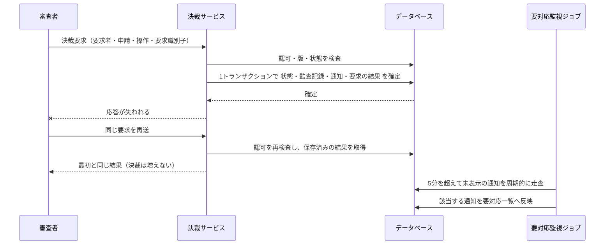

# ADR-0004：決裁・監査記録・アプリ内通知・再送結果を同じデータベーストランザクションで確定する（ADR-0002を置換）

> **架空の記入例。** `status: proposed` は例の中の状態で、実在の提案ではない。要件は [PRD_SAMPLE.md](../prd/PRD_SAMPLE.md)（0.5.0）。本ADRは [ADR-0002](ADR-0002-decision-consistency.md) を置換する（Microsoft Azure Well-Architected Framework の追記専用の指針に従い、ADR-0002の本文は変更しない）。本ADRは2026-09-23にproposedとして起票された。

## 1. 背景と課題（Context and Problem Statement）

PRD は、申請の状態遷移（提出・決裁・修正・取消・自動取消）と参考意見の提示について、その事実と監査記録が必ず対で成立すること（FR-014、0.5.0で一般化）、同じ決裁要求の再送で決裁が重複しないこと（FR-015）、確定した決裁が申請者に1件だけ通知されること（FR-016）、通知の遅延に上限があること（FR-017・NFR-005）を求めている。PRD 0.5.0 ではさらに、拒否された要求（対象なし・自己決裁・競合・決裁できない状態）についても監査記録を残すこと（FR-029）、「同じ決裁要求」を要求者・申請・操作・要求識別子の組で定義することが決まった。今回の通知は**アプリ内通知のみ**で、メールなど外部への送信は対象外である。申請・監査記録・通知を同じデータベースに置けることを前提に、途中の失敗や応答の喪失があっても、これらをどの境界で一貫させ、かつ「5分を超えて表示できない通知を運用者が把握する」（FR-017）手段をどう用意するか。データベース製品の選定はこのADRでは決めない。

## 2. 判断の決め手（Decision Drivers）

| 種別 | 決め手 | 出所 | 確かめ方 |
|---|---|---|---|
| 必須 | 決裁の状態と監査記録が、片方だけ成立することがない | FR-014 | 障害注入を伴う統合試験（NVT-010） |
| 必須 | 再送で決裁・通知が重複しない（同じ決裁要求は要求者・申請・操作・要求識別子の組で判定） | FR-015・FR-016 | 再送・並行のシナリオ（RULE-012・RULE-013） |
| 必須 | 通知が60秒以内に99%表示される | NFR-005 | 負荷試験（NVT-005） |
| 必須 | 決裁確定から5分を超えて未表示の通知を、運用者が要対応一覧で把握できる（通知表の周期走査による） | FR-017 | 周期走査ジョブの統合試験。未表示のまま5分を超えた通知が要対応一覧に反映されることを確認 |
| 比較 | 構成要素と運用負荷の少なさ | — | 構成要素・監視項目の数 |
| 比較 | 外部チャネル（メール等）を将来追加するときの変更範囲 | PRD 5章の対象外 | 影響範囲の見積 |
| 比較 | 決裁の処理能力への影響 | NFR-001 | 負荷試験（NVT-001） |

## 3. 検討した選択肢（Considered Options）

- **案A**：決裁・監査記録・通知・要求の結果を、同じデータベースの1トランザクションで確定し、通知表を周期的に走査して5分を超えて未表示の通知を要対応一覧へ移す監視ジョブを持つ
- **案B**：決裁と監査記録は同じトランザクションで確定し、通知は送信予定（outbox）として記録して別プロセスが非同期に配送する
- **案C**：決裁・監査記録・通知を順番に別々に保存し、失敗したら補償処理で戻す
- **案D**：決裁と通知を別のデータストアに置き、分散トランザクションで確定する

## 4. 決定（Decision Outcome）

採用：**案A**。通知がアプリ内に限られ同じデータベースに置ける現在の範囲では、必須の決め手をすべて満たす案のうち構成要素と故障点が最も少ないため。案Bは外部チャネルが加わるときに必要になる方式であり、今は配送プロセス・再試行・重複排除の運用負荷に見合う利益がない。

FR-017の把握手段（5分を超えて未表示の通知を運用者が把握する方法）は、(a) 通知表を定期的に走査し5分を超えて未表示の通知を要対応一覧へ移す監視ジョブ、(b) クライアント側で表示済みの確認応答を送らせ、サーバ側でタイムアウトを検出する、(c) FR-017をこのADRの`addresses`から外し、別のADRに委ねる、の3案を比較した。(b)はクライアントの挙動に依存し、表示済みでも確認応答が失われれば誤って要対応と判定するか、確認応答が届かない限り検出できないという二重の失敗様式を持ち、クライアント側の実装が増える。(c)は現状維持に近い案だが、FR-017・NFR-005の必須の決め手を本ADRの範囲内で満たせなくなる。(a)はサーバ側だけで完結し、既存のトランザクション設計に1件の周期ジョブを追加するだけで実現できるため、最も単純かつ確実である。以上により(a)を採用した。

### 4.1 結果（Consequences）

- 良い点：決裁が確定すれば通知も必ず存在するため、通知の欠落・重複・遅延が構造上起きにくい。配送プロセスが無く、監視対象が少ない。再送への応答は保存済みの結果を返すだけでよい。5分を超えた未表示通知の把握は、既存のトランザクションに依存しない独立した周期ジョブで実現でき、決裁の処理能力に影響しない。
- 悪い点：通知の保存が決裁のトランザクションに含まれるため、通知表の障害が決裁を止める。決裁1件あたりの書き込みが増える。要求の結果を24時間保持し、期限後に掃除する責任が生じる。**掃除後にその要求が再送されると、同じ決裁要求（要求者・申請・操作・要求識別子の組）と判定されず、FR-028の順序に従って「競合」として拒否される**ため、利用者には掃除前と異なる拒否理由が返る可能性がある。メール等を追加する時点でこの判断は置き換えが必要になる。周期ジョブ自体の停止・遅延は新たな監視対象になる。

### 4.2 確認方法（Confirmation）

| 確認すること | 方法 | 合格基準 | 時点・担当 | 結果 |
|---|---|---|---|---|
| 状態と監査記録が片方だけ成立しない | 保存の各段階に障害を注入する統合試験（NVT-010） | 中途半端な記録が0件 | G2・開発担当 | 未実施 |
| 再送・並行で重複しない | BDD の RULE-012・RULE-013 と、同じ要求者・申請・操作・要求識別子の組の同時登録試験 | 成功する決裁と通知がちょうど1件 | G2・品質担当 | 未実施 |
| 失効後の再送に結果を返さない | BDD の RULE-012（失効の例） | 拒否され、過去の結果が開示されない | G2・品質担当 | 未実施 |
| 処理能力と通知遅延 | NVT-001・NVT-005 | NFR-001・NFR-005 の基準を満たす | G2・性能担当 | 未実施 |
| 5分を超えて未表示の通知が要対応一覧に反映される | 周期走査ジョブの統合試験。通知を意図的に未表示のまま5分経過させる | 5分を超えた対象がすべて要対応一覧に現れ、5分未満の対象は現れない | G2・開発担当 | 未実施 |

## 5. 選択肢の長所・短所（Pros and Cons of the Options）

### 案A：1トランザクションで確定し周期走査で要対応を把握する

- 長所：構成要素が最少。決裁と通知の不整合が原理的に生じない。試験が単純。FR-017の把握手段がサーバ側だけで完結する。
- 短所：通知表の障害が決裁に波及する。外部チャネルには適用できない。周期ジョブの停止・遅延が新たな監視対象になる。
- 必須の決め手：適合。

### 案B：通知は送信予定として記録し非同期に配送する

- 長所：外部チャネルの追加に自然に対応できる。通知先の障害が決裁に波及しない。
- 短所：配送プロセス・再試行・重複排除・滞留監視が必要。通知は少なくとも1回の配送になり、受け側での重複排除が前提になる。
- 必須の決め手：適合。ただし NFR-005・FR-017 を満たすには滞留の監視と運用が別途必要。

### 案C：順番に保存し、失敗時は補償する

- 長所：最初の実装は単純に見える。
- 短所：保存の途中で落ちると、監査記録のない決裁や、決裁のない通知が残る。補償処理自体も失敗し得る。
- 必須の決め手：不適合（FR-014 を満たせない）。

### 案D：分散トランザクションで確定する

- 長所：データストアを分けても強い一貫性を得られる。
- 短所：参加するすべてのデータストアの対応が必要で、1つの停止が全体を止める。現在の範囲では分ける理由がない。
- 必須の決め手：適合。ただし前提となる構成を採る理由がない。

## 6. 補足情報（More Information）

| 項目 | 内容 |
|---|---|
| 確信度の根拠 | 中。方式は一般的で必須の決め手との整合は確認したが、NFR-001 の負荷での書き込み増と周期ジョブの負荷の影響は未測定 |
| 再検討のきっかけ | メール・チャットなど外部への通知を対象に含める、通知を別のデータストアへ移す、NVT-001 で決裁のp95が基準を超える、周期ジョブの遅延がNFR-005の基準を脅かす。いずれも技術責任者が新しいADRを起票し、その時点で案Bを再評価する |
| 撤回できる範囲 | 案Bへの移行は通知の書き込み箇所と周期ジョブの廃止で可能。移行時は確定済みの通知を重複して作らない手順が必要 |
| 関連 | [PRD_SAMPLE.md](../prd/PRD_SAMPLE.md)（0.5.0）の FR-014〜FR-017・FR-029・NFR-005、[BDD_SAMPLE.md](../bdd/BDD_SAMPLE.md) の RULE-011〜RULE-014、[ADR-0003](ADR-0003-ai-authority-boundary.md) |
| 出典 | 案Bの性質（少なくとも1回の配送と受け側の重複排除）は AWS Prescriptive Guidance の Transactional outbox の解説による（[02_RESEARCH_AND_DECISIONS.md](../02_RESEARCH_AND_DECISIONS.md) の S14） |
