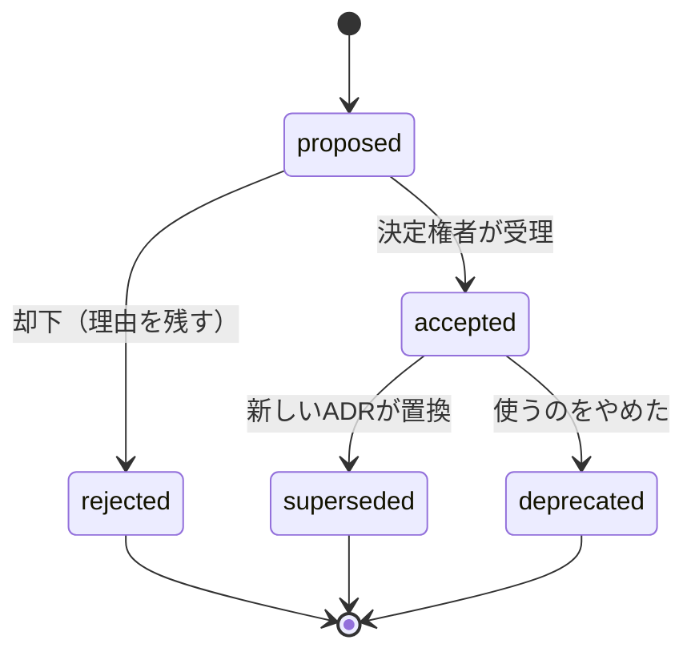

# ADR 記載指示書

対象：[ADR_TEMPLATE.md](ADR_TEMPLATE.md)。4.2「確認方法」は、UT（構造の検査）か CT のテスト項目の由来として受け取られる（[06_TEST_STRATEGY.md](../06_TEST_STRATEGY.md)）。accepted の ADR を由来とするテスト項目が無いと、リンターが不合格にする。記入例：[ADR-0001](ADR-0001-ai-authority-boundary.md)・[ADR-0002](ADR-0002-decision-consistency.md)。共通規約：[03_CONVENTIONS.md](../03_CONVENTIONS.md)。

## 1. いつ書くか

次のどれかに影響する判断を ADR にする：品質特性（性能・信頼性・セキュリティなど）、信頼境界、データの所有と寿命、外部への依存、公開インターフェースの互換性、運用の責任、費用の構造、後から変えにくいこと。変数名や小さな実装の選択は対象外。迷ったら「半年後に入った人が『なぜこうなっているのか』と聞くか」で判断する。

既にある設計を後から記録するときは、当時の理由を推測で埋めない。「遡及して記録」「確認できた事実」「理由は不明」を分けて書く。

## 2. 問いの立て方

ADR の質は1章の問いで決まる。**要件で既に決まっていることは問いにしない。**

| 悪い問い | なぜ悪いか | 良い問い |
|---|---|---|
| AI に決裁させるか | PRD が禁じている。選択肢が成立しない | AI に決裁させないことを、どこで強制し、どう検証可能にするか |
| どの DB を使うか（全体設計も併せて） | 複数の判断の抱き合わせ。責任者も撤回条件も違う | 決裁と監査記録をどの境界で一貫させるか（DB 製品は別の ADR） |
| outbox パターンを採用する | 答えが先にあり、比較が無い | 決裁・監査・通知を、途中の失敗と再送があってもどう一貫させるか |

1件につき判断は1つ。1つの判断を成り立たせるのに不可分な要素（例：トランザクションの境界と、再送結果の保存）は同じ ADR に入れてよい。短期・中期・長期で方式が変わるなら、段階ごとに別の ADR にする。

## 3. 進め方

| 手順 | 何をするか | 終わりの条件 |
|---|---|---|
| 1 問いを絞る | 関係する要件IDを `addresses` に書き、1章を疑問文で終える。決めないことも書く | 独立に変えられる判断が混ざっていない |
| 2 決め手を分ける | 満たさなければ除外する「必須」と、優劣を比べる「比較」を分け、出所と確かめ方を書く | 必須の決め手が要件IDか契約に結び付いている |
| 3 選択肢を並べる | 現状維持・作らない・**最も単純な案**を必ず検討する。勝たせるための弱い案を足さない | どの案も、誰かが本気で推せる |
| 4 同じ物差しで比べる | 5章で全案を同じ決め手に照らす。全案に短所を書く | 採用案にも短所がある |
| 5 不確かな前提を確かめる | 結論を変え得る前提は試作や測定で確かめる。確かめていないなら確信度を下げる | 測っていない数字を測定結果として書いていない |
| 6 決定を書く | 「採用：**案X**。…ため。」と、どの決め手を優先したかを書く | 「総合的に優れる」で終わっていない |
| 7 確認方法を決める | 実装がこの判断に従っているかを、何でいつ誰が確かめるか | 「テストで確認」で終わっていない |
| 8 受理する | 決定権者が受理し status を accepted にする | 決定権者・日付が front matter にある |
| 9 変えるとき | 新しい ADR を proposed で起票し `supersedes` に旧IDを書く。受理されたら旧 ADR の status を superseded、`superseded-by` を新IDにする | 双方向に結ばれている（リンター E086） |

## 4. 章ごとの書き方

| 章 | 書くこと | 不合格の例 |
|---|---|---|
| front matter | MADR 4.0.0 の5項目（status・date・decision-makers・consulted・informed）に、id・title・addresses・supersedes・superseded-by・confidence を加えたもの | 決定権者が空。AI が生成した氏名 |
| 1 背景と課題 | どの要件・制約のもとで何を決めるか。2〜5文、最後は疑問文。判断に関係する境界だけの図 | 製品の一般的な説明。全体構成図 |
| 2 判断の決め手 | 必須と比較の区別、出所、確かめ方 | 「速さを重視」だけ |
| 3 検討した選択肢 | `- **案A**：…` の形で2つ以上 | 採用案だけが詳しい |
| 4 決定 | 採用案と理由。4.1 に良い点と**悪い点**、4.2 に確認方法 | 良い点だけ。「人気がある」「最新である」 |
| 5 長所・短所 | 全案について、長所・短所・必須の決め手への適否 | 必須を満たさない案を点数で救う |
| 6 補足情報 | 確信度の根拠、再検討のきっかけ、撤回できる範囲、関連、出典 | 無条件に「ロールバック可能」 |

確信度の目安：高＝対象の条件での試験で主要な前提を確かめた／中＝公式の仕様からは妥当だが対象の条件では未検証／低＝未知の要因で結論が変わり得る。確信度が低いまま受理してよい。低いと書いてあることが、後の見直しに役立つ。

点数表を使うなら、必須の決め手で除外した後に使う。尺度の意味を先に決め、重みを変えたら結論が変わるかを確かめる。

## 5. 受理後の扱い

accepted の本文は書き換えない。変えてよいのは front matter の `status` と `superseded-by` だけで、意味を変えない誤記の訂正は履歴（コミット）に残す。4.2 の「結果」欄は、実装後に確認結果と証跡へのリンクを追記してよい（判断の理由は変えない）。「採用したから検証済み」とは書かない。

## 6. レビューの観点

| 観点 | 反例として当てる問い |
|---|---|
| 問い | 要件で決まっていることを問いにしていないか。複数の判断が混ざっていないか |
| 選択肢 | 最も単純な案を検討したか。却下された案は、その支持者が読んで公平だと思うか |
| 必須の決め手 | 採用案が満たすという主張は、どの故障点で崩れ得るか |
| 悪い点 | 運用の負荷、規模が変わったとき、供給者が止まったとき、契約が変わったとき、移行できないとき |
| 再試行・ロールバック | 「再試行する」なら何を・何回・どの識別子で・上限の後は誰が。「戻せる」なら既に起きた外部への副作用は戻るのか |
| 確認方法 | 実装が判断から外れたとき、何がそれを検出するか |

## 7. 完成の条件

`python tools/kit_lint.py check` が合格する（状態語彙、`addresses` の要件IDの実在、選択肢2つ以上、採用案が一覧にある、全案に短所、確認方法、置換の双方向）。そのうえで6章の観点を人が確かめる。実装者に渡すのは accepted の判断とその適用範囲であり、部品間の詳細な取り決めは SPEC に書く。
