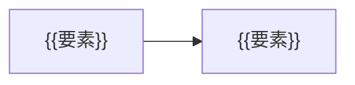

# {{ADR-0001}}：{{題名}}

> 記入方法は [ADR_GUIDE.md](ADR_GUIDE.md)。構成は MADR 4.0.0 に対応する（括弧内が MADR の節名）。1件につき判断は1つ。accepted になった本文は書き換えず、変えるときは新しいADRで置き換える。

## 1. 背景と課題（Context and Problem Statement）

{{どの要件・制約のもとで、何を決める必要があるのかを2〜5文で。最後は疑問文にする。このADRが決めないことも1文で書く。}}

## 2. 判断の決め手（Decision Drivers）

| 種別 | 決め手 | 出所 | 確かめ方 |
|---|---|---|---|
| 必須 | {{満たさない案は点数に関係なく除外する条件}} | {{FR/NFR-ID・契約}} | {{試験・レビュー}} |
| 比較 | {{運用負荷・可逆性・費用・習熟 等}} | {{出所}} | {{測定・見積}} |

## 3. 検討した選択肢（Considered Options）

- **案A**：{{現状維持・作らない・最も単純な案を必ず検討する}}
- **案B**：{{候補}}
- **案C**：{{候補}}

## 4. 決定（Decision Outcome）

採用：**案{{X}}**。{{どの決め手を優先した結果か}}ため。

### 4.1 結果（Consequences）

- 良い点：{{得られる効果}}
- 悪い点：{{引き受ける不利益・新しい責任・変えにくくなること}}

### 4.2 確認方法（Confirmation）

| 確認すること | 方法 | 合格基準 | 時点・担当 | 結果 |
|---|---|---|---|---|
| {{実装がこの判断に従っているか}} | {{試験・設計レビュー・アーキテクチャテスト}} | {{基準}} | {{時点・担当}} | 未実施 |

## 5. 選択肢の長所・短所（Pros and Cons of the Options）

### 案A：{{題名}}

- 長所：{{同じ決め手に照らして}}
- 短所：{{同じ決め手に照らして}}
- 必須の決め手：{{適合／不適合と理由}}

### 案B：{{題名}}

- 長所：{{…}}
- 短所：{{…}}
- 必須の決め手：{{適合／不適合と理由}}

### 案C：{{題名}}

- 長所：{{…}}
- 短所：{{…}}
- 必須の決め手：{{適合／不適合と理由}}

## 6. 補足情報（More Information）

| 項目 | 内容 |
|---|---|
| 確信度の根拠 | {{高＝対象条件での試験で主要な前提を確認／中＝公式仕様上は妥当だが対象条件で未検証／低＝未知の要因で結論が変わり得る}} |
| 再検討のきっかけ | {{何が起きたら、誰が見直すか}} |
| 撤回できる範囲 | {{戻せること・戻せないこと}} |
| 関連 | {{PRD・他のADR・SPEC}} |
| 出典 | {{一次資料のURL・確認日}} |
