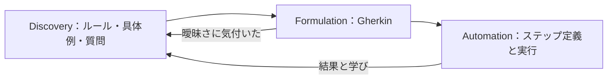

# BDD 記載指示書

対象：[BDD_TEMPLATE.md](BDD_TEMPLATE.md)。シナリオの実行は CT を既定の水準とし、ステップ定義の書き方は [CT_GUIDE.md](../ct/CT_GUIDE.md) 4章にある。記入例：[BDD_SAMPLE.md](BDD_SAMPLE.md)。共通規約：[03_CONVENTIONS.md](../03_CONVENTIONS.md)。

## 1. BDD は活動である

BDD は、業務・開発・品質の観点を持つ人が具体例で期待を揃え（Discovery）、それを共通の言葉で書き（Formulation）、実行できる形にして結果から学ぶ（Automation）活動である。Gherkin の文書や E2E テストのことではない。一人で Gherkin を書いて終えたなら、それは BDD ではなくテスト設計である。



## 2. Discovery：Example Mapping

対象は、業務上の価値が分かる小さな要求のまとまり（ストーリー）1つ。25分程度で区切る。

| 手順 | すること | 問いの例 |
|---|---|---|
| 1 | ストーリーを1文で確かめる | 誰が何を達成したいのか |
| 2 | **ルール**を出す。1つの規則を1文で | 何が成り立てば何を許すのか。許さないのは何か |
| 3 | ルールごとに**具体例**を出す。正例と反例。値を具体的に | どの人が、どの状態で、何をすると、どうなるか。101文字なら。失効していたら。2人同時なら |
| 4 | 答えられないことは**質問**として外に出す | 誰が決めれば例が確定するか |
| 5 | 記録する | テンプレート2章の3つの表 |

判断の目安：質問が多い→まだ着手できない。ルールが多い→ストーリーが大きすぎるので分ける。1つのルールに例が多い→ルールが複雑すぎるので分ける。

ここで見つかった新しい要求は PRD に戻して要件にする。BDD の中だけにある要求を作らない（リンターの E073 が、要件に結び付かないルールを不合格にする）。議論が画面操作やテストコードの話に流れたら、業務上の結果に戻す。

## 3. Formulation：Gherkin の書き方

| 要素 | 書くこと | 避けること |
|---|---|---|
| `# language: ja` | 1行目に必ず書く。1ファイル1言語 | 英語と日本語のキーワードの混在 |
| 機能 | 利用者が得る能力。`@FEAT-nnn`。説明文に誰が何のために必要とするか | 画面名や部品名 |
| 背景 | 全シナリオに共通し、読む人が知っているべき短い前提 | 大量の初期化、こっそり権限を与える前提 |
| ルール | **1つの業務ルールを1文で**。`@RULE-nnn`。PRD の「受入」と対応 | 「○○に関するルール」という入れ物 |
| シナリオ | そのルールを示す具体例1つ。題名は結果が分かるように。`@SCN-nnn` と `@FR-nnn` | 「正常系1」。別のルールの例 |
| 前提 | 成り立っている状態。語彙表の文型を再利用 | 他のシナリオの結果への依存 |
| もし | 業務上の出来事を**1つ** | ならば の後にもう一度 もし（リンター E062） |
| ならば | 観察できる結果（画面・公開API・通知・監査表示）。起きてはいけない副作用が起きていないことも | 内部の変数、DB の行、呼び出し回数。「再検査する」のように出来事の結果でない文 |
| シナリオアウトライン | 同じルールの値違い。境界の内と外 | 違うルールを1つの表に詰める。全組合せの羅列 |
| ステップ数 | 3〜5。7を超えたら分ける | 操作手順の旅行記 |

日本語キーワード：機能／背景／ルール／シナリオ／シナリオアウトライン／例／前提／もし／ならば／かつ／しかし。キーワードの後に半角空白を1つ置く。実行ツールや編集環境の制約で英語キーワードにする場合も、1ファイル1言語と `# language: en` の明記は守る。

### 書き換えの例

直す前（手順と内部の確認、1ステップに複数の事柄、試験の仕掛けの混入）：

```gherkin
# language: ja
機能: 承認
  シナリオ: 正常系1
    前提 テスト用の代役AIを設定し審査者でログインして申請一覧で APP-001 を押す
    もし 承認ボタンを押して理由を入力して送信する
    ならば 申請の管理表の状態列が 2 になり通知の表に1行増える
```

直した後（業務の言葉、1つの出来事、観察できる結果、ルールと要件への結び付き）：

```gherkin
# language: ja
@FEAT-004
機能: 人による決裁
  審査者は、自分以外が提出した申請を、理由を残して決裁する。

  @RULE-008
  ルール: 有効な審査者は他人の提出済み申請を理由付きで決裁できる

    @SCN-017 @FR-011
    シナリオ: 承認すると状態が変わり履歴に残る
      前提 申請者Aが提出した申請 "APP-001" がある
      もし 審査者Aが申請 "APP-001" を理由 "規程を確認した" で承認する
      ならば 申請 "APP-001" の状態は "APPROVED" である
      かつ 監査者Aは申請 "APP-001" の履歴に "承認" を 1 件確認できる
```

### ステップ語彙

同じ意味は同じ文で書く。「状態は変わらない」「SUBMITTED のまま」「維持される」を混ぜず、`申請 "<ID>" の状態は "<状態>" である` に統一する。語彙はテンプレート3章の表に登録し、新しい文型を足す前に既存の文型で書けないか確かめる。リンターは、数値と引用符の中身を除いた文型の一回限り率を計測し、上限（`kit.toml` の `max_unique_step_ratio`）を超えると不合格にする。

試験上の仕掛け（代役、時計の操作、同時到着の作り方）は Gherkin に書かない。「AIは10秒以内に応答しない」は業務の状況であり、それを代役で作るのは自動化の側の仕事である。禁止語は `kit.toml` の `forbidden_terms` で管理する。

### 1つの例で1つの条件だけを変える

「他組織には見えない」を示すのに、他組織の**審査者**に監査出力を要求させると、拒否の原因が組織なのか役割なのか分からない。他組織の**監査者**に出力させ、含まれないことを見る。

## 4. 網羅の確認

テンプレート5章の表を、ルールごとではなく文書全体で埋める。該当するシナリオが無い観点は、理由（他の検証に委ねた・起こり得ない）を書く。特に落としやすいもの：

| 観点 | 例 |
|---|---|
| 時間の経過 | 期限の前日と当日、放置された状態、予告 |
| 状態機械の全状態 | 各状態で、取消・編集・決裁・期限の到来を試したか |
| 再送と同時 | 応答を受け取れなかった再送、期限後の再送、権限を失った後の再送、2人同時 |
| 権限 | 他組織、自分自身、失効後、役割だけを持つ運用者、AI などの機械の主体 |

## 5. Automation への接続

| 論点 | 指針 |
|---|---|
| 実行する層 | ルールを最も安定して確かめられる境界。業務サービスや API で足りる例を、すべて画面の E2E にしない |
| ステップ定義 | 領域の概念（申請・決裁・通知）ごとに整理する。機能ごとに分けると再利用できなくなる。画面・API・外部サービスへのアクセスは別の層に分ける |
| 時刻と待ち | 制御できる時計を使う。実時間の待ちを合否の条件にしない |
| 同時 | 2つの要求を同時に解放して競合を作り、勝者を固定せず「成立はちょうど1件、他方は競合、最終状態は勝者と一致」で判定 |
| 非同期 | 観測の期限、確認の間隔、重複の定義を決める |
| 合否 | 未定義・曖昧・保留のステップ、必要なシナリオのスキップは不合格。通すために期待値を弱めない。期待値を変えるなら、業務の変更か実装の不具合かを7章に書く |
| 実行ツール | `ルール` と `# language: ja` を解釈できることを確かめる。公式 parser を使う実装（Cucumber-JVM、Cucumber.js、pytest-bdd 8 以降、Reqnroll など）なら解釈できる |
| 正本の移管 | 実行ツールを入れたら、`extract` で生成した `.feature` を正本にし、front matter を `gherkin_source: feature` に変える。以後は `.feature` だけを編集し、Markdown 側のフェンスは `mirror` で書き戻す（Markdown を直接編集しない）。両方を手で直す運用はしない |

BDD で確かめないもの（負荷、復旧、内部の一貫性、アクセシビリティ、AI の統計的な品質）は、6章に NVT のIDで書く。

## 6. AI を含む振る舞い

権限の境界、出典の表示、時間切れ、停止、古い版の結果の扱いは、決まった応答を返す代役でシナリオとして確かめられる。生成された内容の有用性や忠実さは、評価セットと評価基準による別の評価（NVT）が要る。文言の完全一致や、モデルが自分で言う確信度で品質を判定しない。攻撃入力では、応答の文面ではなく、状態が変わっていないことと履歴に残っていないことを見る。

## 7. 完成の条件

1. `python tools/kit_lint.py check` が合格する（公式 parser、ID、ルールと要件の双方向の一致、禁止語、ステップの再利用、`.feature` との一致）。
2. 2章に、参加した観点・ルール・具体例・質問が記録されている。質問に担当・期限・保留範囲がある。
3. 5章の全観点に、シナリオか理由がある。
4. status が agreed になるのは関係者が合意したときで、`last_run` が passed になるのは実行証跡があるときである。この2つは別である。
