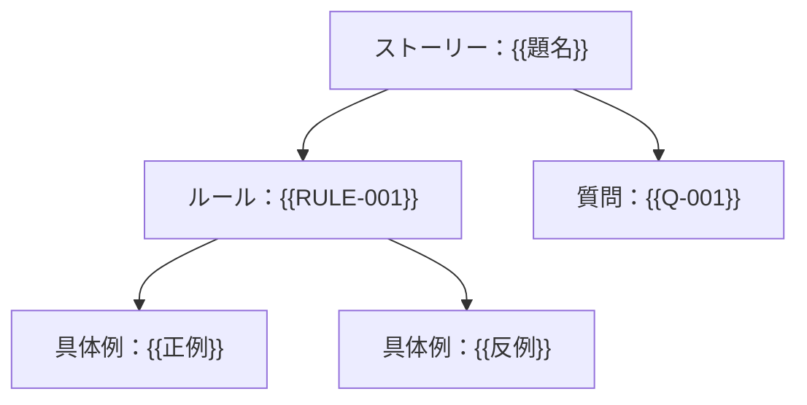

# BDD：{{対象の機能領域}}

> 記入方法は [BDD_GUIDE.md](BDD_GUIDE.md)。BDD は「発見（Discovery）→定式化（Formulation）→自動化（Automation）」の活動で、この文書はその記録である。Gherkin を書いただけでは BDD を実践したことにならない。

## 1. 対象と正本

| 項目 | 内容 |
|---|---|
| 対象の能力 | {{利用者が得る能力}} |
| 対象外 | {{扱わないこと}} |
| 要件の正本 | {{PRD のパス・版}} |
| 関連する設計判断 | {{ADR-ID、または「なし」}} |

## 2. Discovery の記録

| 回 | 日付 | 参加した観点（氏名または役割） | 扱ったルール | 残った質問 |
|---|---|---|---|---|
| 1 | {{日付}} | 業務：{{名前}}／開発：{{名前}}／品質：{{名前}}／{{必要なら安全・運用・UX}} | {{RULE-ID}} | {{Q-ID}} |

| ルールID | 業務ルール（1つの規則を1文で） | 具体例（正例） | 具体例（反例・境界） | 要件 | 優先度 |
|---|---|---|---|---|---|
| RULE-001 | {{条件と、許す／許さないこと}} | {{具体的な値と結果}} | {{境界・失効・失敗}} | FR-001 | {{PRDの優先度}} |

| 質問ID | 未解決の問い | 影響するルール | 決める人・期限 | 決まるまで保留する範囲 |
|---|---|---|---|---|
| Q-001 | {{問い。無ければ行を「なし」にする}} | {{RULE-ID}} | {{担当・期限}} | {{範囲}} |



## 3. 共通語彙とステップ語彙

| 用語 | 業務上の意味 | 混同しないもの |
|---|---|---|
| {{用語}} | {{意味}} | {{内部の実装名など}} |

この表は登録簿である。4章の Gherkin に現れる文型（数値と引用符の中身を `<…>` に正規化した後）は、すべてこの表に載っていなければならない。新しい文型を足す前に、既存の文型で書けないか確かめる。

| 種別 | 再利用するステップ文型 | 意味・前提 |
|---|---|---|
| 前提 | {{例：申請者Aが提出した申請 "<ID>" がある}} | {{初期状態の定義}} |
| もし | {{例：審査者Aが申請 "<ID>" を理由 "<理由>" で承認する}} | {{1つの業務上の出来事}} |
| ならば | {{例：申請 "<ID>" の状態は "<状態>" である}} | {{どこで観察するか（画面・公開API・通知・監査表示）}} |

## 4. Formulation：Gherkin

```gherkin
# language: ja
@FEAT-001
機能: {{利用者が得る能力}}
  {{誰が何のために必要とするかを1〜2文で}}

  背景:
    前提 {{全シナリオに共通し、読む人が知っておくべき短い前提}}

  @RULE-001
  ルール: {{1つの業務ルールを1文で}}

    @SCN-001 @FR-001
    シナリオ: {{結果が分かる題名}}
      前提 {{初期状態}}
      もし {{1つの出来事}}
      ならば {{観察できる結果}}
      かつ {{起きてはいけない副作用が起きていないこと}}

    @SCN-002 @FR-001
    シナリオアウトライン: {{同じルールの境界値}}
      前提 {{初期状態}}
      もし {{値 <入力> を伴う出来事}}
      ならば {{結果 "<結果>" }}

      例:
        | 入力 | 結果 |
        | {{境界の内側}} | {{結果}} |
        | {{境界の外側}} | {{結果}} |
```

## 5. 網羅の確認

| 観点 | 該当するシナリオ | 該当なしの理由 |
|---|---|---|
| 正常・代表的な代替 | {{SCN-ID}} | — |
| 必須・空・最小・最大・境界の外 | {{SCN-ID}} | {{理由}} |
| 無認証・無権限・他組織・失効 | {{SCN-ID}} | {{理由}} |
| 再送・重複・同時・順序の逆転 | {{SCN-ID}} | {{理由}} |
| 依存先の停止・時間切れ・途中の失敗 | {{SCN-ID}} | {{理由}} |
| 取消・訂正・復旧・時間の経過 | {{SCN-ID}} | {{理由}} |
| AI の不確実性・攻撃入力・古い版（該当時） | {{SCN-ID}} | {{理由}} |

## 6. Automation への接続

| 項目 | 内容 |
|---|---|
| 実行する層 | {{業務サービス／API を既定とし、画面固有の確認だけ UI で行う}} |
| 実行ツール | {{Cucumber 実装名と版。Rule と日本語キーワードへの対応を確認済みか}} |
| 時刻・乱数・外部依存 | {{制御できる時計、seed、契約を確認した代役。実接続の試験は別に記録}} |
| 並行・非同期 | {{同時到着の作り方、観測の期限、勝者を固定しない判定}} |
| 失敗とみなすもの | 未定義・曖昧・保留のステップ、必要なシナリオのスキップ、前提データの欠落 |
| BDD では確認しないこと | {{負荷・復旧・内部の一貫性・アクセシビリティ・AIの統計的品質 → NVT-ID}} |

## 7. 合意と変更履歴

実行結果の語彙は `not_run｜partial｜passed｜failed` に固定する（自由記述にしない）。

| 版 | 日付 | 変更内容と理由（期待値の変更は、業務の変更か実装の不具合かを区別） | 合意者 | 実行結果 |
|---|---|---|---|---|
| 0.1.0 | {{日付}} | 初稿 | 未合意 | not_run |
