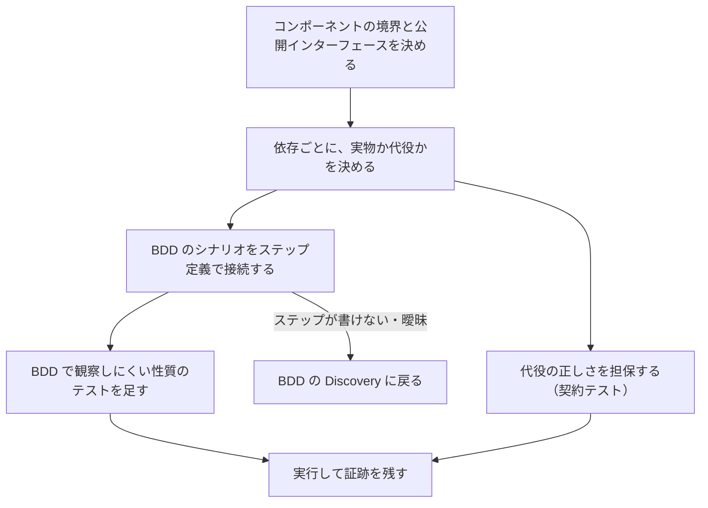

# CT 記載指示書

対象：[CT_TEMPLATE.md](CT_TEMPLATE.md)。記入例：[CT_SAMPLE.md](CT_SAMPLE.md)。水準の分担と共通規約：[06_TEST_STRATEGY.md](../06_TEST_STRATEGY.md)。

## 1. CT の役割と、用語の注意

CT（コンポーネントテスト）は、配備の単位（1つのサービスやアプリ）を、その公開インターフェース越しに確かめる。対象の外側を意図的に切り離すことで、システム全体をつなぐテストより速く安定し、失敗の原因が対象の中に絞れる。BDD のシナリオを実行する既定の水準である。業務ルールは画面に依存しないからである。

用語に注意する。ISTQB は「コンポーネントテスト」をユニットテストと同じ意味で使う。本キットの CT は、Martin Fowler らの言う「範囲を限定したテスト」を配備の単位に適用したもので、ISTQB の水準ではコンポーネント統合テストに近い。組織で呼び名が違う場合は、[06_TEST_STRATEGY.md](../06_TEST_STRATEGY.md) 1章の表の「対象」と「依存の扱い」で読み替える。

## 2. 進め方

| 手順 | すること | 終わりの条件 |
|---|---|---|
| 1 | 境界を決める。テストが操作し観察してよいのは公開インターフェースだけ | 1章に公開インターフェースが列挙されている |
| 2 | 依存を棚卸しし、所有者ごとに扱いを決める（3章） | 2章の表の全行に、扱いと担保がある |
| 3 | 生成された `.feature` を無加工で読み込み、ステップ定義を書く。1つのステップ文型に1つの定義 | 未定義・曖昧なステップが0件 |
| 4 | BDD では観察しにくい性質（一貫性・同時実行・再送・障害時）のテストを足す | 4章の各行に由来とテスト名がある |
| 5 | この水準で行う NVT を決め、範囲を書く。一部だけ行うなら残りの送り先も書く | 5章。全 NVT が、どこか1つの水準の文書に割り当てられている（リンターが検査） |
| 6 | 実行し、結果と証跡を書く。未自動化・未実行はそのまま書く | 3〜5章の状態が実態と一致している |

## 3. 依存の扱い方

| 依存の種類 | 扱い | 理由と注意 |
|---|---|---|
| 自チームが所有する DB・キュー・キャッシュ | **実物**をコンテナなどで起動する | トランザクション・一意制約・同時更新は、フェイクでは本物と食い違いやすい。速度のためにフェイクを使うなら、同じ契約テストをフェイクと実物の両方に走らせる |
| 他チーム・外部のサービス | 代役。取り決めは**契約テスト**で担保する | 相手を起動しない。利用者側のテストが期待を契約として書き出し、提供者側がそれに対して検証する。契約テストは要求と応答の形を確かめるもので、相手の業務ロジックや副作用は確かめない |
| API 仕様（OpenAPI など）がある提供者側 | 仕様からのプロパティベーステストを併用 | 仕様どおりに応答するか、想定外の入力で落ちないかを道具が探す |
| 時計・乱数・識別子の生成 | 注入する | 期限や再送期間を実時間で待たない |
| AI・機械学習の部品 | 決まった応答を返す代役 | CT では「AI がこう返したとき、コンポーネントがどう振る舞うか」だけを確かめる。出力の品質は ST の評価で確かめる |

代役を使ったら、2章の表の「担保」を必ず埋める。空欄の代役は、テストが合格しても本物とつないだときに動く保証にならない。記入例は3つの代役の担保がすべて未実装であり、7章で「未達」と明記している。

## 4. BDD のシナリオを接続する

| 論点 | 指針 |
|---|---|
| `.feature` の扱い | BDD 文書から生成されたものを無加工で読む。テストの都合で `.feature` を直さない。直したいなら BDD 文書を直す |
| ステップ定義の整理 | 領域の概念（申請・決裁・通知）ごと。機能ごとに分けると再利用できない |
| 状態の受け渡し | シナリオごとに新しい「世界」を作り、ステップはそれを介してだけ状態を共有する |
| 試験上の仕掛け | 時計を進める、要求を同時に解放する、障害を注入する、は全部ステップ定義の側に書く |
| 観察 | 「ならば」は公開インターフェースで観察する。保存先の中身を直接読むのは、BDD ではなく固有のテスト（障害時の一貫性など）に限る |
| タグ | Gherkin のタグ（SCN・FR・RULE）を実行時の印に写し、証跡からIDをたどれるようにする |
| 合否 | 未定義・曖昧・保留のステップ、スキップは不合格。通すために「ならば」を弱めない |

記入例では、日本語キーワードと `ルール` を含む `features/FEAT-004.feature` を pytest-bdd でそのまま実行し、16ケースすべてが合格している。シナリオアウトラインの `<決裁>` のような置換は、置換後の文がステップ定義に渡る。

## 5. BDD では足りない、コンポーネント固有のテスト

| 性質 | なぜ BDD では足りないか | 技法 |
|---|---|---|
| 障害時の一貫性 | 業務の言葉では「決裁は成立しない」までしか言えない。途中まで書かれた記録が残っていないかは内部を見る必要がある | 保存の各段階に障害を注入し、前後の全記録を比較 |
| 同時実行 | シナリオは2者の競合を1例示すだけ。多重度を上げた確認は別に要る | 同時に解放する仕掛けで N 本。結果の性質（ちょうど1件）で判定 |
| 認可の全分岐 | 主体×操作×状態の全組合せを Gherkin に書くと読めない | 決定表からテストを生成 |
| 契約 | 相手との取り決めは業務ルールではない | 契約テスト |
| 移行・スキーマ変更 | 業務の振る舞いではない | 旧スキーマのデータで起動し、新しい版で読めることを確かめる |

## 6. 章ごとの書き方

| 章 | 必ず答える問い | 悪い例 → 良い例 |
|---|---|---|
| 1 対象と正本 | どの配備単位を、どの入口から確かめるか | 「バックエンド全体」→ サービスを1つ名指しし、公開インターフェースを列挙 |
| 2 境界と依存 | 何が実物で、何が代役か。代役は何で担保するか | 「外部はモック」→ 依存ごとに所有者・扱い・担保 |
| 3 BDD の実行 | どの機能のどのシナリオを、どの層で実行し、いまどういう状態か | 「BDD は別途」→ 機能ごとに自動化の状態と結果。未実行は未実行と書く |
| 4 固有のテスト | BDD で見えない何を確かめるか | 「異常系テスト」→ 性質を1文で、技法と由来つき |
| 5 NVT | どの専用検証を、どこまでこの水準で行うか | NVT を ST に丸投げ → 早く確かめられる部分を CT で。残りの送り先を書く |
| 6 データ・時刻・並行 | どう決定的にするか | 「テスト環境の共有 DB」→ テストごとに作って片付ける |
| 7 十分性 | 何をもって足りるとするか | 基準を満たしていないなら「未達」と書き、何が足りないかを書く |

## 7. レビューの観点

| 観点 | 反例として当てる問い |
|---|---|
| 境界 | テストが非公開の関数や保存先の中身に触れていないか。触れているなら、それは固有のテストとして理由があるか |
| 代役 | 代役の応答は、本物が実際に返すものか。本物が仕様を変えたら、何が失敗して気付けるか |
| 分担 | UT で網羅した組合せを、CT でもう一度網羅していないか |
| 決定性 | 実時間の待ち、実行順への依存、共有データが無いか。並列に実行しても合格するか |
| 同時実行 | 勝者を固定していないか。「たまたま順番に実行された」だけで合格していないか |
| 状態の正直さ | 「自動化済み」「合格」と書いたものに、証跡があるか |

## 8. 完成の条件

1. `python tools/kit_lint.py check` が合格する（テンプレートとの一致、由来のIDの実在、BDD の全機能が CT か ST の文書に割り当てられている、全 NVT がちょうど1つの文書に割り当てられている、accepted の ADR を由来とするテストが1件以上ある、テスト名がコードに実在、証跡が古くない）。
2. 2章のすべての代役に担保がある。無ければ7章に未達と書く。
3. 3〜5章の自動化と結果の欄が、証跡と一致している。
