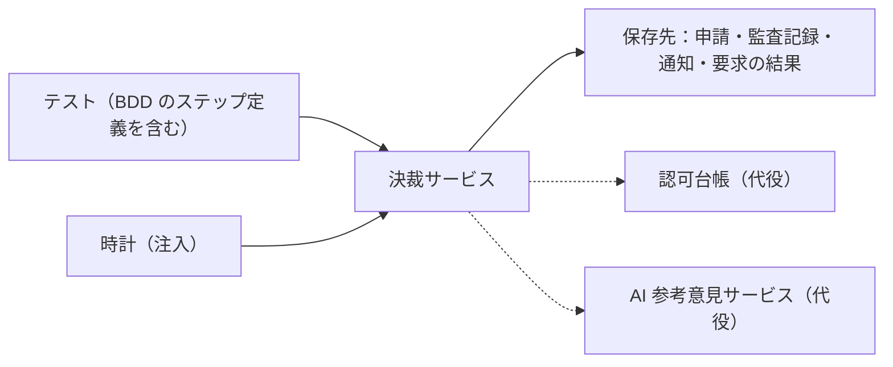

# CT 設計：FlowApprove の決裁サービス

> **記入例。** 対象は最小の参考実装で、製品ではない。自動化したのは FEAT-004（人による決裁）と固有のテスト4件で、これらは実際に実行した結果を書いている。それ以外は「未自動化」「未実行」と明記している。参考実装の保存先はメモリ上のフェイクであり、実物の DB に対する確認は行っていない（2章）。テンプレートは [CT_TEMPLATE.md](CT_TEMPLATE.md)。

## 1. 対象と正本

| 項目 | 内容 |
|---|---|
| 対象のコンポーネント | 決裁サービス。申請の提出・修正・決裁を受け付け、状態・監査記録・通知・要求の結果を確定する |
| 公開インターフェース | `submit`・`edit`・`decide` と、観察用の `state_of`・`history`・`notifications`。テストは保存先の中身を直接読まない（障害注入の確認を除く） |
| 対象外 | 画面、AI 参考意見サービス、認証基盤、負荷時の性能（ST） |
| 由来 | FEAT-001〜FEAT-008、NVT-002・NVT-010・NVT-011、ADR-0001・ADR-0002 |
| テストコードの場所と実行方法 | `examples/flowapprove_core/tests/component/`。`python tools/run_examples.py` |

## 2. コンポーネントの境界と依存の扱い

| 依存 | 所有者 | CT での扱い | 代役の正しさをどう担保するか |
|---|---|---|---|
| 保存先 | 自チーム | **参考実装ではメモリ上のフェイク。** 実案件では実物の DB をコンテナで起動し、同じテストを走らせる | フェイクを残す場合は、CT-005（同じ契約テストをフェイクと実物の両方に実行）で担保する。未実装 |
| 認可台帳 | 認証基盤チーム（架空） | プロセス内のフェイク | CT-006（契約テスト）。未実装。RISK-001（同期遅延）は ST で確かめる |
| AI 参考意見サービス | AI チーム（架空） | 決まった応答を返す代役。FEAT-003・FEAT-008 の自動化時に用意する | 契約テスト。未実装。出力の品質は NVT-007（ST） |
| 時計 | — | 関数として注入し、テストが進める | — |

## 3. BDD シナリオの実行

| 機能 | シナリオ | 実行する層 | 自動化 | 結果 |
|---|---|---|---|---|
| FEAT-001 | SCN-001〜SCN-006 | 公開インターフェース | 未自動化 | 未実行 |
| FEAT-002 | SCN-007〜SCN-010 | 公開インターフェース | 未自動化 | 未実行 |
| FEAT-003 | SCN-011〜SCN-016、SCN-040 | 公開インターフェース（AI は代役） | 未自動化 | 未実行 |
| FEAT-004 | SCN-017〜SCN-025、SCN-041、SCN-042（11シナリオ、展開後16ケース） | 公開インターフェース | 自動化済み（pytest-bdd 8.1.0。`features/FEAT-004.feature` を無加工で実行） | 16ケースすべて合格 |
| FEAT-005 | SCN-026〜SCN-028 | 公開インターフェース | 未自動化 | 未実行 |
| FEAT-006 | SCN-029〜SCN-031 | 公開インターフェース | 未自動化 | 未実行 |
| FEAT-007 | SCN-032〜SCN-036 | 公開インターフェース（時計を進める） | 未自動化 | 未実行 |
| FEAT-008 | SCN-037、SCN-038 | 公開インターフェース（AI は代役） | 未自動化 | 未実行 |

画面経由でも実行するシナリオ（SCN-001・SCN-017）は [ST_SAMPLE.md](../st/ST_SAMPLE.md) の旅程に含めている。

## 4. コンポーネント固有のテスト

| ID | 確かめる振る舞い | 技法 | 由来 | テスト名 |
|---|---|---|---|---|
| CT-001 | 監査記録の保存で失敗したら、状態・通知・要求の結果のどれも残らず、復旧後は同じ要求が成立する | 障害注入 | FR-014、NVT-010、ADR-0002 | `test_audit_failure_rolls_back_every_write` |
| CT-002 | 同じ要求の識別子を8本同時に送っても、決裁と通知は1件で、全員が同じ結果を受け取る | 同時実行 | FR-015、FR-016、ADR-0002 | `test_same_request_id_sent_concurrently_decides_and_notifies_once` |
| CT-003 | 決裁操作は、失効していない同じ組織の審査者だけに許され、他の主体には状態も版も返らない | 決定表（主体5×失効の有無） | FR-001、FR-002、NVT-002 | `test_authorization_decision_table_for_decide` |
| CT-004 | AI 処理主体には審査者の資格が無く、決裁要求は成立せず履歴にも残らない | 例示 | FR-008、ADR-0001 | `test_ai_principal_has_no_path_to_decide` |
| CT-005 | 保存先のフェイクと実物が、トランザクション・一意制約・同時更新について同じ振る舞いをする | 契約テスト（同じテストを両方に実行） | FR-014、ADR-0002 | 未実装 |
| CT-006 | 認可台帳の代役が、実物の応答の形と失効の反映の取り決めに合っている | 契約テスト | FR-001、NVT-002 | 未実装 |

## 5. 専用検証（NVT）の実行

| 検証ID | この水準で行う範囲 | 方法と道具 | 自動化 | 結果 |
|---|---|---|---|---|
| NVT-010 | 全部 | 保存の途中に障害を注入し、前後の全記録を比較（CT-001） | 自動化済み（フェイクに対して） | 合格。実物の DB では未実行 |
| NVT-002 | 一部：決裁操作の分岐（CT-003）。一覧・詳細・更新・出力・再送の分岐と、脅威モデルのレビュー・ASVS の確認は未着手 | 決定表から生成したテスト | 一部自動化 | 決裁の10分岐は合格。残りは未実行 |
| NVT-011 | 全部 | 合成の操作列を流し、記録された時刻から KPI を再計算して照合 | 未自動化（参考実装に FR-026 が無い） | 未実行 |

## 6. データ・時刻・並行

| 項目 | 方針 |
|---|---|
| テストデータ | テストごとに新しい保存先と認可台帳を作る。共有しない |
| 時刻 | 時計を関数として注入し、「25時間が経過している」はテストが時計を進める。実時間では待たない |
| 同時実行 | `threading.Barrier` で要求を同時に解放する。SCN-021 はどちらが勝つかを固定せず、「成立がちょうど1件、他方は競合、最終状態は勝者と一致」で判定 |
| 非同期 | 参考実装に非同期の処理は無い。通知を非同期にした場合は観測の期限（60秒）を設ける |
| 障害注入 | 保存先の監査記録の追記に失敗を注入する（`audit_fault`） |

試験上の仕掛け（時計・同時解放・障害注入）はすべてステップ定義とテストコードの側にあり、Gherkin には現れない。

## 7. 十分性の基準

| 指標 | 基準 | 測り方 | 基準に届かないとき |
|---|---|---|---|
| シナリオの実行 | 対象スライスの全シナリオが実行され合格。未定義・保留・スキップは不合格 | 実行結果 | ステップ定義を足す |
| 依存の扱い | 代役のすべてに、正しさの担保がある | 2章の表 | 契約テストを足す（現状：3つとも未実装のため、この基準は**未達**） |
| 実行時間と安定性 | CT 全体で5分以内。不安定なテスト0件 | 実行記録 | 遅いものは分割、不安定なものは隔離して直す |

## 8. 実行と証跡

| 項目 | 内容 |
|---|---|
| 実行の契機 | プルリクエストと主ブランチへの統合 |
| 大きさの宣言 | medium。モジュール全体に `pytest.mark.medium` を付けている |
| 証跡 | [evidence/example_tests.json](../evidence/example_tests.json)。Gherkin のタグ（SCN・FR・RULE・FEAT）は実行時に `req` の印へ写され、テストごとに記録される |
| 直近の結果 | 29件すべて合格（BDD 16ケース＋固有のテスト13ケース）。所要時間は証跡 `durations` を参照。`service.py` の分岐カバレッジ 94.4% |

## 9. 変更履歴

| 版 | 日付 | 変更内容と理由 | 影響ID | 合意者 |
|---|---|---|---|---|
| 0.1.0 | 2026-09-19 | 初稿。FEAT-004 と固有のテスト4件を自動化 | FEAT-004・CT-001〜CT-004 | 未合意（架空例） |
