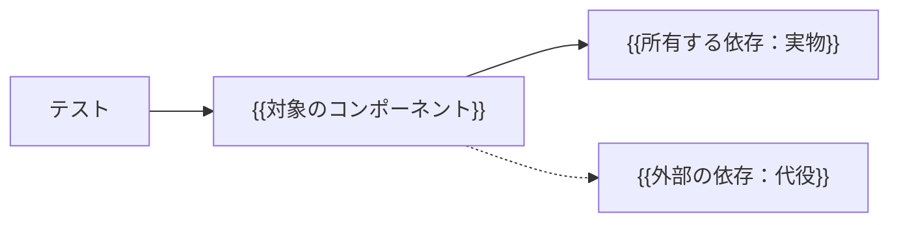

# CT 設計：{{対象のコンポーネント}}

> 記入方法は [CT_GUIDE.md](CT_GUIDE.md)。CT は、配備の単位（1つのサービスやアプリ）を公開インターフェース越しに確かめる。BDD のシナリオを実行する既定の水準である。

## 1. 対象と正本

| 項目 | 内容 |
|---|---|
| 対象のコンポーネント | {{配備の単位と、その責務}} |
| 公開インターフェース | {{API・メッセージ・コマンド。テストはここからだけ操作し、ここでだけ観察する}} |
| 対象外 | {{画面、他のコンポーネント、本番相当の負荷}} |
| 由来 | {{FEAT・FR・NVT・ADR のID}} |
| テストコードの場所と実行方法 | {{パスとコマンド}} |

## 2. コンポーネントの境界と依存の扱い

| 依存 | 所有者 | CT での扱い | 代役の正しさをどう担保するか |
|---|---|---|---|
| {{データベース}} | 自チーム | {{実物をコンテナで起動}} | — |
| {{他チームのサービス}} | {{チーム名}} | {{契約に基づく代役}} | {{契約テスト。相手側での検証の場所}} |
| {{時計・識別子の生成}} | — | {{注入}} | — |

## 3. BDD シナリオの実行

| 機能 | シナリオ | 実行する層 | 自動化 | 結果 |
|---|---|---|---|---|
| FEAT-001 | {{SCN の範囲と件数}} | {{公開 API}} | {{未自動化／自動化済み}} | {{未実行／合格／不合格}} |

## 4. コンポーネント固有のテスト

| ID | 確かめる振る舞い | 技法 | 由来 | テスト名 |
|---|---|---|---|---|
| CT-001 | {{BDD では観察しにくい性質：トランザクション、同時実行、再送、障害時の一貫性、契約}} | {{障害注入／同時実行／決定表／契約テスト}} | FR-001 | `{{test_name}}` |

## 5. 専用検証（NVT）の実行

| 検証ID | この水準で行う範囲 | 方法と道具 | 自動化 | 結果 |
|---|---|---|---|---|
| {{この水準で行う NVT のID。無ければ行を「なし」にする}} | {{全部／一部（残りの送り先）}} | {{方法}} | {{状態}} | {{結果}} |

## 6. データ・時刻・並行

| 項目 | 方針 |
|---|---|
| テストデータ | {{テストごとに作り、片付ける。共有しない}} |
| 時刻 | {{制御できる時計。実時間で待たない}} |
| 同時実行 | {{同時に解放する仕掛け。勝者を固定せず結果の性質で判定}} |
| 非同期 | {{観測の期限と間隔}} |
| 障害注入 | {{どこに、どの障害を}} |

## 7. 十分性の基準

| 指標 | 基準 | 測り方 | 基準に届かないとき |
|---|---|---|---|
| シナリオの実行 | {{対象スライスの全シナリオが実行され合格。未定義・保留・スキップは不合格}} | {{実行結果}} | {{ステップ定義を足す}} |
| 依存の扱い | {{代役のすべてに、正しさの担保がある}} | {{2章の表}} | {{契約テストを足す}} |
| 実行時間と安定性 | {{全体で n 分以内。不安定なテスト0件}} | {{CI の記録}} | {{遅いものは分割、不安定なものは隔離して直す}} |

## 8. 実行と証跡

| 項目 | 内容 |
|---|---|
| 実行の契機 | {{プルリクエスト・主ブランチへの統合}} |
| 大きさの宣言 | {{medium。単一マシン内}} |
| 証跡 | {{形式と保存先。対象の版と確かめたIDを含む}} |
| 直近の結果 | {{件数・合否、または「未実行」}} |

## 9. 変更履歴

| 版 | 日付 | 変更内容と理由 | 影響ID | 合意者 |
|---|---|---|---|---|
| 0.1.0 | {{日付}} | 初稿 | — | 未合意 |
