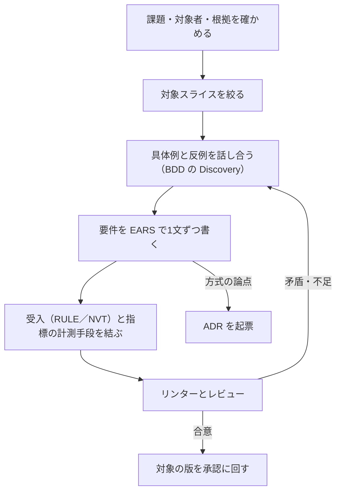

# PRD 記載指示書

対象：[PRD_TEMPLATE.md](PRD_TEMPLATE.md)。検証計画（NVT）と成功条件（GOAL）が、どのテスト水準で確かめられるかは [06_TEST_STRATEGY.md](../06_TEST_STRATEGY.md)。記入例：[PRD_SAMPLE.md](PRD_SAMPLE.md)。共通規約：[03_CONVENTIONS.md](../03_CONVENTIONS.md)。

## 1. PRD の役割と、書かないこと

PRD は、製品・業務・開発・品質・運用が「解く課題」と「成功の条件」を同じ言葉で持つための入口である。設計書ではない。方式や製品名が頭に浮かんだら、それが外から与えられた制約でない限り PRD には書かず、12章に論点として挙げて ADR に渡す。

次のどれかに当てはまるなら PRD は要らない。バックログの項目で足りる：目的も受入条件も1〜2文で言え、権限・データ・品質への影響が無く、やり直しが容易。

## 2. 進め方

| 手順 | 誰が | 何をするか | 終わりの条件 |
|---|---|---|---|
| 1 | 製品責任者・業務代表 | 依頼の背景、対象者、現行の業務、困りごとの発生箇所を確かめる。面談・観察・計測の出所と日付を残す | 2章の根拠表に、事実と仮説が区別されて並んでいる |
| 2 | 製品責任者 | 一度に扱う範囲（スライス）を決める。目的に効く最小の能力に絞る | 5章の対象と対象外が、第三者にも判定できる |
| 3 | 業務・開発・品質 | ルールと具体例を話し合う（[BDD_GUIDE.md](../bdd/BDD_GUIDE.md) の Discovery）。ここで要件の抜けが見つかる | ルール・具体例・質問が分かれている |
| 4 | 製品責任者・開発 | 要件を EARS の型で1文ずつ書く（3章の規則） | 全要件がリンターの E030〜E039 を通る |
| 5 | 製品責任者・品質・分析 | 各 FR に受入（RULE または NVT）、各 NFR に NVT、各指標に計測手段を結ぶ | 目的→要件→受入、指標→計測要件 が切れていない |
| 6 | 全員 | `kit_lint.py check` を通し、6章の観点でレビューする | 指摘に根本原因と是正が付いている |
| 7 | 製品責任者 | 対象の版を承認に回し、15章に承認者・日時・条件を記録する | 承認の記録があるまで status は in_review |

## 3. 章ごとの書き方

| 章 | 必ず答える問い | 悪い例 → 良い例 |
|---|---|---|
| 1 要約 | 誰に、なぜ、何を、今回はどこまで。いま誰に何の判断を求めているか | 「申請システムを刷新する」→「審査者が根拠確認に時間を取られ版を取り違える。出典付きの参考意見と版の追跡を提供する。購入・配布は扱わない」 |
| 2 背景 | どこで何が起きているか。どう確かめたか。作らない選択肢はなぜ駄目か | 「現場から要望が多い」→「審査者5名の観察で、1件あたり中央値40分のうち25分が規程の再確認（2026-08、30件）。仮説ではなく実測」 |
| 3 目的と指標 | 何がどう変われば成功か。何を悪化させてはいけないか。その数字は何で測れるか | 「審査を効率化」→式・母集団・期間・基準値・判定時点・計測手段を埋める。基準値が無ければ「未測定」と書き、測る計画を書く。用語（『内容版』のような）は10章の用語集で定義する |
| 4 利用者と権限 | 誰が何をでき、何をできないか | できることだけを書く → **できないこと**（自己承認・他組織・役割だけを理由にした閲覧）を必ず書く |
| 5 スコープ | 何を含め、何を含めないか。何を仮定しているか | 「将来対応」→対象外と、見直すきっかけを書く |
| 6 状態（任意） | どの状態で、誰が、何をすると、どうなるか | 図だけ → 図と状態表の両方。全状態について、取消・放置・時間の経過を確かめる |
| 7 機能要件 | どの条件で、システムは何をしなければならないか | 次節 |
| 8 非機能要件 | 誰が何をどの負荷・状態でしたとき、何がどの数値なら合格か | 「高速であること」→刺激と環境、合格基準（数値・単位・分位・期間）、検証ID |
| 9 検証と受入 | BDD で見ないものを、いつ誰がどう確かめるか。各ゲートは何で通るか | 「テストで確認」→方法・環境・除外・時点・担当 |
| 10〜11・13（任意） | 該当するときだけ | 不要なら節ごと削除する。「該当なし」と書いた節を残さない |
| 12 設計の論点 | どの要件が設計判断を必要としているか | 方式を要件に書く → 論点として挙げ ADR に渡す。無ければ「該当なし」と判定者を書く |
| 14 リスクと未決 | 何が決まっておらず、誰がいつ決め、それまで何を止めるか | 「要検討」→担当・期限・保留する範囲 |
| 15 履歴と承認 | どの版を、誰が、いつ、どの条件で承認したか | 役職名だけ → 氏名・日時・対象の版・条件 |

## 4. 機能要件の書き方（EARS）

1要件＝1文＝1ID。文末は「…なければならない。」または「…てはならない。」。

| 型 | 構文 | 使う場面 | 例 |
|---|---|---|---|
| 常時 | システムは、〈応答〉しなければならない。 | いつでも成り立つ性質 | システムは、AI処理主体に申請の状態を変更する手段を与えてはならない。 |
| イベント | 〈契機〉とき、システムは〈応答〉しなければならない。 | 出来事への応答 | 決裁が確定したとき、システムは申請者の通知一覧にその決裁の通知を1件だけ表示しなければならない。 |
| 状態 | 〈状態〉間、システムは〈応答〉しなければならない。 | ある状態が続く間の振る舞い | 申請がDRAFT・RETURNED以外の状態である間、システムは申請内容の編集を拒否しなければならない。 |
| 異常 | もし〈望ましくない契機〉ならば、システムは〈応答〉しなければならない。 | エラー・不正・失敗・競合 | もし審査者が自分の提出した申請の決裁を要求したならば、システムは状態を変えずに自己決裁として拒否しなければならない。 |
| オプション | 〈機能・構成〉場合、システムは〈応答〉しなければならない。 | 機能が有効なときだけ | AI参考意見機能が有効な場合、審査者が参考意見を要求したとき、システムは… |
| 複合 | 〈状態〉間、〈契機〉とき、システムは〈応答〉しなければならない。 | 状態と契機の両方が要る | — |

書き換えの例：

| 直す前 | 問題 | 直した後 |
|---|---|---|
| 申請を適切に処理する | 合否を判定できない | イベント型で契機と観察できる応答を書く（FR-003） |
| 入力を検証し、不備があればエラーを表示し、ログに記録する。再提出時は再検査する。 | 1つのIDに複数の義務。どれが不合格か追えない | 義務ごとにIDを分ける。ログは観察できる結果でなければ NFR か SPEC へ |
| 通知は最大5回、1・2・4・8分の間隔で再試行する | 方式の指定。より単純な設計を締め出す | 結果を要求する：「1件だけ表示」（FR-016）、「5分以内に表示できなければ運用者が把握できる」（FR-017）、遅延の基準（NFR-005）。方式は ADR |
| Redis でキャッシュして高速化する | 手段と目的の混同 | NFR に p95 の基準を書き、手段は ADR で比較する |
| セキュアであること | リスクも判定条件も無い | 「もし要求者に権限がないならば、内容も存在も明かさない共通の拒否結果を返す」（FR-002）と、全分岐の検証（NFR-002） |
| 失敗したら拒否する | 拒否した後に利用者が復帰できない | 状態を保つこと、何を表示するか、どうやり直せるかを応答に含める（FR-004・FR-013） |

異常型は最も書き忘れやすい。各イベント型の要件について、権限なし・入力不正・競合・再送・依存先の失敗・時間切れを順に当て、必要なものを異常型で書く。

優先度は Must（無ければリリースしない）・Should（重要だが回避策がある）・Could（余裕があれば）。全件 Must は優先順位を付けていないのと同じである。今回やらないものは要件表に入れず、5章の対象外に書く。

## 5. 指標と非機能要件で落としやすい点

| 論点 | 確かめること |
|---|---|
| 指標が測れるか | その数字を出すための記録を、どの要件が作るのか。無ければ計測要件を追加する（サンプルの FR-026）。人に申告させる計測は、作業を増やし結果を歪める |
| 指標と受入の違い | 「不備があれば提出できない」は受入。「審査時間が20%減る」はリリース後に測る成果仮説。「権限のない決裁が0件」はガードレールで、超えたら何を止めるかを書く |
| 基準値 | 未測定なら「未測定」と書き、期間・最低件数・欠損の扱いを決める。基準値が0や少数なら比率を計算しない |
| 性能 | 操作の比率、到着率とそのモデル（一定の到着率か、同時接続数の固定か）、データ件数、暖機、測定時間、測定点、分位、エラー率。負荷が目標に達しなかった測定は無効 |
| 可用性 | 母集団（有効な要求）、良い結果の定義、期間、除外、計測欠損の扱い、エラーバジェットを使い切ったときの方針 |
| 復旧 | 想定する障害、RPO／RTO、復旧後に何を照合するか |
| アクセシビリティ | 規格の版とレベル、対象画面、手動確認。自動検査の指摘0件だけで適合としない |
| AI の品質 | 評価セットの構成と版、指標と分母、閾値、判定者と一致度、評価セットの入替、全件棄権で指標を稼げないこと |
| 品質特性の棚卸し | ISO/IEC 25010:2023 の9特性を順に見て、要件にしなかった特性と理由を8章の末尾に書く |

## 6. レビューの観点

| 観点 | 反例として当てる問い |
|---|---|
| 目的 | 全部作っても目的に効かない、ということはないか。GOAL を根拠にした FR はあるか |
| 根拠 | 仮説を事実として書いていないか |
| 権限 | 他組織、自己承認、失効後、再送、出力、運用者ではどうなるか |
| 状態と時間 | 全状態について、取消・放置・期限の到来・古い版の遅れた結果はどうなるか。削除の起点に到達しない状態は無いか |
| 並行と再送 | 同時の操作、応答の喪失、同じ要求の再送、期限後の再送ではどうなるか |
| 故障 | 依存先が止まったとき、何が続き何が止まるか。戻し方はあるか |
| 手段の混入 | 要件に方式・製品名・内部パラメータが入っていないか |
| 測定 | 数値に単位・母集団・期間・測定点があるか |

## 7. 完成の条件

1. `python tools/kit_lint.py check` が合格する（構造・EARS・根拠・受入・計測手段・ルールとの一致）。
2. 1章の要約が本文と矛盾しない。図と状態表が矛盾しない。
3. 未決事項に担当・期限・保留範囲がある。
4. 承認の記録が無い間、status は draft または in_review である。
5. 実装者には、承認された版の PRD・accepted の ADR・合意した BDD・未作成の SPEC の一覧を渡す。「PRD を読んで細部は自由に補って公開して」とは依頼しない。
