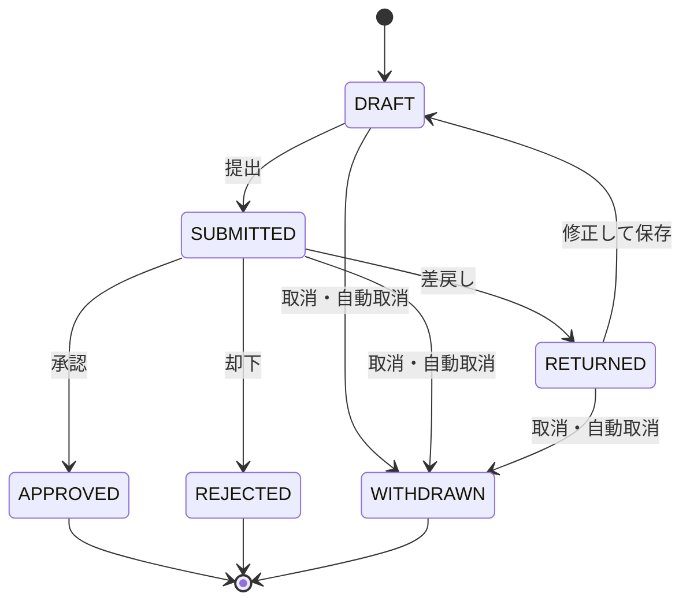

# PRD：FlowApprove（社内ソフトウェア利用申請とAI審査補助）

> **架空の記入例。** 組織・数値・期間はすべて説明用で、実測・契約・法令の値ではない。製品は未実装、承認も存在しない（だから `status: draft`）。テンプレート [PRD_TEMPLATE.md](PRD_TEMPLATE.md) の全必須節を、テンプレートと同じ表で埋めている。

## 1. 要約

| 項目 | 内容 |
|---|---|
| 誰の、どんな困りごとか | ソフトウェア利用申請の審査者が、規程や過去判断の確認に時間を取られ、申請の版を取り違える |
| 目指す変化 | 根拠の確認が速くなり、誰がどの版を決裁したかを常に追える |
| 提供する能力 | 申請の提出・差戻し・取消、出典付きのAI参考意見、人による決裁、決裁の通知、監査表示 |
| 今回やらないこと | ソフトウェアの購入・配布、メール通知、AIによる自動承認 |
| 成功の判断 | KPI-001・KPI-002、GRD-001・GRD-002 |
| いま求める判断 | 版0.5.0のレビュー（G1 実装着手の可否） |

## 2. 背景・課題・根拠

現行は申請フォームと調査メモが別々で、審査者は規程・ベンダー情報・過去の判断を手作業で突き合わせている。差戻し後に申請内容が変わっても、古い調査メモで判断してしまう余地がある。以下は業務仮説であり、面談・計測は未実施である。

| 根拠ID | 内容 | 出所・取得日・範囲 | 事実／仮説 | 限界 |
|---|---|---|---|---|
| EVID-001 | 審査時間の多くが根拠の再確認に使われている | 架空設定（実案件では審査者5名以上の業務観察） | 仮説 | 実測なし。G1 までに基準値を計測する |
| EVID-002 | 版の取り違えと権限のない決裁は、件数が少なくても影響が大きい | 架空設定（実案件では過去の監査指摘） | 仮説 | 発生頻度は不明 |

検討した代替（作らない案を含む）：①既存フォームの入力項目とチェックリストの統一だけを行う（AIなし）。効果は見込めるが根拠確認の時間は減らない。本PRDはAIが無くても申請と審査が成立することを要求し（FR-010）、①を縮退経路として内包する。②既製のワークフロー製品の導入。版ごとの根拠提示ができる製品を確認できておらず、RISK-003 で調査する。

## 3. 目的・成果指標・ガードレール

| 目的ID | 対象者 | 期待する変化 | 根拠 |
|---|---|---|---|
| GOAL-001 | 審査者 | 根拠確認を含む審査の所要時間が短くなる | EVID-001 |
| GOAL-002 | 組織（監査者・申請者を含む） | 権限のない決裁と版の取り違えが起きず、起きた場合は追跡できる | EVID-002 |

| 指標ID | 種類 | 定義（式・単位・母集団・期間） | 基準値 | 目標と判定時点 | 計測手段 |
|---|---|---|---|---|---|
| KPI-001 | 成果 | 審査着手（審査者が申請詳細を初めて開いた時刻）から決裁確定までの経過時間の中央値（分）。決裁が確定した申請が母集団。差戻しを挟む申請は別集計 | 未測定（第1段階でFR-026の記録から算出） | 基準値比20%減を仮説目標とする。第2段階の4週間・100件以上と第1段階の比較で判定し、標本不足なら判定を保留 | FR-026 |
| KPI-002 | 成果 | 提出から決裁確定までの経過時間の中央値とp90（時間）。取消は除外し件数を併記 | 未測定 | KPI-001 の改善と引き換えに悪化していないこと。判定時点は KPI-001 と同じ | FR-003・FR-026 |
| GRD-001 | ガードレール | 権限のない決裁・自己決裁・他組織への開示・監査記録のない決裁・重複決裁の確認件数 | 0件 | 0件。1件でも該当経路を止めて影響を調べる | FR-014・FR-029 の監査記録を、外部：月次の監査レビューで集計 |
| GRD-002 | ガードレール | 人の操作でもACT-006の予定処理でもない状態変化の件数 | 0件 | 0件。1件でもAI参考意見機能を停止する | FR-008・FR-014 |

KPI-001 は操作していない時間も含む近似である。審査者に作業時間を自己申告させる方法は、計測自体が作業を増やし結果を歪めるため採らない。前後比較は申請種類の構成比も併記し、差をそのまま因果効果と断定しない。

## 4. 利用者・権限

| 主体ID | 役割と目的 | できること | できないこと |
|---|---|---|---|
| ACT-001 | 申請者：業務に必要なソフトウェアの利用許可を得る | 自分の申請の作成・閲覧・編集・提出・取消、自分宛て通知の閲覧 | 他人の申請の閲覧、決裁 |
| ACT-002 | 審査者：規程に沿って判断する | 同じ組織の申請と履歴の閲覧、参考意見の要求、提出済み申請の決裁 | 自分が提出した申請の決裁、他組織の申請への操作 |
| ACT-003 | 監査者：決裁の経緯を確認する | 同じ組織の申請・履歴・監査記録の閲覧と出力 | 申請内容や決裁の変更 |
| ACT-004 | 運用者：サービスを維持する | AI参考意見機能の停止と復帰、要対応通知の確認 | 役割だけを理由とする申請本文の閲覧、決裁 |
| ACT-005 | AI処理主体：参考意見を作る | 対象申請の内容と許可済み出典の読み取り | 申請の状態変更、権限変更、許可済み出典以外の取得 |
| ACT-006 | システム（予定処理）：期限の到来による自動取消・予告・削除対象化を行う | 期限到来時の FR-021〜FR-023 の遷移と通知 | 決裁、参考意見、権限変更 |

一人が複数の役割を持っても、自己決裁の禁止は解除されない。「権限がある」とは、要求を処理する時点でアプリケーションの認可台帳が許可していることを指し、認証トークンが期限内であることとは別である。

## 5. スコープ

| 区分 | 内容 | 理由 | 見直す条件 |
|---|---|---|---|
| 対象 | 申請の提出・差戻し・修正・取消、AI参考意見、人による決裁、アプリ内通知、監査表示、AI機能の停止と復帰、保存期限に基づく削除 | GOAL-001・GOAL-002 に直接効く最小の範囲 | — |
| 対象外 | 購入・配布・インストール、メールやチャットへの通知、AIによる自動承認、ベンダーURLの自動取得 | 外部への副作用を伴い、権限と補償の設計が別に必要 | 外部通知の要望が出たら新しいPRDスライスとADRで扱う |
| 前提 | 組織IDと主体IDを確認できる認証基盤、役割を管理する認可台帳、組織が利用を許可した規程・出典集が存在する | 未確認（架空設定） | 成立しなければ RISK-001 の検証を先に行う |
| 制約 | 本文の保存は終端から90日、監査の最小記録は365日（架空の社内規程） | 出所：情報管理規程（架空）。変更権限はデータ管理責任者 | 規程改定時に FR-021・NFR-009 を変更管理にかける |

## 6. 業務フロー・状態（任意）

| 現状態 | 出来事 | 許可される主体・条件 | 次状態 | 要件 |
|---|---|---|---|---|
| DRAFT | 提出 | 申請者本人、入力規則を満たす | SUBMITTED | FR-003・FR-004 |
| SUBMITTED | 承認／却下／差戻し | 申請者本人でない有効な審査者、現行の版を指定 | APPROVED／REJECTED／RETURNED | FR-011・FR-012・FR-013 |
| RETURNED | 修正して保存 | 申請者本人 | DRAFT（内容版+1） | FR-019 |
| DRAFT・SUBMITTED・RETURNED | 取消 | 申請者本人、理由付き | WITHDRAWN | FR-018 |
| DRAFT・RETURNED | 180日間更新なし | ACT-006（予定処理） | WITHDRAWN | FR-022 |
| SUBMITTED 以外（DRAFT・RETURNED・終端状態） | 決裁の要求 | 誰にも許可しない | 変化なし | FR-020 |

AI参考意見の状態（未要求・作成中・提示済み・利用不可）は申請の状態から独立しており、AIの結果によって上の表の遷移は起きない（FR-008）。

## 7. 機能要件

1要件＝1文＝1ID。EARS の型に従い、文末は「…なければならない。」または「…てはならない。」とする。手段（製品名・方式・内部パラメータ）は書かず ADR に渡す。

| ID | 型 | 要求文 | 優先度 | 根拠 | 受入 |
|---|---|---|---|---|---|
| FR-001 | 常時 | システムは、閲覧・検索・更新・出力のすべての要求について、処理する時点の認可台帳に基づき組織・役割・所有者の条件を検査しなければならない。 | Must | GOAL-002 | RULE-003、RULE-012、NVT-002 |
| FR-002 | 異常 | もし要求者に対象の申請への権限がないならば、システムは申請の内容も存在も明かさない共通の拒否結果を返さなければならない。 | Must | GOAL-002・GRD-001 | RULE-003 |
| FR-003 | イベント | 申請者が入力規則を満たす下書きを提出したとき、システムは受付番号・内容版・提出日時を申請者に表示しなければならない。 | Must | GOAL-001・KPI-002 | RULE-001 |
| FR-004 | 異常 | もし提出された下書きが入力規則に違反するならば、システムは状態をDRAFTに保ったまま違反した項目と理由を申請者に表示しなければならない。 | Must | GOAL-001 | RULE-001 |
| FR-005 | 状態 | 申請がDRAFT・RETURNED以外の状態である間、システムは申請内容の編集を拒否しなければならない。 | Must | GOAL-002 | RULE-002 |
| FR-006 | オプション | AI参考意見機能が有効な場合、審査者が参考意見を要求したとき、システムは各主張に許可済み出典のIDと版を付けた参考意見を「AIによる参考情報」と明示して表示しなければならない。 | Must | GOAL-001 | RULE-004 |
| FR-007 | 異常 | もし主張を裏付ける許可済み出典を確認できないならば、システムはその主張を「未確認」と識別して表示しなければならない。 | Must | GOAL-001・GOAL-002 | RULE-005 |
| FR-008 | 常時 | システムは、AI処理主体に申請の状態を変更する手段を与えてはならない。 | Must | GRD-002 | RULE-006 |
| FR-009 | 異常 | もし参考意見が要求から10秒以内に得られないならば、システムは参考意見を「利用不可」として理由区分とともに表示しなければならない。 | Must | GOAL-001 | RULE-007 |
| FR-010 | 状態 | AI参考意見が利用不可または停止中である間、システムは人による審査と決裁を制限なく提供しなければならない。 | Must | GOAL-001・GRD-002 | RULE-007 |
| FR-011 | イベント | 申請者本人でない有効な審査者がSUBMITTEDの申請に理由区分と決裁理由を添えて承認・却下・差戻しを要求したとき、システムは申請を対応する状態へ遷移させなければならない。 | Must | GOAL-001・GOAL-002 | RULE-008 |
| FR-012 | 異常 | もし審査者が自分の提出した申請の決裁を要求したならば、システムは状態を変えずに自己決裁として拒否しなければならない。 | Must | GRD-001 | RULE-009 |
| FR-013 | 異常 | もし決裁要求が指定する申請の版が現行の版と一致しないならば、システムは状態を変えずに競合を知らせて再読込を案内しなければならない。 | Must | GOAL-002・GRD-001 | RULE-010 |
| FR-014 | 常時 | システムは、申請の状態遷移（提出・決裁・修正・取消・自動取消）と参考意見の提示について、その事実と監査記録を、両方とも成立するか両方とも成立しないかのいずれかにしなければならない。 | Must | GRD-001 | RULE-011、RULE-015、RULE-019、RULE-021、NVT-010 |
| FR-015 | 異常 | もし利用者が同じ決裁要求を24時間以内に再送したならば、システムは決裁を重複させずに最初の結果を返さなければならない。 | Must | GRD-001 | RULE-012 |
| FR-016 | イベント | 決裁が確定したとき、システムは申請者のアプリ内通知一覧にその決裁の通知を1件だけ表示しなければならない。 | Must | GOAL-001 | RULE-013 |
| FR-017 | 異常 | もし決裁の通知を確定から5分以内に表示できないならば、システムはその通知を運用者の要対応一覧に表示しなければならない。 | Must | GOAL-001 | RULE-014 |
| FR-018 | イベント | 申請者がDRAFT・SUBMITTED・RETURNEDのいずれかである自分の申請に理由を添えて取消を要求したとき、システムは申請をWITHDRAWNへ遷移させなければならない。 | Must | GOAL-001 | RULE-015 |
| FR-019 | イベント | 申請者がRETURNEDの申請を修正して保存したとき、システムは内容版を1つ増やして申請をDRAFTへ遷移させなければならない。 | Must | GOAL-002 | RULE-016 |
| FR-020 | 状態 | 申請がSUBMITTED以外の状態である間、システムは決裁の要求を状態を変えずに「決裁できない状態」として拒否しなければならない。 | Must | GOAL-002 | RULE-017 |
| FR-021 | イベント | 申請が終端状態になってから90日が経過したとき、システムは申請本文・AI入出力・理由全文を削除対象にしなければならない。 | Must | GOAL-002 | RULE-018、NVT-009 |
| FR-022 | イベント | DRAFT または RETURNED の申請が180日間更新されなかったとき、システムは申請をWITHDRAWNへ遷移させなければならない。 | Must | GOAL-002 | RULE-019 |
| FR-023 | イベント | DRAFT または RETURNED の申請が166日間更新されなかったとき、システムは申請者のアプリ内通知一覧に自動取消の予告を表示しなければならない。 | Could | GOAL-001 | RULE-019 |
| FR-024 | イベント | 運用者がAI参考意見機能を停止したとき、システムは以後の参考意見の要求を「停止中」として拒否しなければならない。 | Must | GRD-002 | RULE-020 |
| FR-025 | 異常 | もし停止前に開始された参考意見の結果が停止後に届いたならば、システムはその結果を表示も保存もしてはならない。 | Should | GRD-002 | RULE-021 |
| FR-026 | 常時 | システムは、提出・審査着手・決裁確定の時刻を申請ごとに記録しなければならない。 | Must | KPI-001・KPI-002 | NVT-011 |
| FR-027 | イベント | 申請の内容版が増えたとき、システムは以前の内容版に対する参考意見を現行の参考意見として表示してはならない。 | Must | GOAL-002 | RULE-022 |
| FR-028 | 異常 | もし1つの要求が複数の拒否条件に当たるならば、システムは対象なし・再送・自己決裁・競合・決裁できない状態・入力不備の順で最初に当たる理由だけを返さなければならない。 | Must | GOAL-002・GRD-001 | RULE-023 |
| FR-029 | 異常 | もし要求が対象なし・自己決裁・競合・決裁できない状態のいずれかとして拒否されたならば、システムは要求者・対象申請・拒否理由・時刻を対象申請の組織の監査記録に残さなければならない。 | Must | GRD-001 | RULE-003、RULE-009、RULE-010、RULE-017、NVT-010 |

EARS の型：常時「システムは、…」／イベント「…とき、システムは…」／状態「…間、システムは…」／異常「もし…ならば、システムは…」／オプション「…場合、システムは…」／複合「…間、…とき、システムは…」。

FR-028 が無いと、同時に届いた決裁の敗者（版の不一致かつ相手の決裁で決裁できない状態）や期限後の再送に返す理由が実装ごとに変わり、権限のない相手に終端状態であることが漏れ得る。

24時間を過ぎた再送は新しい要求として評価され、版不一致なら競合になる。

FR-022 は「終端から90日」という削除の起点（FR-021）に到達しない放置申請の本文が、永久に残ることを防ぐための要件である。

FR-002 の「共通の拒否結果」は要求単位の直接アクセス（詳細取得・更新・出力）を指す。検索・一覧では、権限のない申請は結果に含めないことをもって拒否とする（個別の拒否結果は返さない）。

## 8. 非機能要件

| ID | 品質特性 | 刺激と環境 | 合格基準 | 検証 |
|---|---|---|---|---|
| NFR-001 | 性能効率性 | 一覧・詳細・提出・決裁を各25%の比率で、合計20要求/秒の一定到着率（オープンモデル）で30分間、申請10万件、暖機5分 | 操作ごとにサーバー処理時間のp95が800ms以下、かつ予期しない5xxが0.1%以下。到着率未達の測定は無効 | NVT-001 |
| NFR-002 | セキュリティ（機密性・完全性） | 組織2×役割5×所有者の内外×権限失効の有無×操作（一覧・詳細・更新・出力・再送）の決定表の全分岐を実行 | 許可されない開示と更新が0件 | NVT-002 |
| NFR-003 | 信頼性（可用性） | 認証済みで業務規則上処理できる要求を母集団とする30日窓。AI参考意見とヘルスチェックは別集計 | 3秒以内に正しい結果を返した割合が99.9%以上。エラーバジェットを使い切ったら新機能のリリースを止め信頼性改善を優先する | NVT-003 |
| NFR-004 | 信頼性（回復性） | 永続領域を失う障害を想定した隔離環境での復旧演習 | RPO 15分以内、RTO 4時間以内、復旧後の決裁・監査記録・通知の照合差分が0件 | NVT-004 |
| NFR-005 | 性能効率性（時間効率性） | NFR-001 と同じ負荷のもとで決裁が確定してから申請者の通知一覧に表示されるまで | 99%が60秒以内、5分を超えたものは100%が要対応一覧に表示される | NVT-005 |
| NFR-006 | インタラクション能力 | 申請入力・一覧・詳細・審査・通知・監査表示の6画面を、キーボードのみとスクリーンリーダーで操作 | WCAG 2.2 レベルAAの該当する達成基準の未達が0件 | NVT-006 |
| NFR-007 | 機能適合性（AIの正確性） | 版管理した評価セット200件（通常・根拠不足・矛盾・攻撃入力・旧版が各40件）をモデル・プロンプト・出典集を固定して実行 | 主張単位の出典支持率95%以上、根拠不足40件の未確認表示率95%以上、通常40件中36件以上が評価基準上有用、判定者2名の一致度κが0.6以上 | NVT-007 |
| NFR-008 | セキュリティ（責任追跡性） | アプリケーションと運用の通常権限で監査記録の更新と削除を試行 | 成功が0件 | NVT-008 |
| NFR-009 | セキュリティ（機密性） | 削除対象になった本文、および保持指定の設定と解除 | 7日以内に稼働領域から、35日以内に全バックアップから消去され、復旧後の再出現が0件 | NVT-009 |

検討した品質特性と適用判断：互換性（外部連携が対象外のため要件化しない）、保守性・柔軟性（PRDでは要件化せず開発規約とADRで扱う）、安全性（人命・身体・環境への危害が想定されないため非該当。判定者：製品責任者）。品質特性名は ISO/IEC 25010:2023 の仮訳である。

## 9. 検証・受入

| 検証ID | 対象 | 方法と環境 | 実施時点 | 担当 |
|---|---|---|---|---|
| NVT-001 | NFR-001 | 本番相当構成と合成データで負荷試験。負荷生成側の待ち時間とサーバー処理時間を分けて記録し、達成到着率も記録する | G2 | 性能担当 |
| NVT-002 | NFR-002・FR-001 | 決定表から生成した認可試験、脅威モデルのレビュー、採用するOWASP ASVSの版と項目の確認記録 | G2、認可変更時 | セキュリティ担当 |
| NVT-003 | NFR-003 | 合成イベントで計算式と除外規則を検証（G3）、その後30日の実運用で評価（G4）。導入前に30日の実績があるとは扱わない | G3・G4 | 運用担当 |
| NVT-004 | NFR-004 | 隔離環境でバックアップから復旧し、復旧宣言時刻・最後に復元できた更新・照合結果を記録 | G3 | 運用担当 |
| NVT-005 | NFR-005 | NVT-001 の負荷中に決裁確定と通知表示の時刻差を全件記録 | G2 | 性能担当 |
| NVT-006 | NFR-006 | 画面×達成基準の確認表を作り、自動検査に加えて手動で確認。自動検査の指摘0件だけで適合としない | G2 | UX・品質担当 |
| NVT-007 | NFR-007 | 独立した2名が評価基準で判定し、不一致は業務責任者が裁定。全件棄権と分母0は不合格。カテゴリ別の結果と95%区間を併記。評価セットは四半期ごとに2割を入れ替え、調整に使った例は判定から外す | G2、モデル等の変更時 | AI・業務担当 |
| NVT-008 | NFR-008 | アプリ・運用・管理の各経路から更新と削除を試行し、特権操作の記録も確認 | G2 | セキュリティ担当 |
| NVT-009 | NFR-009・FR-021 | 制御できる時計で期限を超過させ、稼働領域・検索索引・キャッシュ・出力用一時領域・バックアップを棚卸しして確認 | G3 | データ管理担当 |
| NVT-010 | FR-014・FR-029 | 申請の状態遷移（提出・決裁・修正・取消・自動取消）および参考意見の提示の保存と、監査記録の保存との間に障害を注入する統合試験。対象なし・自己決裁・競合・決裁できない状態として拒否された要求について、要求者・対象申請・拒否理由・時刻が監査記録に記録されることも確認する。業務シナリオでは観察できない内部の一貫性を確認する | G2 | 開発担当 |
| NVT-011 | FR-026 | 合成の操作列を流し、記録された時刻から KPI-001・KPI-002 を再計算して期待値と照合 | G2 | 分析担当 |

| ゲート | 通過条件 | 判定者 |
|---|---|---|
| G1 実装着手 | 対象スライスの FR・NFR・ルール・具体例が合意済みで、ADR-0001・ADR-0002 が accepted、基準値の計測手順（第1段階）が合意、対象スライスの12章に未起票のADRが無い | 製品責任者・技術責任者 |
| G2 受入 | 対象スライスの全シナリオ（優先度 Could のみに対応するシナリオを除く）と G2 対象の NVT が実行され合格。未実行・未定義ステップ・スキップは不合格として扱い、逸脱は判定者が理由を記録 | 品質責任者 |
| G3 本番導入 | 利用者受入（UAT）の判定が合格し、NVT-003（計算式）・NVT-004・NVT-009 が合格し、監視・縮退手順・権限分離を確認 | 運用責任者・セキュリティ責任者 |
| G4 成果評価 | KPI-001・KPI-002・GRD-001・GRD-002 と NFR-003 の実測に基づき、継続・改修・撤回を判断。KPI-001・KPI-002 は第1段階と第2段階の比較で判定する。データ不足は成功とも失敗とも断定しない | 製品責任者 |

## 10. データ・外部インターフェース（任意）

| データ | 分類・所有者 | 利用目的 | 保存と削除 | 詳細仕様の置き場 |
|---|---|---|---|---|
| 申請本文・理由全文 | 社内・申請者の組織 | 審査と監査 | 終端から90日で削除対象（FR-021） | SPEC-001（未作成・技術責任者・G1まで） |
| AI入出力 | 社内・申請者の組織 | 参考意見の提示と監査 | 同上 | SPEC-001 |
| 監査の最小記録（主体・申請・内容版・行為・結果・時刻・理由区分・拒否理由） | 社内・監査部門 | 追跡 | 365日で削除対象 | SPEC-001 |

用語集（FR-015・FR-019・FR-022・FR-023 が使う語の定義）：

| 用語 | 定義 |
|---|---|
| 内容版 | 提出のたびに確定する番号。RETURNED から修正して保存したときに1増える。DRAFT 中の編集では増えない |
| 更新 | 申請者による内容の保存・提出・修正 |
| 同じ決裁要求 | 要求者・申請・操作・要求識別子の組が一致する要求 |

入力規則（FR-003・FR-004・FR-011 が参照する）：

| 項目 | 規則 |
|---|---|
| 製品名 | 必須。前後の空白を除きUnicode NFCで正規化した後、1〜100コードポイント |
| 提供元URL | 必須。https で始まり、ユーザー情報を含まず、2048コードポイント以内。値は記録するだけで取得しない |
| 利用バージョン | 必須。正規化後1〜50コードポイント |
| 利用目的 | 必須。正規化後1〜1000コードポイント |
| 情報分類 | 必須。公開・社内・機密のいずれか |
| 決裁理由 | 必須。正規化後1〜1000コードポイント |

## 11. AI固有の要件（任意）

| 論点 | 定義 |
|---|---|
| AI に任せること／任せないこと | 任せる：許可済み出典に基づく参考意見の作成。任せない：承認・却下・差戻し、権限や規程の変更、外部への送信 |
| 不確実性の扱い | 出典で裏付けられない主張は「未確認」と表示する（FR-007）。モデルの自己申告の確信度は確率として扱わない |
| 品質評価 | NFR-007 と NVT-007。支持率だけを上げるための全件棄権を防ぐため、有用性の基準を併せて課す |
| 安全性 | 出典や申請に含まれる命令文は資料として扱い、権限を与えない（FR-008、ADR-0001） |
| 故障時 | 10秒で打ち切り利用不可と表示（FR-009）、人の審査は継続（FR-010）、運用者が機能を停止できる（FR-024） |
| 変更時の再評価 | モデル・プロンプト・出典集・評価基準のいずれかを変えたら NVT-007 を再実行する |

## 12. 設計判断が必要な論点

| 論点 | 関係する要件 | なぜ判断が要るか | ADR |
|---|---|---|---|
| AI処理主体が決裁できないことを、どこで強制するか | FR-008・FR-010・FR-024 | 指示注入に対して検証可能な境界が必要で、後から変えにくい | [ADR-0001](../adr/ADR-0001-ai-authority-boundary.md)（サンプル上 accepted） |
| 決裁・監査記録・通知・再送をどう一貫させるか | FR-014・FR-015・FR-016・NFR-005 | 途中失敗と再送で重複や欠落が起き得る。方式により運用負荷が大きく変わる | [ADR-0002](../adr/ADR-0002-decision-consistency.md)（サンプル上 accepted） |
| 認可台帳と外部IdPの同期遅延をどう扱うか | FR-001・NFR-002 | 失効の反映遅れは権限のない決裁に直結する | 未起票・技術責任者・G1まで（RISK-001） |

## 13. リリース・運用・撤回（任意）

| 項目 | 内容 |
|---|---|
| 段階導入 | 第1段階：人の審査経路のみ（AI参考意見は停止）で4週間・100件以上を運用しKPI-001／KPI-002の基準値をFR-026の記録から算出する。第2段階：AI参考意見を限定した審査者から拡大 |
| 監視と通知先 | 要対応通知の件数、AIの利用不可率、5xx率、SLOのエラーバジェット消費を運用担当へ通知 |
| 障害時の縮退 | AIの障害はAI参考意見だけを停止する。監査記録を残せない状態では決裁を受け付けず、監査なしの決裁には切り替えない |
| 撤回条件と戻し方 | GRD-001・GRD-002 の違反で該当経路を停止。確定済みの決裁は自動では取り消さず、影響調査のうえ再申請で是正する |

## 14. リスク・未決事項

| ID | 内容 | 影響 | 対処 | 担当・期限 | 決まるまで保留する範囲 |
|---|---|---|---|---|---|
| RISK-001 | 認可台帳と外部IdPの同期遅延の上限が未確認 | 失効後の決裁が成立し得る | 接続方式を検証しADRを起票 | 技術責任者・G1まで | 決裁機能の実装着手 |
| RISK-002 | 申請本文をAIへ渡すことの利用条件が未確認 | 実データを使えない | 法務・情報管理と確認 | AI責任者・G1まで | 実データでの評価と導入 |
| RISK-003 | 既製品で代替できるかの調査が未了 | 作る必要がない可能性 | 3製品を要件と照合 | 製品責任者・G1まで | 実装への投資判断 |
| RISK-004 | KPIの基準値が未測定 | 効果を判定できない | 第1段階（人の審査経路のみ・AI参考意見停止）の4週間・100件以上で計測 | 製品責任者・G1まで | 効果に関する対外的な約束 |

## 15. 変更履歴・承認

| 版 | 日付 | 変更内容と理由 | 影響ID | 承認（承認者・日時・条件） |
|---|---|---|---|---|
| 0.1.0 | 2026-09-01 | 初稿 | — | 未承認 |
| 0.2.0 | 2026-09-10 | 放置申請の自動取消を追加（削除の起点に到達しない本文が残るため） | FR-022・FR-023・RULE-019 | 未承認 |
| 0.3.0 | 2026-09-19 | KPI-001 を自己申告からシステム記録へ変更し計測要件を追加。通知の方式指定を削除し結果の要求に置換。拒否理由の優先順位を追加（同時決裁と期限後の再送で理由が一意に決まらなかったため） | KPI-001・FR-016・FR-017・FR-026・FR-028・NFR-005 | 未承認（架空例のため承認者なし） |
| 0.4.0 | 2026-09-19 | UT の設計と参考実装の過程で見つかった欠落を是正。①提出前・差戻し中の申請への決裁要求の扱いが未定義だったため FR-020 を「SUBMITTED 以外」に一般化。②FR-028 の優先順位に自己決裁が無かったため追加。③G3 に利用者受入（UAT）を追加 | FR-020・FR-028・RULE-017・G3 | 未承認（架空例のため承認者なし） |
| 0.5.0 | 2026-09-23 | 敵対的レビュー（refkit-P3）で見つかった矛盾・未測定な指標を是正。①自動処理をACT-006として明示しGRD-002の対象から除外。②FR-028の優先順位に再送を追加し「同じ決裁要求」を用語集で定義。③FR-014の監査対象を提出・修正・取消・自動取消・参考意見の提示に一般化し、拒否記録FR-029を追加してNVT-010の対象をFR-029まで広げた。④KPI-001の基準値を第1段階の運用実測に紐付け、FR-026に提出時刻の記録を追加。⑤FR-017の優先度をMustに変更。⑥G2の合格条件からCould限定シナリオを除外。⑦FR-022・FR-023の対象をDRAFT・RETURNEDに限定し「更新」を用語集で定義。⑧FR-011の理由文字数の規則を10章入力規則へ移し「決裁理由」を追加、提供元URLの単位をコードポイントに統一、FR-005をDRAFT・RETURNED以外に一般化。⑨FR-002に検索・一覧での拒否の扱いを注記として追加。⑩リンター対象範囲の記載をE030〜E039に修正し、G1にADRの未起票が無いことを追加 | GRD-002・ACT-006・FR-028・FR-014・FR-029・FR-026・KPI-001・FR-017・FR-022・FR-023・FR-011・FR-005・FR-002・RISK-004・NVT-010・G1・G2・G4 | 未承認（架空例のため承認者なし） |
