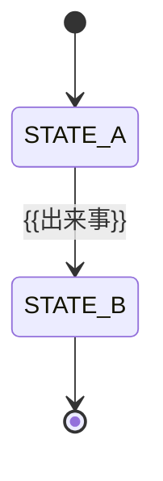

# PRD：{{製品名／対象スライス}}

> 記入方法は [PRD_GUIDE.md](PRD_GUIDE.md)。見出しに「（任意）」が付く節は、不要なら**節ごと削除**する。それ以外の節と表は削除・改名しない（`kit_lint.py` がテンプレートとの一致を検査する）。小さな変更なら必須節だけで1〜2ページに収まる。

## 1. 要約

| 項目 | 内容 |
|---|---|
| 誰の、どんな困りごとか | {{対象者と場面}} |
| 目指す変化 | {{現状→あるべき状態}} |
| 提供する能力 | {{技術手段ではなく、利用者ができるようになること}} |
| 今回やらないこと | {{主要な対象外}} |
| 成功の判断 | {{KPI-ID／GRD-ID}} |
| いま求める判断 | {{探索継続／実装着手／リリース 等と対象版}} |

## 2. 背景・課題・根拠

{{現行の業務と、困りごとが発生する箇所を3〜6文で。}}

| 根拠ID | 内容 | 出所・取得日・範囲 | 事実／仮説 | 限界 |
|---|---|---|---|---|
| EVID-001 | {{観測・面談・計測・資料}} | {{誰が・いつ・何件}} | {{事実／仮説}} | {{偏り・未確認}} |

検討した代替（作らない案を含む）：{{既存運用の改善／既製品／縮小案と、採らない理由}}

## 3. 目的・成果指標・ガードレール

| 目的ID | 対象者 | 期待する変化 | 根拠 |
|---|---|---|---|
| GOAL-001 | {{対象者}} | {{変化}} | EVID-001 |

| 指標ID | 種類 | 定義（式・単位・母集団・期間） | 基準値 | 目標と判定時点 | 計測手段 |
|---|---|---|---|---|---|
| KPI-001 | 成果 | {{分子／分母、除外、欠損の扱い}} | {{実測値／未測定}} | {{目標値・仮説である旨・判定日}} | {{計測イベントを記録する FR-ID、または「外部：〜」}} |
| GRD-001 | ガードレール | {{悪化させてはいけないこと}} | {{基準}} | {{許容値と、超えたら何を止めるか}} | {{FR-ID または「外部：〜」}} |

## 4. 利用者・権限

| 主体ID | 役割と目的 | できること | できないこと |
|---|---|---|---|
| ACT-001 | {{役割・ジョブ}} | {{許可}} | {{禁止（越境・自己承認等）}} |

## 5. スコープ

| 区分 | 内容 | 理由 | 見直す条件 |
|---|---|---|---|
| 対象 | {{今回提供する}} | {{GOAL との関係}} | — |
| 対象外 | {{今回提供しない}} | {{理由}} | {{再検討のきっかけ}} |
| 前提 | {{成立を仮定していること}} | {{確認状況}} | {{崩れたときの影響}} |
| 制約 | {{契約・既存環境・規程・期限}} | {{出所と変更権限者}} | {{変更手続}} |

## 6. 業務フロー・状態（任意）

| 現状態 | 出来事 | 許可される主体・条件 | 次状態 | 要件 |
|---|---|---|---|---|
| {{状態}} | {{出来事}} | {{条件}} | {{状態}} | FR-001 |

## 7. 機能要件

1要件＝1文＝1ID。EARS の型に従い、文末は「…なければならない。」または「…てはならない。」とする。手段（製品名・方式・内部パラメータ）は書かず ADR に渡す。

| ID | 型 | 要求文 | 優先度 | 根拠 | 受入 |
|---|---|---|---|---|---|
| FR-001 | イベント | {{契機}}とき、システムは{{観察可能な応答}}しなければならない。 | Must | GOAL-001 | RULE-001 |

EARS の型：常時「システムは、…」／イベント「…とき、システムは…」／状態「…間、システムは…」／異常「もし…ならば、システムは…」／オプション「…場合、システムは…」／複合「…間、…とき、システムは…」。

## 8. 非機能要件

| ID | 品質特性 | 刺激と環境 | 合格基準 | 検証 |
|---|---|---|---|---|
| NFR-001 | {{ISO/IEC 25010:2023 の特性}} | {{誰が／何が、どの負荷・状態で、何をしたとき}} | {{数値・単位・分位・期間}} | NVT-001 |

検討した品質特性と適用判断：{{機能適合性・性能効率性・互換性・インタラクション能力・信頼性・セキュリティ・保守性・柔軟性・安全性のうち、要件化しなかったものと理由}}

## 9. 検証・受入

| 検証ID | 対象 | 方法と環境 | 実施時点 | 担当 |
|---|---|---|---|---|
| NVT-001 | NFR-001 | {{測定方法・データ・除外・回数}} | {{ゲート}} | {{担当}} |

| ゲート | 通過条件 | 判定者 |
|---|---|---|
| G1 実装着手 | {{対象スライスの要件・ルール・具体例が合意済み、必要な ADR が accepted}} | {{担当}} |
| G2 受入 | {{BDD シナリオ（優先度 Could のみに対応するシナリオを除く）と G2 対象の NVT が実行され合格、逸脱は判定者が記録}} | {{担当}} |
| G3 本番導入 | {{利用者受入（UAT）の判定、運用・復旧・移行の確認}} | {{担当}} |
| G4 成果評価 | {{KPI／GRD の実測による継続・改修判断}} | {{担当}} |

## 10. データ・外部インターフェース（任意）

| データ | 分類・所有者 | 利用目的 | 保存と削除 | 詳細仕様の置き場 |
|---|---|---|---|---|
| {{データ}} | {{分類}} | {{目的}} | {{期間・削除の起点}} | {{SPEC のID。未作成なら「未作成・担当・期限」}} |

用語集（該当する場合）：

| 用語 | 定義 |
|---|---|
| {{用語}} | {{定義}} |

入力規則（該当する場合）：

| 項目 | 規則 |
|---|---|
| {{項目}} | {{規則}} |

## 11. AI固有の要件（任意）

| 論点 | 定義 |
|---|---|
| AI に任せること／任せないこと | {{範囲と、人が必ず行う判断}} |
| 不確実性の扱い | {{根拠不足・推測の表示方法}} |
| 品質評価 | {{評価セットの構成・指標・分母・閾値・判定者・更新方針。NFR-ID}} |
| 安全性 | {{指示注入・権限境界・外部副作用}} |
| 故障時 | {{時間切れ・停止・手動代替・復帰条件}} |
| 変更時の再評価 | {{モデル／プロンプト／参照集合を変えたら何を再実行するか}} |

## 12. 設計判断が必要な論点

| 論点 | 関係する要件 | なぜ判断が要るか | ADR |
|---|---|---|---|
| {{論点。無ければ「該当なし」と判定者}} | {{FR/NFR-ID}} | {{品質・コスト・不可逆性}} | {{ADR-ID と status、または「未起票・期限」}} |

## 13. リリース・運用・撤回（任意）

| 項目 | 内容 |
|---|---|
| 段階導入 | {{対象と拡大条件}} |
| 監視と通知先 | {{症状・閾値・担当}} |
| 障害時の縮退 | {{何を止め、何を続けるか}} |
| 撤回条件と戻し方 | {{条件・戻せないもの}} |

## 14. リスク・未決事項

| ID | 内容 | 影響 | 対処 | 担当・期限 | 決まるまで保留する範囲 |
|---|---|---|---|---|---|
| RISK-001 | {{リスクまたは未決の問い}} | {{影響}} | {{対処・検証}} | {{担当・期限}} | {{範囲}} |

## 15. 変更履歴・承認

| 版 | 日付 | 変更内容と理由 | 影響ID | 承認（承認者・日時・条件） |
|---|---|---|---|---|
| 0.1.0 | {{日付}} | 初稿 | — | 未承認 |
