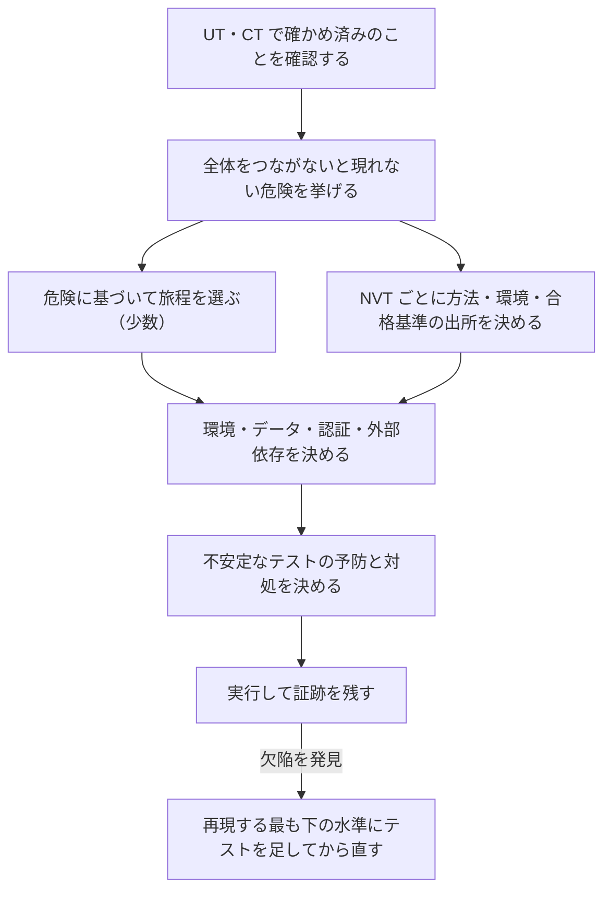

# ST／E2E 記載指示書

対象：[ST_TEMPLATE.md](ST_TEMPLATE.md)。記入例：[ST_SAMPLE.md](ST_SAMPLE.md)。水準の分担と共通規約：[06_TEST_STRATEGY.md](../06_TEST_STRATEGY.md)。

## 1. ST／E2E の役割と、やらないこと

ST は、配備したシステム全体でしか現れない問題を見つける。画面と裏側のつなぎ目、認証、配備構成、複数の主体をまたぐ流れ、そして性能・可用性・復旧・セキュリティなどの非機能である。

E2E（利用者の入口から出口までを通すテスト）は、全部の部品がつながった状態を確かめられる唯一の手段だが、遅く、壊れやすく、失敗の原因が絞りにくい。だから**少数の重要な旅程に絞る**。業務ルールの組合せを E2E で網羅しない。それは UT と CT の仕事である。BDD のシナリオのうち画面経由でも実行するのは、つなぎ目に固有の危険がある代表的な経路だけにする。

この水準の文書の中心は、旅程の選択と、専用検証（NVT）の実行計画である。

## 2. 進め方

| 手順 | すること | 終わりの条件 |
|---|---|---|
| 1 | CT の文書で、どのシナリオが下の水準で確かめ済みかを確認する | 2章の「確かめない」に送り先が書けている |
| 2 | 全体をつながないと現れない危険を挙げる（3章の表） | 危険ごとに、旅程か NVT が対応している |
| 3 | 旅程を選ぶ。目的と結果で書き、画面の操作手順は書かない | 4章。各旅程に「この水準でしか見えない確認点」がある |
| 4 | NVT ごとに方法を決める。PRD の検証計画を、実行できる詳しさにする | 5章。全 NVT がどこか1つの水準の文書に割り当てられている |
| 5 | 環境と本番の差、データの作り方、認証、外部依存の扱いを決める | 3章。差が結果に与える影響が書いてある |
| 6 | 不安定なテストの予防・検出・対処を決める | 6章 |
| 7 | 実行し、結果と証跡を書く。未実行はそのまま書く | 5・8章が実態と一致している |

## 3. 旅程の選び方

| 全体をつながないと現れない危険 | 旅程で確かめること |
|---|---|
| 画面が裏側の結果を正しく表示しない | 受付番号・状態・拒否理由・通知が、利用者に見える形で出る |
| 認証・セッション・権限の受け渡しの誤り | 主体を切り替えながら通す。他の主体の URL を直接開く |
| 複数の主体をまたぐ流れの断絶 | 申請者→審査者→申請者→監査者のように、業務の一巡を通す |
| 配備構成・設定の誤り | 機能の停止・復帰など、設定で振る舞いが変わるものを通す |
| 支援技術・キーボードで操作できない | キーボードだけで主要な旅程を完了する |

旅程の数の目安は、主要な業務の一巡につき1本、権限の境界につき1本、縮退運転につき1本。それ以上に増やしたくなったら、その確認が CT でできない理由を先に考える。

旅程は目的と結果で書く。「ログインして、メニューから申請を押して、製品名に入力して…」という操作手順は書かない。手順は画面の変更で変わるが、旅程の目的は変わらない。

## 4. ブラウザ経由のテストの書き方

| 論点 | 指針 |
|---|---|
| 確かめる対象 | 利用者に見える振る舞い。関数名・CSS クラス・内部の状態に依存しない |
| 要素の特定 | 役割と表示名（ボタン「承認」、テキスト入力「理由」）を優先する。利用者と支援技術が見ているものと同じで、マークアップの変更に強い。アクセシビリティの欠陥も同時に見つかる |
| 待ち | 条件が満たされるまで自動で待つ検証を使う。固定の待ち時間を書かない |
| 独立性 | テストごとに独立したデータ・認証状態・保存領域。前のテストの結果に依存しない |
| 前提の作り方 | API や管理用の入口で直接作る。画面を操作して前提を作ると、遅く、無関係な画面の変更で壊れる |
| 外部 | 自分が制御できない外部の画面や API を直接テストしない。代役にする |
| 失敗時 | 操作の記録・画面・通信を自動で保存する |
| 確認の量 | 1つの旅程で、その旅程でしか見えない点だけを確かめる。規則の確認を詰め込まない |

## 5. 専用検証（NVT）の設計

| 種類 | 設計で決めること | 落とし穴 |
|---|---|---|
| 負荷・性能 | 操作の比率、**負荷のモデル**、データ件数、暖機、測定時間、測定点、分位、エラー率 | 同時接続数を固定するモデルは、システムが遅くなるほど要求の到着が減り、測定が甘くなる。到着率を固定するオープンモデルを使い、到着率を保てなかった測定は無効にする |
| 可用性（SLO） | 母集団、良い結果の定義、期間、除外、計測欠損の扱い | リリース前に確かめられるのは計算式と計測の正しさまで。実績は運用で評価する |
| 復旧 | 想定する障害、RPO／RTO、復旧後に何を照合するか | バックアップが取れていることと、復旧できることは別。演習する |
| セキュリティ | 認可の全分岐（CT）、脅威モデル、採用する検証標準の版と項目、脆弱性の検査 | 道具の指摘0件を「安全」と読み替えない |
| アクセシビリティ | 規格の版とレベル、対象画面、自動検査と手動確認の分担 | 自動検査で見つかるのは一部。キーボードとスクリーンリーダーでの確認が要る |
| データの削除 | 期限の起点、消えるべき場所の棚卸し（稼働領域・索引・キャッシュ・一時領域・バックアップ） | 稼働領域だけ見て終わる。復旧したら再出現する |
| AI の品質 | 評価セットの構成と版、指標と分母、閾値、判定者と一致度、入替の方針 | モデル・プロンプト・出典集を固定しないと比較できない。全件棄権で指標を稼げないようにする |

PRD の検証計画（NVT）は「何を・いつ・誰が」までを決める。この文書は「どうやって」を、実行できる詳しさで決める。合格基準は PRD の NFR が正本であり、ここで緩めない。

## 6. 不安定なテスト

同じ版に対して合格と不合格が入れ替わるテストは、割合が小さくても、失敗を無視する習慣を作ってテスト全体の価値を壊す。

| 原因 | 対処 |
|---|---|
| 固定の待ち時間、表示の途中での操作 | 条件が満たされるまで待つ検証に変える |
| テスト間でデータや認証状態を共有 | テストごとに独立させる |
| 実行順や並列度への依存 | 単独でも、逆順でも、並列でも合格することを確かめる |
| 制御できない外部 | 代役にする |
| 実時間・タイムゾーン・日付の境界 | 時計を制御する |

再実行で合格に変える設定は、原因を隠す。使うなら「再実行で合格したテスト」を必ず記録し、不安定なテストとして扱う。

## 7. 章ごとの書き方

| 章 | 必ず答える問い | 悪い例 → 良い例 |
|---|---|---|
| 1 対象と正本 | どの版のどの構成を、どの入口から | 「システム全体」→ 版・構成・入口、対象外 |
| 2 確かめること | 下の水準と何が違うのか | 「全機能を画面から確認」→ 観点ごとに、ここで確かめるか送り先か |
| 3 環境・データ | 本番と何が違い、それが結果にどう効くか | 「検証環境で実施」→ 差分と影響、データの作り方、認証、外部、時刻 |
| 4 旅程 | 誰が何のために何をして何を得るか | 操作手順の列挙 → 目的と結果、通るシナリオ、ここでしか見えない確認点 |
| 5 NVT | どうやって測り、いまどういう状態か | 「負荷試験を実施」→ モデル・測定点・無効条件、自動化と結果 |
| 6 不安定さ | どう防ぎ、見つけ、直すか | 「失敗したら再実行」→ 予防・検出・対処・材料 |
| 7 合否とゲート | 何が通れば次へ進めるか | 「問題なければリリース」→ ゲートごとの条件と判定者 |

## 8. レビューの観点

| 観点 | 反例として当てる問い |
|---|---|
| 重複 | この旅程の確認点は、CT では確かめられないのか |
| 漏れ | 権限の境界、縮退運転、主体をまたぐ一巡が、旅程に入っているか |
| 環境 | 本番との差で、合格が無意味になる項目は無いか（規模、データ量、外部の代役） |
| 測定 | 負荷のモデルは何か。目標の到着率に達したことを確かめているか |
| 合格基準 | PRD の NFR より緩くなっていないか |
| 正直さ | 未実行のものを、計画があるだけで「対応済み」と書いていないか |

## 9. 完成の条件

1. `python tools/kit_lint.py check` が合格する（テンプレートとの一致、旅程が通るシナリオと由来のIDの実在、全 NVT がちょうど1つの文書に割り当てられている）。
2. 旅程のそれぞれに、この水準でしか見えない確認点がある。
3. 5章と8章の状態が実態と一致している。未実行は未実行と書く。
