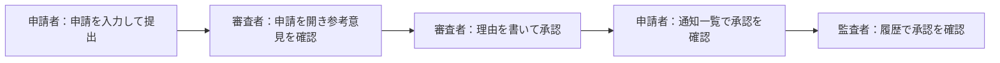

# ST／E2E 設計：FlowApprove 初回リリース

> **架空の記入例。** FlowApprove のシステム全体（画面・永続化・認証・AI 連携）は実装されていないため、この水準のテストは1件も実行していない（だから `automation: not_implemented`・`last_run: not_run`）。9章のコードは構文だけを確認した設計上の例である。テンプレートは [ST_TEMPLATE.md](ST_TEMPLATE.md)。

## 1. 対象と正本

| 項目 | 内容 |
|---|---|
| 対象 | 配備した FlowApprove 全体。入口は Web 画面と公開 API |
| 対象外 | 業務ルールの組合せ（UT・CT で確かめ済み）、認証基盤と AI モデル提供元の内部 |
| 由来 | 4章の旅程が通る BDD のシナリオ、NFR-002・NFR-006、NVT-001・NVT-003〜NVT-009、ADR-0001 |
| テストコードの場所と実行方法 | 未作成。`e2e/`（Playwright）、`perf/`（k6）、`evals/`（AI の評価）を予定 |

## 2. この水準で確かめること・確かめないこと

| 観点 | ST／E2E で確かめる | 確かめない（確かめる水準） |
|---|---|---|
| 画面と裏側のつなぎ目、認証、複数の主体をまたぐ流れ | 5つの旅程（4章） | — |
| 業務ルールの組合せ・境界 | — | UT（全数）・CT（BDD の全シナリオ） |
| 同時実行・再送・障害時の一貫性 | 負荷時の再確認だけ（NVT-001 の中で重複決裁0件を確認） | CT（CT-001・CT-002） |
| 性能・可用性・復旧・削除・監査記録の保護 | NVT-001・NVT-003〜NVT-005・NVT-008・NVT-009 | — |
| アクセシビリティ | NVT-006（自動検査と手動確認） | 実利用者による確認は UAT |
| AI の出力の品質 | NVT-007（評価セット） | AI が返したときのシステムの振る舞いは CT |

## 3. 環境・データ・外部依存

| 項目 | 内容 |
|---|---|
| 環境 | 本番と同じ構成で規模を1/2にした検証環境。NVT-001 の合格基準は本番相当の規模で再確認するまで暫定とする |
| テストデータ | 公開 API で直接作る。画面を操作して前提を作らない。実行ごとに組織を新しく作り、他の実行と共有しない。NVT-001 用に合成の申請10万件。申請の状態は作成後に提出などの操作を積み重ねて作る（テスト専用の入口で状態を直接指定しない） |
| 認証 | テスト用の主体（申請者・審査者2名・監査者・運用者・他組織の審査者と監査者）を実行ごとに発行し、認証状態を主体ごとに保存して再利用する |
| テスト専用の入口 | `/api/test-support/*` の `clock`（検証環境の時計を進める）と `seed`（申請の作成）はいずれも検証専用で、本番環境には配備しない |
| 外部依存 | 認証基盤は検証用の実物。AI モデルの提供元は、旅程では決まった応答を返す代役（費用と非決定性のため）、NVT-007 では実物 |
| 時刻 | 90日・180日の期限は、検証環境の時計を進める管理用の入口で確かめる（NVT-009）。本番にはこの入口を配備しない |

## 4. 利用者の旅程（E2E）



| ID | 旅程（目的と結果） | 主体 | 通るシナリオ | 由来 | この水準でしか見えない確認点 |
|---|---|---|---|---|---|
| E2E-001 | 申請者が申請を提出し、審査者が承認し、申請者が通知を、監査者が履歴を確認する | ACT-001、ACT-002、ACT-003 | SCN-001、SCN-011、SCN-017、SCN-026 | FR-003、FR-006、FR-011、FR-016 | 受付番号の表示、「AIによる参考情報」の表示、主体をまたいだ画面の更新、通知の表示 |
| E2E-002 | 差戻された申請を申請者が修正して再提出し、審査者が新しい内容版を承認する | ACT-001、ACT-002 | SCN-017、SCN-030、SCN-040 | FR-019、FR-027 | 修正後の画面に古い内容版の参考意見が出ないこと |
| E2E-003 | 運用者が AI 参考意見を停止しても、審査者は承認できる | ACT-002、ACT-004 | SCN-016、SCN-037 | FR-010、FR-024、ADR-0001 | 停止中の表示、停止の操作が決裁の画面に影響しないこと |
| E2E-004 | 他組織の審査者には申請が見えず、URL を直接開いても同じ拒否になる | ACT-002 | SCN-007 | FR-002、NFR-002 | 一覧・検索・URL 直接指定・ブラウザの戻る操作で内容が漏れないこと |
| E2E-005 | キーボードだけで申請を入力して提出できる | ACT-001 | SCN-001、SCN-002 | NFR-006 | フォーカスの順序、入力不備の読み上げ、操作の完了 |

## 5. 専用検証（NVT）の実行

| 検証ID | この水準で行う範囲 | 方法と道具 | 自動化 | 結果 |
|---|---|---|---|---|
| NVT-001 | 全部 | 到着率を固定するオープンモデル（k6 の `constant-arrival-rate`、20件/秒、30分、暖機5分）。達成した到着率が目標に届かない測定は無効。サーバー処理時間と負荷生成側の時間を分けて記録 | 未自動化 | 未実行 |
| NVT-003 | G3 までの範囲：合成の出来事で SLO の計算式と除外規則を確かめる。30日の実測は G4 で運用が評価する | 計算の単体検証と、検証環境への合成の失敗の注入 | 未自動化 | 未実行 |
| NVT-004 | 全部 | 隔離環境でバックアップから復旧し、復旧時刻・最後に復元できた更新・決裁と監査記録と通知の照合結果を記録 | 手動の演習 | 未実行 |
| NVT-005 | 全部 | NVT-001 の負荷中に、決裁の確定と通知の表示の時刻差を全件記録 | 未自動化 | 未実行 |
| NVT-006 | 全部 | 6画面×達成基準の確認表。自動検査（axe-core）と、キーボード・スクリーンリーダーでの手動確認。自動検査の指摘0件だけで適合としない | 一部自動化の予定 | 未実行 |
| NVT-007 | 全部 | 版管理した評価セット200件を、モデル・プロンプト・出典集を固定して実行。独立した2名が判定。評価の実行基盤は未選定 | 未自動化 | 未実行 |
| NVT-008 | 全部 | アプリ・運用・管理の各経路から監査記録の更新と削除を試行 | 未自動化 | 未実行 |
| NVT-009 | 全部 | 検証環境の時計を進め、稼働領域・検索索引・キャッシュ・一時領域・バックアップを棚卸し | 手動と自動の併用 | 未実行 |

NVT-002・NVT-010・NVT-011 は CT で行う（[CT_SAMPLE.md](../ct/CT_SAMPLE.md) 5章）。

## 6. 不安定なテストの扱い

| 項目 | 方針 |
|---|---|
| 予防 | 要素は役割と表示名で特定する（利用者と支援技術に見える属性）。条件が満たされるまで待つ検証を使い、固定の待ち時間を書かない。テストごとに新しい組織を使う（認証状態は3章の通り主体ごとに再利用する）。前提は API で作る |
| 検出 | 同じ版に対する結果の揺れを実行ごとに記録し、揺れたテストを一覧にする |
| 対処 | 再実行で合格にしない。隔離し、原因（待ち・順序・共有データ・外部）を直し、2週間以内に戻す。隔離中の旅程の由来は検証済みと数えない |
| 失敗時の材料 | 操作の記録（トレース）、失敗時の画面、通信の記録、サーバーのログの相関ID |

## 7. 合否とゲート

| ゲート | 条件 | 判定者 |
|---|---|---|
| G2 受入 | E2E-001〜E2E-005 が合格。NVT-001・NVT-005〜NVT-008 が合格（G2 対象の残り NVT-002・NVT-010・NVT-011 は CT で判定）。NVT-001 は本番相当の規模での非暫定の結果を必要とする（3章の暫定の注記）。それが無い場合は判定者が逸脱を明記して判断する | 品質責任者 |
| G3 本番導入 | NVT-003（計算式）・NVT-004・NVT-009 が合格 | 運用責任者・セキュリティ責任者 |

## 8. 実行と証跡

| 項目 | 内容 |
|---|---|
| 実行の契機 | 旅程は主ブランチへの統合後とリリース候補ごと。NVT-001・NVT-005 はリリース候補ごと。NVT-004 は四半期ごとの演習（初回はG3判定前に完了する） |
| 大きさの宣言 | large |
| 証跡 | 未作成。JUnit 形式の結果、操作の記録、k6 の要約、評価の判定表を、対象の版と環境の識別子つきで保存する予定 |
| 直近の結果 | 未実行 |

## 9. コード例（任意）

E2E-001 の一部（Playwright）。未実行。型検査だけを通している。

```typescript
import { test, expect } from '@playwright/test';

test.describe('E2E-001 申請から通知まで', { tag: ['@E2E-001', '@FR-003', '@FR-011', '@FR-016'] }, () => {
  test('審査者が承認すると申請者に通知が届く', async ({ browser, request }) => {
    // 前提は画面ではなく API で作る。状態はテスト専用の入口で直接指定せず、作成後に実物の提出操作を積む
    const created = await request.post('/api/test-support/seed', { data: { owner: 'applicant-a' } });
    const { id } = await created.json();
    await request.post(`/api/applications/${id}/submit`);

    const reviewer = await browser.newContext({ storageState: 'auth/reviewer-a.json' });
    const page = await reviewer.newPage();
    await page.goto(`/applications/${id}`);
    await page.getByRole('textbox', { name: '理由' }).fill('規程を確認した');
    await page.getByRole('button', { name: '承認' }).click();
    await expect(page.getByRole('status')).toHaveText(/承認しました/);

    const applicant = await browser.newContext({ storageState: 'auth/applicant-a.json' });
    const inbox = await applicant.newPage();
    await inbox.goto('/notifications');
    await expect(inbox.getByRole('listitem').filter({ hasText: id })).toHaveCount(1);
  });
});
```

NVT-001 の負荷の形（k6）。未実行。構文だけを確認している。

```javascript
import http from 'k6/http';

const BASE_URL = __ENV.BASE_URL;
const OPS = ['list', 'detail', 'submit', 'decide']; // 一覧・詳細・提出・決裁を25%ずつ

export const options = {
  scenarios: {
    warmup: {
      executor: 'ramping-arrival-rate',    // 暖機はオープンモデルのまま到着率を上げる
      startRate: 0, timeUnit: '1s',
      preAllocatedVUs: 50, maxVUs: 400,
      stages: [{ target: 20, duration: '5m' }],
    },
    nvt_001: {
      executor: 'constant-arrival-rate',   // 応答が遅くなっても到着率を保つ（オープンモデル）
      rate: 20, timeUnit: '1s', duration: '30m',
      preAllocatedVUs: 50, maxVUs: 400,
      startTime: '5m',                     // 暖機の後に開始
    },
  },
  thresholds: {
    'http_req_duration{op:list}': ['p(95)<800'],
    'http_req_duration{op:detail}': ['p(95)<800'],
    'http_req_duration{op:submit}': ['p(95)<800'],
    'http_req_duration{op:decide}': ['p(95)<800'],
    http_req_failed: ['rate<0.001'],
    dropped_iterations: ['count==0'],       // 到着率を保てなかった測定は無効
  },
};

export default function () {
  const op = OPS[Math.floor(Math.random() * OPS.length)];

  if (op === 'list') {
    http.get(`${BASE_URL}/api/applications`, { tags: { op: 'list' } });
    return;
  }

  if (op === 'submit') {
    const created = http.post(`${BASE_URL}/api/test-support/seed`,
      JSON.stringify({ owner: `k6-${__VU}-${__ITER}` }),
      { headers: { 'Content-Type': 'application/json' }, tags: { op: 'submit' } });
    const { id } = created.json();
    http.post(`${BASE_URL}/api/applications/${id}/submit`, null, { tags: { op: 'submit' } });
    return;
  }

  // detail・decide は一覧から対象を選び、詳細を取得してから進む
  const list = http.get(`${BASE_URL}/api/applications?state=SUBMITTED`, { tags: { op: 'list' } });
  const items = list.json('items') || [];
  if (items.length === 0) return;
  const target = items[Math.floor(Math.random() * items.length)];
  const detail = http.get(`${BASE_URL}/api/applications/${target.id}`, { tags: { op: 'detail' } });

  if (op === 'decide') {
    const seenRev = detail.json('revision');
    http.post(`${BASE_URL}/api/applications/${target.id}/decisions`, JSON.stringify({
      requestId: `${__VU}-${__ITER}-${Date.now()}`, // 常に新しい要求識別子
      seenRevision: seenRev,                        // detail 呼び出しで得た内容版
      action: 'approve',
      reason: '規程を確認した',
    }), { headers: { 'Content-Type': 'application/json' }, tags: { op: 'decide' } });
  }
}
```

## 10. 変更履歴

| 版 | 日付 | 変更内容と理由 | 影響ID | 合意者 |
|---|---|---|---|---|
| 0.1.0 | 2026-09-19 | 初稿 | — | 未合意（架空例） |
