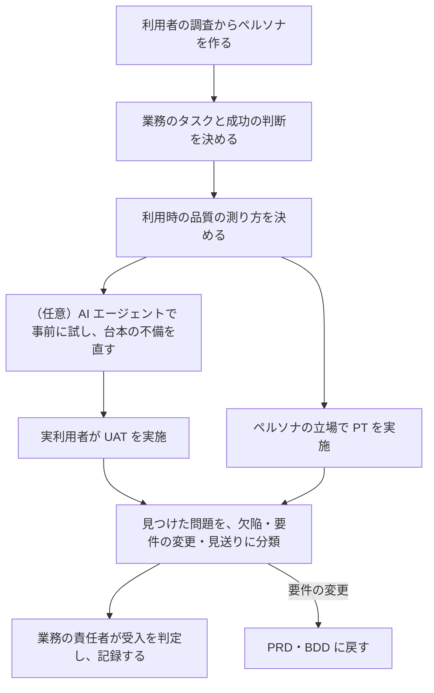

# UAT／PT 記載指示書

対象：[UAT_TEMPLATE.md](UAT_TEMPLATE.md)。記入例：[UAT_SAMPLE.md](UAT_SAMPLE.md)。水準の分担と共通規約：[06_TEST_STRATEGY.md](../06_TEST_STRATEGY.md)。

## 1. UAT と PT の役割

下の水準のテストは「仕様どおりに作られているか」を確かめる。UAT は「それで業務の目的が達成できるか」を、実際の利用者の手で確かめ、業務の側が受け入れるかどうかを決める。仕様どおりでも業務が回らないことはあり、それを見つけられるのはこの水準だけである。

受入テストには、利用者受入（UAT）のほかに、運用の担当者による運用受入、契約や規制への適合の確認、限定した利用者への先行提供（アルファ・ベータ）がある。本テンプレートは UAT を中心に、運用受入を運用者のペルソナとして含める。契約・規制への適合は、適用される制度の要求に従って別に定める。

PT（ペルソナ駆動テスト）は、ペルソナの状況・目標・制約に立って行う探索的テストである。台本のあるテストは、書いた人が想定した問題しか見つけない。PT は、想定していなかった使われ方と、仕様に書かれていない問題を見つける。本キットでは、探索をセッション単位で管理する方法（チャーター・時間枠・記録・振り返り）で運用する。

UAT は CT や E2E の再実行ではない。同じ手順を利用者になぞらせても、新しいことは何も分からない。

## 2. 進め方

| 手順 | すること | 終わりの条件 |
|---|---|---|
| 1 | PRD の主体（ACT）ごとに、調査に基づくペルソナを作る。調査が無ければ仮説と明記し、UAT の前に調査する | 2章。全主体にペルソナがあるか、対象外の理由が1章にある |
| 2 | ペルソナごとに、実際の業務で起きる依頼の形でタスクを書く。成功の判断を、利用者と判定者の言葉で決める | 3章。全 GOAL に受入シナリオがある（リンターが検査） |
| 3 | 有効さ・効率・満足度・害の無さの測り方と基準を決める | 4章 |
| 4 | 探索のチャーターを書く。疑っている危険から逆算する | 5章 |
| 5 | 参加者を集める。開発に関わった人は参加者にしない | 8章 |
| 6 | 実施する。進行役は操作を教えない | 記録が残っている |
| 7 | 見つけた問題を分類し、判定者が受入を判定して記録する | 7章に、判定・判定者・日時・対象の版・条件がある |

## 3. ペルソナの作り方

ペルソナは、調査で分かった利用者の状況・目標・制約を、1人の具体的な人物像にまとめたものである。想像で作った人物像は、作った人の思い込みを確認するだけになる。

| 論点 | 指針 |
|---|---|
| 根拠 | 面談・業務の観察・問合せの記録・利用の記録。表の「根拠」に出所を、「事実／仮説」に区別を書く |
| 主体との対応 | PRD の主体（ACT）ごとに1つ以上。同じ役割でも、習熟や状況が違えば分ける（ベテランと新任） |
| 端の利用者を入れる | 支援技術の利用者、めったに使わない人、急いでいる人、道具を信用していない人、道具を信用しすぎる人 |
| 属性より状況 | 年齢や性別ではなく、どんな場面で・何を達成したくて・何に制約されているか |
| 数 | テストに使える数に絞る。主体ごとに1〜2 |

AI を含む製品では、「AI の出力を疑う人」と「そのまま採る人」の両方を入れる。後者で何が起きるかは、下の水準のテストでは分からない。

## 4. 受入シナリオの書き方

| 直す前 | 問題 | 直した後 |
|---|---|---|
| 「申請画面を開き、製品名に◯◯と入力し、提出ボタンを押す。受付番号が表示されることを確認する」 | 操作手順。E2E の再実行になり、利用者が自力でできるかは分からない | 「来週から図面ソフトを使いたいので、利用の許可を取ってください」 |
| 成功の判断：「エラーが出ない」 | 業務として完了したかが分からない | 「助けなしに提出でき、受付番号を控え、この後に何が起きるかを自分の言葉で説明できる」 |
| 正常な依頼だけ | 実際の業務には、根拠不足・自分の申請・途中で変わる申請が混ざる | 実際の比率で混ぜた20件を渡す |
| 由来が機能のIDだけ | 目的が達成されたかを判定できない | GOAL・KPI・ガードレールを由来に含める |

## 5. 利用時の品質の測定

利用時の品質は、特定の利用者が特定の状況で目的を達成するときの、有効さ（正確に完全に達成できたか）、効率（費やした資源）、満足度で捉える。ISO/IEC 25019:2023 の利用時品質モデルはこれを広げ、有益さ・リスクからの解放・受容性の3つの特性で、使った結果と害の無さまでを対象にしている。

| 指標 | 測り方 | 注意 |
|---|---|---|
| 有効さ | タスクごとの完了を、助けなし・助けあり・未完了で記録 | 参加者が少ないので、割合ではなく人数で報告する |
| 効率 | タスクの所要時間 | 声に出して考えてもらうと時間は延びる。比較に使うなら条件を揃える。成果指標（KPI）の判定は運用での実測で行う |
| 満足度 | 標準の質問票（System Usability Scale など）と、困った点の聞き取り | 少人数の得点は参考値。合否に使うのは、困った点の内容 |
| 害の無さ | 業務上の損害につながる出来事（誤った承認、見落とし、情報の漏れ）の件数 | ガードレール（GRD）に対応させ、基準は0件 |

## 6. 探索セッション（PT）の運用

| 要素 | 内容 |
|---|---|
| チャーター | 「〈対象〉を、〈条件・道具・データ〉で探り、〈知りたいこと・疑っている危険〉を見つける」。広すぎると散漫に、狭すぎると台本になる。疑っている危険の出所（リスク・ガードレール・要件）を由来に書く |
| セッション | 中断されない60〜90分。ペルソナの状況と制約を守って行動する（急いでいる人は説明を読まない） |
| 記録 | 何を試したか、見つけた問題、疑問、チャーターから外れて調べたこと、時間の内訳（テスト・問題の調査・準備） |
| 振り返り | 終了後すぐに、実施者と責任者が短く話す。何が起きたか、何が分かったか、何が妨げになったか、何が残っているか、実施者の感触 |
| 問題の分類 | 欠陥（要件どおりでない）、要件の変更（要件どおりだが業務に合わない→PRD へ）、見送り（理由つき） |
| 次へ | 見つけた欠陥は、再現する最も下の水準にテストを足してから直す。新しい危険は次のチャーターにする |
| 実施者 | 実際の利用者・業務代表が操作する。品質担当・進行役は同席し、進行と記録を担うが操作しない（品質担当が実施者を兼ねると、開発側の期待を確かめるだけになり、実利用者にしか見えない問題を見つけられない） |

チャーターの出所：PRD のリスクとガードレール、ADR の「悪い点」、下の水準で確かめにくいと分かっていること、過去の障害、ペルソナの制約と製品の前提の食い違い。

## 7. AI エージェントをペルソナとして使うとき

ペルソナを与えた AI エージェントに画面を操作させ、利用者の行動を模擬する研究と道具が増えている。研究の側も、実利用者による調査の**前に**、調査の設計を試して直すための手段として位置付けている。一方、AI が生成した「利用者の声」を実利用者の調査結果と比べた検証では、応答が浅く、何にでも好意的で、実際の人が途中でやめる・使わないといった行動を再現しないことが報告されている。

| 使ってよい | 使ってはいけない |
|---|---|
| 実利用者の時間を使う前の、台本とタスクの文面の試行 | 受入の判定の根拠 |
| 再現できる機能上の問題の発見（先へ進めない、表示が誤り、エラー） | 満足度・好み・「使いやすい」という感想 |
| 多数の入力の組合せや、人が飽きる繰り返しの探索 | 所要時間や完了率を、人の値の代わりにすること |
| チャーターの案出し | ペルソナそのものの根拠（調査の代わり） |

AI による試行の結果は、そう明記して別に保管し、実利用者の結果と混ぜない。見つけた機能上の問題は、人が再現を確かめてから欠陥として扱う。

## 8. 章ごとの書き方

| 章 | 必ず答える問い | 悪い例 → 良い例 |
|---|---|---|
| 1 対象と正本 | 何を、誰が、どの前提で受け入れるのか | 判定者が開発の責任者 → 業務の責任者 |
| 2 ペルソナ | 誰の、どんな状況か。根拠は何か | 「30代・男性・IT に詳しい」→ 状況・目標・制約と、根拠・事実か仮説か |
| 3 受入シナリオ | どんな業務の依頼を、何をもって完了とするか | 操作手順と期待結果 → 依頼の文面と、業務としての成功の判断 |
| 4 測定 | 何を測り、何を判定に使うか | 「満足度80%以上」→ 定義・基準・少人数であることの扱い |
| 5 PT | 何を疑って、誰の立場で、どれだけ探るか | 「自由に触ってもらう」→ チャーター・時間・実施者 |
| 6 AI の事前試行 | 何のために使い、何に使わないか | 「AI で UAT を自動化」→ 目的・使える結果・使えない結果・表示 |
| 7 受入判定 | 何が満たされれば受け入れるか。誰がいつ決めたか | 「問題なければ OK」→ 判定項目と基準、判定の記録 |
| 8 実行と証跡 | 誰が参加し、どう進め、何を残すか | 「関係者で確認」→ 参加者の選び方、進行役の振る舞い、記録 |

## 9. レビューの観点

| 観点 | 反例として当てる問い |
|---|---|
| 独立性 | 参加者や判定者に、作った本人が入っていないか |
| 目的 | 全部のシナリオが成功しても、GOAL が達成されたと言えない、ということはないか |
| 端の利用者 | 支援技術の利用者、めったに使わない人、AI を信用しすぎる人が入っているか |
| 誘導 | タスクの文面が、画面の用語や操作を教えてしまっていないか |
| 測定 | 少人数の数値を、統計的な事実のように扱っていないか |
| AI | AI による試行の結果が、判定や測定値に混ざっていないか |
| 判定 | 条件付きで受け入れるとき、条件・期限・担当が書いてあるか |

## 10. 完成の条件

1. `python tools/kit_lint.py check` が合格する（テンプレートとの一致、ペルソナの主体と由来のIDの実在、PRD の全主体がこの文書で扱われている、全 GOAL に受入シナリオがある）。
2. ペルソナのそれぞれに根拠があり、事実と仮説が区別されている。
3. 受入シナリオが操作手順ではなく、業務の依頼と成功の判断で書かれている。
4. 実施後は、7章に判定・判定者・日時・対象の版・条件が記録されている。実施前は「未実施」と書く。
