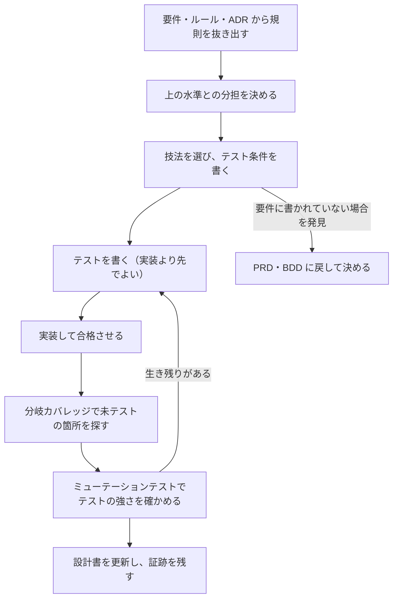

# UT 記載指示書

対象：[UT_TEMPLATE.md](UT_TEMPLATE.md)。記入例：[UT_SAMPLE.md](UT_SAMPLE.md)。水準の分担と共通規約：[06_TEST_STRATEGY.md](../06_TEST_STRATEGY.md)。

## 1. UT の役割と、文書に書かないこと

UT は、規則と計算が正しいことを、入出力なしで速く確かめる。開発者が保存のたびに実行できる速さと、失敗したときに原因が1か所に絞れる狭さが価値である。

UT の文書は**テスト設計書**である。「どの規則を、なぜ UT で、どの技法で、どこまで確かめるか」を書く。個々のテストの入力・手順・期待値はテストコードが正本であり、文書に写さない。写した瞬間から食い違い始める。設計書の「テスト名」がコードに実在することは、リンターが検査する。

次の場合、UT 設計書は要らない。テストコードとその名前で足りる：規則が単純で、由来が1つの要件に収まり、技法の選択に迷いが無い。設計書が価値を持つのは、組合せが多い規則、上の水準との分担に判断が要る規則、監査で「何を確かめたか」を示す必要がある規則である。

## 2. 進め方

| 手順 | すること | 終わりの条件 |
|---|---|---|
| 1 | PRD の要求文、BDD のルール、ADR の確認方法から、入出力なしで確かめられる規則を抜き出す | 対象と対象外が1章に書けている |
| 2 | 上の水準との分担を決める。組合せの網羅は UT、業務の具体例は CT | 2章の表で、各観点の置き場が1つに決まっている |
| 3 | 規則ごとに技法を選び、テスト条件を書く（4章） | 3章の各行に由来とテスト名がある |
| 4 | テストを書く。期待値は要件とルールから書き起こす。実装を見て期待値を決めない | テストが、実装が無い状態で失敗する |
| 5 | 分岐カバレッジで未実行の分岐を読む。要るテストか、不要なコードかを判断する | 未実行の分岐に説明が付く |
| 6 | ミューテーションテストで生き残りを1件ずつ見る。テストを強めるか、理由を書いて受け入れる | 生き残りの全件に判断がある |
| 7 | 条件を書く途中で「要件に書かれていない場合」に気付いたら、推測で埋めずに PRD・BDD へ戻す | 変更履歴に、見つけた欠落と戻し先が書いてある |

手順7は UT の設計の副産物として最も価値が高い。記入例では、状態×出来事の全数表を書く過程で「提出前の申請への決裁要求」が、決定表を書く過程で「自己決裁の優先順位」が、要件に無いことが見つかった。

## 3. 章ごとの書き方

| 章 | 必ず答える問い | 悪い例 → 良い例 |
|---|---|---|
| 1 対象と正本 | どのコードの、どの要件に由来する規則か | 「全モジュール」→ 規則を持つ関数を名指しし、入出力を持つものは対象外に書く |
| 2 確かめること・送ること | この観点はどの水準で確かめるのか | 「UT で一通り」→ 観点ごとに UT か送り先かを1つに決め、理由を書く |
| 3 テスト設計 | 何が成り立つべきか。どの技法で導いたか | 「`violations` を呼んで結果を確認」→「必須5項目のどれが空でも、その項目名だけが報告される」 |
| 4 テストダブルと決定性 | 何を実物で、何を差し替え、どう決定的にするか | 「依存はすべてモック」→ 自前の協調コードは実物、時刻は引数で渡す |
| 5 十分性の基準 | どこまでやれば足りるか。届かないとき何をするか | 「カバレッジ80%」→ 対象・指標・測り方・届かないときの行動 |
| 6 実行と証跡 | いつ走り、何が残るか | 「CI で実行」→ 契機、大きさ、不安定なテストの扱い、証跡の場所、直近の結果 |
| 8 変更履歴 | 何をなぜ変えたか。要件へ戻したものは何か | 「テスト追加」→ 追加の理由（例：ミューテーションテストの生き残り） |

## 4. 技法の選び方

| 技法 | 使う場面 | 記入例 |
|---|---|---|
| 同値分割 | 入力が、同じ扱いを受ける群に分かれる | 空・空白・全角空白は「空」の群（UT-002） |
| 境界値 | 上限・下限・期限がある。境界の両側を必ず取る | 100と101文字、89と90日（UT-003・UT-016） |
| 決定表 | 複数の条件の組合せで結果が決まる。条件が少なければ全数 | 拒否条件5つの全32通り（UT-013） |
| 状態遷移 | 状態と出来事で振る舞いが変わる。許される遷移と**許されない遷移**の両方 | 状態6×出来事6の全36通り（UT-011） |
| プロパティ | 「どんな入力でも成り立つ性質」が言える。例では思いつかない入力を道具が探す | 正規化の冪等性、長さ判定が正規化後の文字数だけで決まること（UT-005・UT-006） |
| 状態機械のプロパティ | 出来事の任意の列に対して不変条件が言える | 終端状態から動かない（UT-012） |
| 例示 | 上のどれでも表しにくい代表例、過去の欠陥の再現 | 分解形の文字（UT-004） |

プロパティの見つけ方：往復して元に戻る（符号化と復号）、2回適用しても変わらない（冪等）、順序を変えても結果が同じ、単純で遅い別実装と結果が一致する、不変条件が保たれる。

## 5. 保守できるテストの性質

| 直す前 | 問題 | 直した後 |
|---|---|---|
| `test_violations_1`、`test_violations_2` | 失敗しても何が壊れたか分からない | 振る舞いを名前にする：`test_blank_required_field_is_reported` |
| メソッドごとに1テスト | 1つのテストが複数の振る舞いを抱え、失敗の原因が絞れない | 振る舞いごとに1テスト。1つの関数に複数のテストがあってよい |
| 非公開の関数を直接呼ぶ、内部の変数を読む | 実装を変えるたびにテストが壊れる | 公開の入口から呼び、外から見える結果を確かめる |
| 「保存先の `save` が1回呼ばれた」を確かめる | 呼び出しの形に縛られ、結果が正しいかは分からない | 状態を確かめる：保存された内容を読み戻す。呼び出しの確認は、外部への副作用そのものが仕様のときだけ |
| テストの中に条件分岐やループで期待値を計算 | テスト自体に欠陥が入る。実装と同じ誤りを写す | 期待値は直接書く。表にしたければパラメータ化する |
| 共通の初期化に大量の値を隠す | そのテストに何が効いているか読めない | テストに効く値はテストの中に書く。重複より読みやすさを優先する |
| `assert result` だけ | 失敗しても何が違ったか分からない | 期待と実際が分かる比較にする。項目名まで確かめる（記入例の UT-009 は、ここが弱くミューテーションテストで見つかった） |

## 6. テストダブルの使い方

優先順位は、実物 → フェイク（軽量だが本物と同じ振る舞いをする実装）→ スタブ（決まった値を返す）→ 呼び出しの検証（モック）の順。下へ行くほど、テストが実装の形に縛られ、本物との食い違いに気付けなくなる。

UT で差し替えるのは、時刻・乱数・識別子の生成と、入出力を伴うものだけにする。時刻は関数の引数で渡すのが最も単純で、差し替えの道具も要らない。フェイクを使ったら、フェイクが本物と同じ振る舞いをすることを CT で確かめる。

## 7. 十分性：カバレッジとミューテーションテスト

カバレッジは「実行された」ことを示すだけで、「確かめられた」ことは示さない。未テストの箇所を見つける手段として使い、数値を目的にしない。Google は目安として 60% を許容、75% を望ましい、90% を模範的としつつ、一律の数値目標より、変更されるコードが覆われていることと、覆われていない箇所を人が読んで判断することを勧めている。

テストの強さはミューテーションテストで測る。コードに小さな誤りを1つずつ入れ、テストが失敗するか（検出）を見る。記入例では分岐カバレッジが初回から100%だったが、68件中5件の誤りをテストが見逃した。全体に毎回かけると遅いので、規則の中核に絞り、プルリクエストでは変更された箇所だけにかける。生き残りは1件ずつ見て、テストを強めるか、意味の同じ変異・仕様でない文言などの理由を書いて受け入れる。

## 8. AI にテストを書かせるとき

| 守ること | 理由 |
|---|---|
| 渡すのは要件・ルール・この設計書。実装を読ませて期待値を作らせない | 実装の誤りを「正しい振る舞い」として固定してしまう |
| 生成されたテストを人が読む。「このテストはどんな欠陥を見つけるか」に答えられないものは捨てる | 実行するだけで何も確かめないテストが混ざる |
| ミューテーションテストにかける | カバレッジは上がるが検出力の低いテストを見分けられる |
| 設計書の3章を先に合意し、テスト名をそこに合わせさせる | 由来の無いテストが増えるのを防ぐ |
| 失敗したテストを、合格するように書き換えさせない | 期待値を変えるなら、要件の変更か実装の不具合かを先に判断する |

## 9. レビューの観点

| 観点 | 反例として当てる問い |
|---|---|
| 由来 | このテスト条件は、どの要件のどの語句から来たか。要件に無い場合を勝手に決めていないか |
| 分担 | 同じ組合せを CT や E2E でも網羅していないか。逆に、UT だけで入出力を伴う性質を確かめたつもりになっていないか |
| 境界 | 境界の両側があるか。0・1・最大・最大+1、期限の前日と当日 |
| 否定 | 許されない遷移、不正な入力、複数の違反が同時に起きた場合があるか |
| 決定性 | 時計・乱数・実行順・並列実行に依存していないか |
| 強さ | 実装の比較演算子を1つ逆にしたら、どのテストが失敗するか |

## 10. 完成の条件

1. `python tools/kit_lint.py check` が合格する（テンプレートとの一致、由来のIDの実在、テスト名がコードに実在、証跡が古くない）。
2. 1章の由来のすべてに、3章のテスト条件か、2章の送り先がある。
3. 5章の基準に対する直近の結果が6章に書いてある。未実行なら「未実行」と書く。
4. ミューテーションテストの生き残りの全件に判断がある。
5. 設計の途中で見つけた要件の欠落が、PRD・BDD に戻されている。
