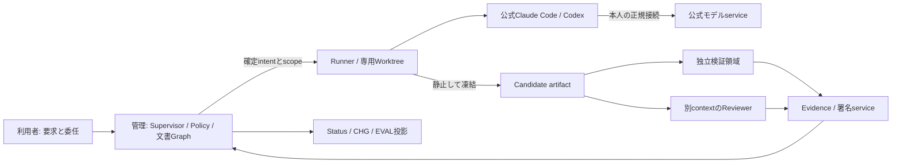

# L5 ARCH＋ADR — 構造と設計判断

構造の正本は[統合アーキテクチャー](../spec/02_ARCHITECTURE.md)、採用理由の正本は[選定ADR](../spec/00_DECISION.md)。ここは文書分類上の入口であり別構造を定義しない。C4のContextは利用者/外部境界、Containerは実行単位/データストア/接続、Componentは内部責任を示す。BRD=ContextやPRD=Containerに固定しない。[DG-S01](../sources/DOCUMENT_GUARDRAIL_SOURCES.md)

## ContextとContainerの読取り

利用者はMandateと要求を渡す。公式Claude/Codexの本人認証・モデルservice、公開資料・依存取得先、必要な私設検証serviceは外部境界。製品内は管理Supervisor、本人専用native実行、資格情報を持たない独立検証の3信頼領域。Supervisor DBは唯一の工程正本、agmsgは通知輸送である。

## Component契約

DocumentRegistry/ResolverとPolicy DecisionはSupervisor内の責任モジュール。Policy EnforcementはAPI/Runner/native権限/OS/Verifierの実施点に置く。10文書や24ガードの数だけdaemonを増やさない。read/write/shellは同writerのExecutionBinding、Verifierは別権限で同source snapshot。

## 追加ADR（CR-DOC-GUARD-001）

文書分類だけを追加する案は不採用：根拠と変更影響が機械追跡できない。ガードをpromptだけに書く案は不採用：強制点と故障時挙動がない。別guard LLM/汎用frameworkを新たに最終認可へ置く案は不採用：既存の責任分離・認証・有限予算を不必要に増やす。

採用は、型付き文書graphと操作別guardを既存状態・dispatch・検証・更新経路へ統合する案。意味審査と取得可能なnative能力には限界があるため、構造検査/独立レビュー/OS制限/実世界試験を併用する。このADRは提案仕様の策定であって実環境資格・本番承認ではない。

## V4全体統合

V4の構成決定はspec/00_DECISION.md、責任配置はspec/02_ARCHITECTURE.mdとspec/11〜14にある。二repo一ReleaseSet、知識派生、単一quality contract、学習候補の非自己昇格を採る。
