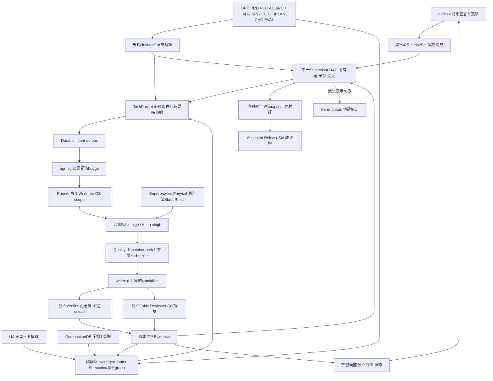

# V4統合アーキテクチャー

## 全体原則

配布と実行を分け、正本と派生情報を分け、実装と独立検証を分ける。統合はすべてを一プロセス/一DBに詰め込むことではない。同じ責任を二重所有しないことと、境界を越える契約を明示することを意味する。



## C4相当の責任と信頼境界

Context: 利用者が成果/制約/委任を与え、公式モデル接続と承認済み取得先以外への作用を制限する。Container: 管理VM（Supervisor/authority/DB）、本人native実行VM（公式CLIとproject別worker scope）、独立検証VM（candidate codeとtest user）、署名サービス（検証子processとは別権限）。KnowledgeAdapterはAuthを持たない限定processとしてRunnerが管理し、常駐RESTサーバーを追加しない。

Component: 設定生成/qualification、DAG/lease/fence、dispatch/inbox/outbox、snapshot、context、quality、review、evidence、learningは明確な契約で接続する。セッション会話状態は公式runtime、配送状態はagmsg、業務合否はSupervisor、知識索引は再構成可能な派生物が所有する。複数の格納先の存在を否定するのではなく、同じ事実の承認権限を重複させない。

## 正本・生成・観測

| 項目 | 編集/確定の主体 | 生成・参照先 |
|---|---|---|
| 事業/製品要求・仕様・oracle | Baseline Authority/CHG | 10分類の文書と型付きgraph、TaskPacket |
| 配布モデル・拡張設定 | dotfiles agent-config.yamlのadh profile | native config、launcher env、runtime manifest |
| V4の要求model/effort | 本計画の要求制約 | 配布設定との一致を検査。設定への逆書込みはしない |
| projectの品質条件 | 承認済QualityPlan/rule inventory | prek設定、checker引数、CI/Verifier計画 |
| job所有権・合否 | Supervisor管理DB | UI、worklog、bus通知 |
| code構造/記憶/知識参照 | UA/CompactionDB/Semanticaの各出典付き派生物 | 有効範囲だけをcontextへ供給 |
| 実試験結果 | A4と独立signer | receipt/evidence。Agent文面は代替しない |

## 一つの実行経路

1. InputBaseline（要求/委任）またはSolutionBaseline（確定設計）から当該nodeの規範closureを取得する。
2. ReleaseSet/actor/grant、model/effort、選択資産、quality profile、実行領域、依存、予算をadmissionで照合する。
3. 必須要求は決定的参照で確保し、Semanticaは関連資料を補う。project/ACL/版/source不一致の検索結果は採用しない。
4. task/run/attempt/fence、TaskPacket digest、dispatch intent/outboxをcommit後だけ配送する。
5. Runnerがjob所有権を持ち、公式nativeを正しいworktreeで開始/継続する。public結果は候補提出であって合否ではない。
6. 編集中に必要なqualityを実行する。fixは同一writer、commitはindex snapshotのcheck-only、独立検証はcandidate snapshotのcheck-onlyである。
7. writer/子孫process静止を確認し候補を凍結。A3/A4は別scopeで同source/contract/環境/qualityを確認する。
8. 実証拠と未解決MUSTを照合して修正または直列統合へ進む。統合後のsourceには旧receiptを流用しない。
9. Accepted後に来歴・学習候補を更新するが、Semantica/記憶/学習文字列から合否を逆更新しない。

## 並列とレジリエンス

各writerは専用WorktreeとOS scope。git-common-dirは共有し得るためWorktreeだけを隔離と呼ばず、別領域やcopy/workspace providerで共有管理ファイルへの書込みを防ぐ。独立した調査/実験/実装/checkはDAGと資源予算内で並列。schema、lock、同tree formatter、索引公開、統合branchは一writer。

Semanticaや表示UIが停止しても必須原本・qualityが利用できるtaskは継続できる。必須guard/原本/資格を失ったtaskはHOLD。未知の副作用を無視してREADYに戻さない。全体を止める剛性ではなく、領域限定の隔離・復旧・再検証を用いる。

## リポジトリの配置

```text
dotfiles/                          # 配布と既存資産の適合
  home/dot_agents/agent-config.yaml # adh profileの編集元
  scripts/generate-agent-configs.py
  scripts/update-agent-assets.sh
  scripts/check-agent-runtime.py
  home/dot_local/bin/common/       # agent-context/qualityの薄いwrapper
  home/dot_agents/quality/         # project opt-in preset、実装本体ではない
  home/dot_claude/hooks/           # 共通quality/permissionへ接続
  tests/                          # 既存回帰と生成/配布の追加試験

autonomous-dev-harness/            # 一箇所の製品実装
  src/adh/{domain,storage,assets,qualification,scheduler,dispatch,messaging}/
  src/adh/{runner,context,knowledge,quality,verifier,review,recovery,learning,api}/
  integrations/semantica/          # 隔離Python packageとuv.lock
  quality/                        # 固定rule inventory、project profile契約
  skill-pack/                     # 役割に適合した共有入口とreferences
  contracts/ workflows/ tests/ deployment/ docs/
```

この配置は後続の実装先を指定している。V4 ZIP内に未完成srcやinstallerを同梱しない。所有境界を変えない細かなclass名は実装時に記録できるが、採用構成・合否・権限を省略しない。
