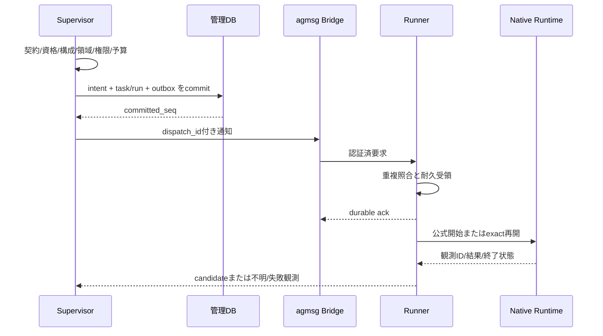

# 状態・順序・失効の統合規約

## projectとtaskを分ける

ProjectはDRAFT→QUALIFYING→ACTIVE(G1..G6)→DEVELOPMENT_ACCEPTEDと進む。公開は別のReleaseRequest。TaskはREADY→RUNNING→VERIFYING→ACCEPTED。未達は修正READY、新attempt/fenceへ戻す。taskの完了を足し合わせてprojectの完了としない。

状態更新はexpectedVersionと管理transactionで直列化する。Goalは目的の参照でありadmissionの状態ではない。Nativeのturn/completedやAgentResultは観測またはcandidate提出であってACCEPTEDではない。

| 発端 | 遷移/保持状態 | 再開条件 |
|---|---|---|
| USER_STOP | 新admission停止→PAUSING→全writer静止→PAUSED_USER | operatorの対象版付き明示再開、資格/予算/正本適合 |
| 予算超過 | 新admission停止、必要停止後PAUSED_BUDGET | 明示の予算改訂。round上限を達成としない |
| 認証/モデル不足 | PAUSED_AUTH/QUALIFICATION_FAILED | 本人の公式認証/資格確認。無断fallbackしない |
| process/lease失効 | RECONCILING | native/process/intent/effectを照合し旧writer静止 |
| dispatch応答不明 | DISPATCH_UNKNOWNをrun/effectに保存、taskはRECONCILING | 未実行・既存runを観測し、証拠付きで同一操作へ収束 |
| 作用不明 | BLOCKED_EFFECT | query/補償で判断できるまで維持 |
| baseline改訂 | 影響taskはSUPERSEDEDまたは再検証待ち | 新baselineとcontract。旧証拠を流用しない |
| 恒久失敗 | FAILED | 理由を保持しCR/委任範囲で再計画 |

停止要求のcommitがcandidate受入より先なら、late successはcandidate証拠として保持し受入/再開をしない。受入commitが先なら過去事実は保持し、pauseは次のadmissionへ適用する。新しい失敗・資格取消による失効は訂正eventで行う。DB commit順とrun identityにより一意に決める。

## 開始・受領・結果の順序

受領ackは着手・完了と違う。agmsg read_atと業務inboxの耐久受領も別である。受信側に永続記録されていない仕事へ完了ackを返さない。応答不明で再開するときは、書込みや外部作用がなかったと仮定しない。

## 正本・投影・記憶

Supervisor DBのcommitted stateが正本。ProjectionCursorはstate_version/baseline_revision/as_of_seq/scopeを持つ。UI/status/要約は同じread cutから構成し、cacheを消しても確定値を再生成できる。native観測はその出所と時刻を残すが、非公開の内部状態まで推論して補完しない。監査replayは外部作用を実行しない。

## 契約変更の失効表

| 変更対象 | 失効/再検証 |
|---|---|
| binary/model/effort/plugin/skill/hook/権限 | IC01資格、IC03構成。開始/再開/代表動作を再確認 |
| source/worktree/index/working/untracked | IC02/09 source fingerprint。正式candidateは再freeze |
| baseline/ADR/MUST/check inventory | IC06継続許可、IC07依存/下流acceptance、receipt対象 |
| VM/uid/egress/credential境界 | execution bindingと境界別VM資格 |
| event/projection schema | projection versionとcache。正本はmigrationで処理 |
| context省略/redaction/範囲 | ContextEnvelope digestと参照先。原本を上書きしない |
| 検証/署名鍵/role/suite | CheckReceipt/ReviewReceiptと現在の受入許可 |

六hash（source/spec/policy+assets/environment/test-suite/task-contract）を別々に保持する。署名はissuerを含むcanonical payloadへ行い、浮動小数、重複key、NaN/Infinityを禁止する。UTF-8/integer/key順序のtest vectorを先に固定し、独自dump形式をRFC8785準拠と誤表示しない。

## model packの状態と無断変更防止

指示資産のAUTHORED、nativeのNATIVE_QUALIFIED、行動のBEHAVIOR_QUALIFIED、効果のEFFECT_EVALUATED、製品のDEVELOPMENT_ACCEPTEDを分ける。今回AUTHORED以外の製品資格は未実施。profile・Skill・renderer更新は旧runを変えず新runの再資格を要求する。

TaskPacketのmissing required ref、旧read epoch、model/effort mismatchを検出した場合はadmission前に修正/保留する。進捗text、短いprompt、catalog存在だけではtaskのacceptedや資格状態を更新しない。

## 文書版・ガード判定と状態遷移

GuardDecisionは業務のTaskStateではない。ALLOWは操作前提を満たすだけでACCEPTEDを意味しない。DENYは該当操作を拒否、HOLDは必要資格/承認/依存を待つ、QUARANTINEは影響scopeを隔離する。作用不明は既存BLOCKED_EFFECT/RECONCILINGへ、明示停止はPAUSED_USERへ、予算停止はPAUSED_BUDGETへ対応させる。

CHGは現在有効なbaseline/closureと判定を更新する。過去のaccepted記録を削除せずcurrent-validを失効し、依存nodeだけ再検証へ戻す。graph全体の監査hashが変わっただけでは無関係なtaskを全停止しない。作業再開では現grant/policy/qualification、旧writer停止、effect結果を照合し、過去ALLOWを再利用しない。
