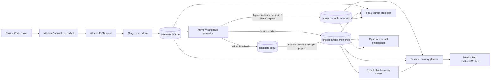
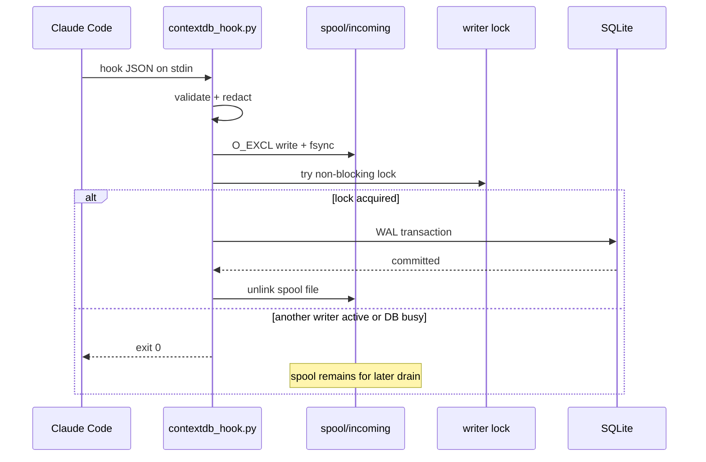
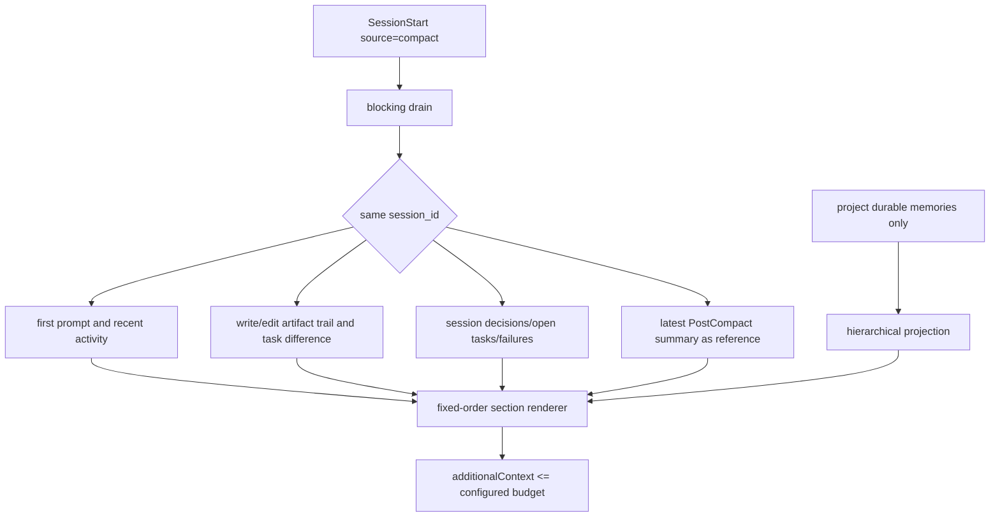

# Architecture

## 目的

Compaction復旧に必要な直近の操作証跡と、長期に残すべき決定・制約を同じデータとして扱わないことが本設計の中心です。

## write path

頻繁なeventはClaude Code設定でasync実行します。`PreCompact`と`PostCompact`は、Compaction境界を確実に残すため同期実行です。

## recovery path

packetは Header / Goal / File modifications / Recent activity / Decisions / Open tasks / Failures / Compact summary の固定順で、ledgerから毎回決定論的に再構築します。空sectionも見出しと `(none)` を出力し、compact summaryと矛盾する場合はledger由来sectionを正とします。File modificationsは同一sessionのwrite/editだけをpath単位で集約し、最新操作順と専用文字数budgetを適用します。recovery pathからLLMや外部processは呼び出しません。

raw eventは必ず同一sessionに限定します。heuristicとPostCompact由来のmemoryも既定ではsession scopeです。異なるsessionから利用できるのは、明示markerまたは手動承認でproject scopeへ昇格したdurable memoryだけです。

## hierarchy cache

`memories`が正本で、`memory_blocks`は削除・再構築可能な投影です。

- leaf: 1 memory
- level 1: adjacent 2 memories
- level 2: adjacent 4 memories
- 以下同様

古いproject memoryは大きいblock summary、最近のmemoryはleaf/raw summaryとして復旧packetへ入れます。session memoryは他sessionとの混入を防ぐためblock化しません。

## vendor independence

Claude固有なのはhook input adapterとSessionStart outputだけです。SQLite schema、spool、memory、search、CLIは独立しており、他agentは `contextdb_cli.py ingest` と `memory add/search` を利用できます。

`ingest --ingested-from <token>` は、信頼済みのlocal adapterが保存元を明示するための入力です。tokenは `^[a-z0-9][a-z0-9_-]{0,31}$` に制限され、spool envelopeからSQLiteの `ingested_from` へ渡されます。通常のhookはこのkeyを設定できず、従来どおりspool filenameを保存元に使います。

## project identity

project identityはpath hashではなく、`.claude/contextdb/state/project-id`に保存した128-bit random IDです。初回の並行hook起動では`O_EXCL`相当の原子的作成を使い、一つのIDへ収束します。directory renameやmoveではIDが変わらず、backup/restore時にはDBとproject-idを一緒に保持します。
